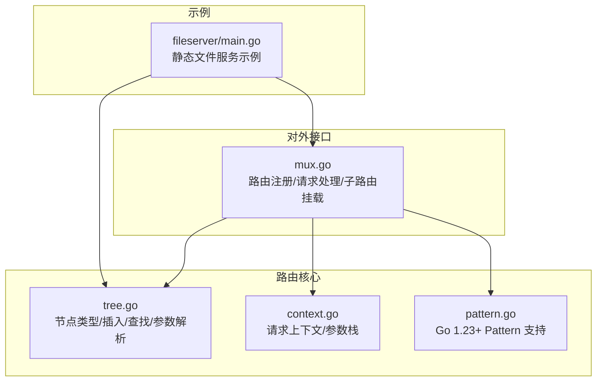
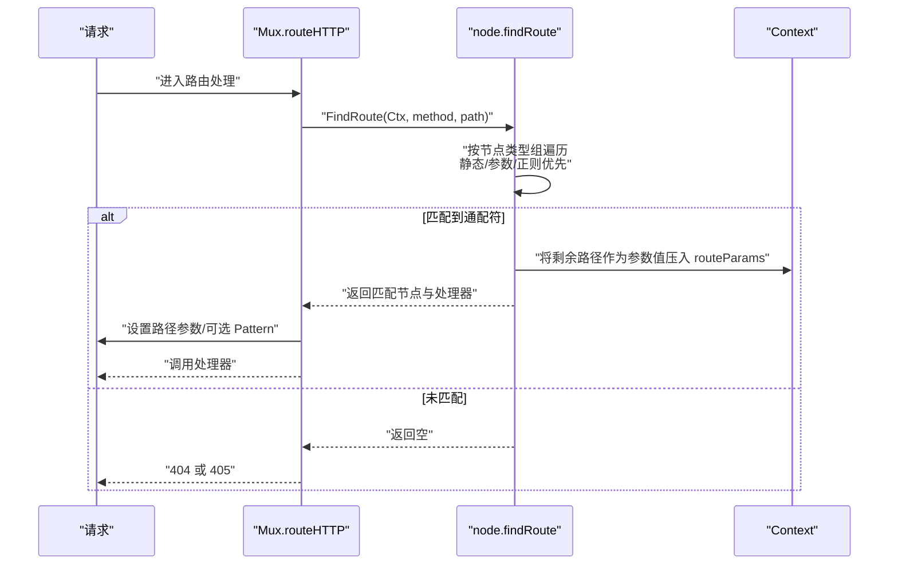
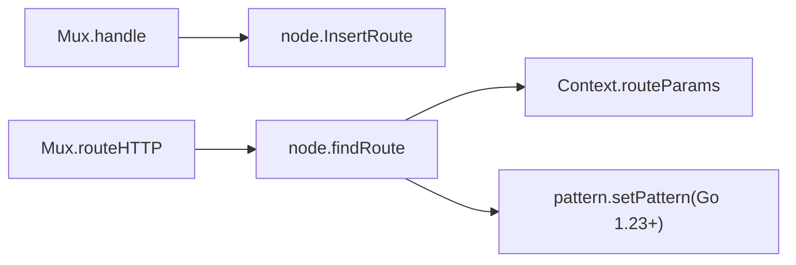

# 通配符节点匹配

<cite>
**本文引用的文件**
- [tree.go](file://tree.go)
- [mux.go](file://mux.go)
- [context.go](file://context.go)
- [pattern.go](file://pattern.go)
- [tree_test.go](file://tree_test.go)
- [fileserver/main.go](file://_examples/fileserver/main.go)
</cite>

## 目录
1. [引言](#引言)
2. [项目结构](#项目结构)
3. [核心组件](#核心组件)
4. [架构总览](#架构总览)
5. [详细组件分析](#详细组件分析)
6. [依赖关系分析](#依赖关系分析)
7. [性能考量](#性能考量)
8. [故障排查指南](#故障排查指南)
9. [结论](#结论)
10. [附录](#附录)

## 引言
本文件系统性阐述 chi 框架中“通配符节点”（ntCatchAll）的特殊处理机制，重点围绕 “/*pattern” 路由的实现细节展开，包括：
- 通配符节点作为叶节点的语义：匹配剩余全部路径
- findRoute 方法如何将整个剩余路径作为参数值存入 routeParams
- 通配符必须位于路由末尾的约束条件
- patNextSegment 函数对 ‘*’ 字符的检测逻辑及其错误提示机制
- 结合示例展示通配符路由的插入与查找过程
- 讨论通配符节点与参数节点的优先级关系及使用场景

## 项目结构
围绕通配符节点的关键代码主要分布在以下文件：
- tree.go：路由树节点类型、插入与查找算法、参数解析与校验
- mux.go：对外路由接口、请求处理链路、子路由挂载与通配符挂载
- context.go：请求上下文与参数栈管理
- pattern.go：Go 1.23+ 对 http.Request 的 Pattern 字段支持
- tree_test.go：包含通配符路由的单元测试用例
- _examples/fileserver/main.go：通配符在静态文件服务中的典型使用

图表来源
- [tree.go](file://tree.go#L78-L112)
- [mux.go](file://mux.go#L414-L487)
- [context.go](file://context.go#L45-L113)
- [pattern.go](file://pattern.go#L9-L17)
- [_examples/fileserver/main.go](file://_examples/fileserver/main.go#L48-L66)

章节来源
- [tree.go](file://tree.go#L78-L112)
- [mux.go](file://mux.go#L414-L487)
- [context.go](file://context.go#L45-L113)
- [pattern.go](file://pattern.go#L9-L17)
- [_examples/fileserver/main.go](file://_examples/fileserver/main.go#L48-L66)

## 核心组件
- 节点类型枚举：包含 ntStatic、ntRegexp、ntParam、ntCatchAll 四种类型，其中 ntCatchAll 即通配符节点
- 插入流程：InsertRoute 将路由模式按段解析并拆分为静态、参数、正则或通配符节点，构建多维前缀树
- 查找流程：findRoute 在多维树上进行递归遍历，优先尝试静态/参数/正则分支，最后处理通配符分支
- 参数提取：当匹配到通配符时，将剩余路径整体作为参数值压入 routeParams，键为特殊标记（如 “*”）

章节来源
- [tree.go](file://tree.go#L78-L112)
- [tree.go](file://tree.go#L138-L227)
- [tree.go](file://tree.go#L373-L543)

## 架构总览
chi 的路由查找采用多维前缀树（radix trie）结构，按节点类型分组遍历。通配符节点（ntCatchAll）在遍历时被单独处理，优先级低于静态、参数、正则节点；一旦匹配到通配符，会将剩余路径整体作为参数值返回。

图表来源
- [mux.go](file://mux.go#L441-L487)
- [tree.go](file://tree.go#L398-L543)
- [context.go](file://context.go#L45-L113)
- [pattern.go](file://pattern.go#L9-L17)

## 详细组件分析

### 通配符节点的语义与约束
- 语义：通配符节点作为叶节点，表示“匹配剩余全部路径”。在查找过程中，若某条分支能走到通配符节点，则将其视为最终匹配，剩余路径整体作为参数值
- 约束：通配符必须位于路由末尾。patNextSegment 在解析模式时会校验：若存在 ‘*’，必须出现在字符串末尾；否则抛出错误提示，要求将 ‘*’ 放在末尾或改用参数段

章节来源
- [tree.go](file://tree.go#L494-L500)
- [tree.go](file://tree.go#L684-L752)

### findRoute 中的通配符处理
- 遍历阶段：在按节点类型组遍历时，ntCatchAll 分支单独处理
- 匹配策略：直接将当前搜索剩余路径作为参数值压入 routeParams，然后令 xsearch 为空，继续递归
- 叶节点判定：若当前节点是叶节点且存在对应方法的处理器，则返回该节点；否则记录允许的方法集合以支持 405 响应

章节来源
- [tree.go](file://tree.go#L398-L543)

### patNextSegment 对 ‘*’ 的检测逻辑
- 解析顺序：先查找 ‘{’ 和 ‘*’ 的位置，若两者都存在且 ‘*’ 在 ‘{’ 前面，则直接报错，提示 ‘*’ 必须在路由末尾，否则使用参数段
- 末尾校验：若仅存在 ‘*’，需确保其位于字符串末尾，否则报错，提示将 ‘*’ 放在末尾或移除尾部文本
- 返回值：当为通配符时，返回类型 ntCatchAll，键为 “*”，起止索引指向 ‘*’ 的位置

章节来源
- [tree.go](file://tree.go#L684-L752)

### 插入与查找过程示例（基于测试）
- 插入：通过 InsertRoute 将 “/pages/*”、“/articles/{id}/*”、“/articles/{slug}/{uid}/*” 注册到树中
- 查找：findPattern 用于验证模式是否存在于树中；实际请求匹配由 FindRoute 完成
- 行为：通配符必须位于末尾，否则无法正确插入或匹配

章节来源
- [tree_test.go](file://tree_test.go#L417-L445)
- [tree.go](file://tree.go#L138-L227)

### 与参数节点的优先级关系
- 遍历顺序：findRoute 先尝试 ntStatic、ntParam、ntRegexp 分支，最后才尝试 ntCatchAll
- 优先级：参数/正则节点优先于通配符节点，因为它们更具体；只有在参数/正则无法匹配时才会回退到通配符
- 注意：若通配符位于中间（例如 “/api/*/v1”），会被 patNextSegment 拦截并报错，要求将 ‘*’ 移至末尾

章节来源
- [tree.go](file://tree.go#L398-L543)
- [tree.go](file://tree.go#L684-L752)

### 使用场景
- 静态资源服务：在文件服务器示例中，通过将路径后缀拼接 “/*” 实现对子目录的通配匹配，处理器从上下文中读取 RoutePattern 并剥离前缀，再交由 http.FileServer 处理
- 子路由挂载：Mount 会在父路由上挂载 “/*” 以将后续路径交给子路由器继续匹配

章节来源
- [_examples/fileserver/main.go](file://_examples/fileserver/main.go#L48-L66)
- [mux.go](file://mux.go#L282-L340)

## 依赖关系分析
- Mux.handle -> tree.node.InsertRoute：注册路由时将模式拆分为节点并插入树
- Mux.routeHTTP -> tree.node.FindRoute：请求到来时在树中查找匹配节点
- tree.node.findRoute -> context.Context：将匹配到的参数写入 routeParams
- pattern.go：在 Go 1.23+ 条件下将匹配到的路由模式写入 http.Request 的 Pattern 字段

图表来源
- [mux.go](file://mux.go#L414-L487)
- [tree.go](file://tree.go#L373-L543)
- [pattern.go](file://pattern.go#L9-L17)

章节来源
- [mux.go](file://mux.go#L414-L487)
- [tree.go](file://tree.go#L373-L543)
- [pattern.go](file://pattern.go#L9-L17)

## 性能考量
- 多维前缀树遍历：findRoute 按节点类型组顺序遍历，ntCatchAll 通常在最后尝试，避免不必要的回溯
- 参数栈复用：通过 sync.Pool 复用 Context，减少每次请求的分配开销
- 正则匹配：ntRegexp 分支在匹配前会做边界检查，避免跨段匹配导致的无效尝试

章节来源
- [mux.go](file://mux.go#L414-L487)
- [tree.go](file://tree.go#L398-L543)

## 故障排查指南
- 错误提示一：“* 必须是路由的最后一个模式，否则使用 ‘{param}’”
  - 触发条件：模式中 ‘*’ 出现在 ‘{’ 之前
  - 处理建议：将 ‘*’ 移动到末尾，或将中间部分改为参数段
- 错误提示二：“* 必须是路由的最后一个值。修剪尾随文本或改用 ‘{param}’”
  - 触发条件：模式以 ‘*’ 结尾但其后仍有非 ‘*’ 文本
  - 处理建议：删除尾随文本或将 ‘*’ 移动到末尾
- 404/405：若通配符匹配成功但无对应方法处理器，会记录允许的方法集合以生成 405 响应
- 参数缺失：若通配符节点位于中间或模式不合法，将无法插入或匹配

章节来源
- [tree.go](file://tree.go#L694-L752)
- [tree.go](file://tree.go#L494-L500)
- [tree.go](file://tree.go#L505-L524)

## 结论
- 通配符节点（ntCatchAll）在 chi 中承担“匹配剩余全部路径”的职责，必须位于路由末尾
- findRoute 在多维树上按静态/参数/正则优先、通配符最后的顺序进行匹配，匹配成功时将剩余路径整体作为参数值存入 routeParams
- patNextSegment 对 ‘*’ 的严格校验保证了路由定义的合法性与可预测性
- 在静态文件服务等场景中，通配符提供了强大的路径兜底能力，配合子路由挂载可实现灵活的资源组织

## 附录
- 关键实现路径参考
  - 通配符类型与节点结构：[tree.go](file://tree.go#L78-L112)
  - 插入与拆分逻辑：[tree.go](file://tree.go#L138-L227)
  - 查找与参数提取：[tree.go](file://tree.go#L398-L543)
  - 模式解析与校验：[tree.go](file://tree.go#L684-L752)
  - 请求处理与参数注入：[mux.go](file://mux.go#L441-L487)
  - 上下文参数栈：[context.go](file://context.go#L45-L113)
  - Go 1.23+ Pattern 支持：[pattern.go](file://pattern.go#L9-L17)
  - 示例：静态文件服务通配符使用：[_examples/fileserver/main.go](file://_examples/fileserver/main.go#L48-L66)