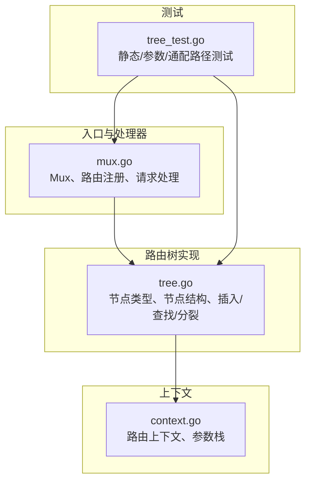
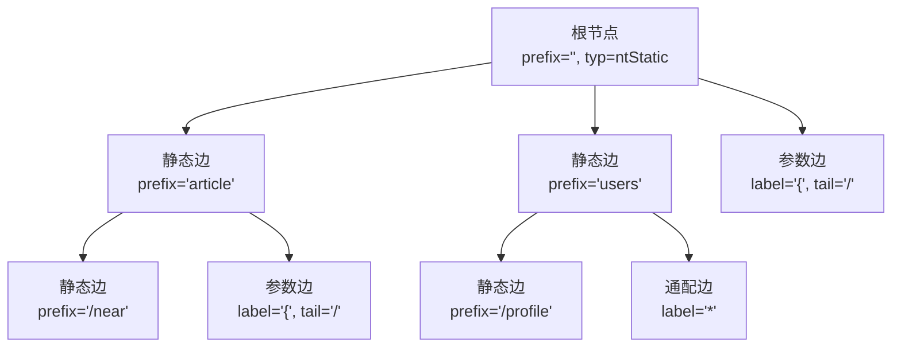
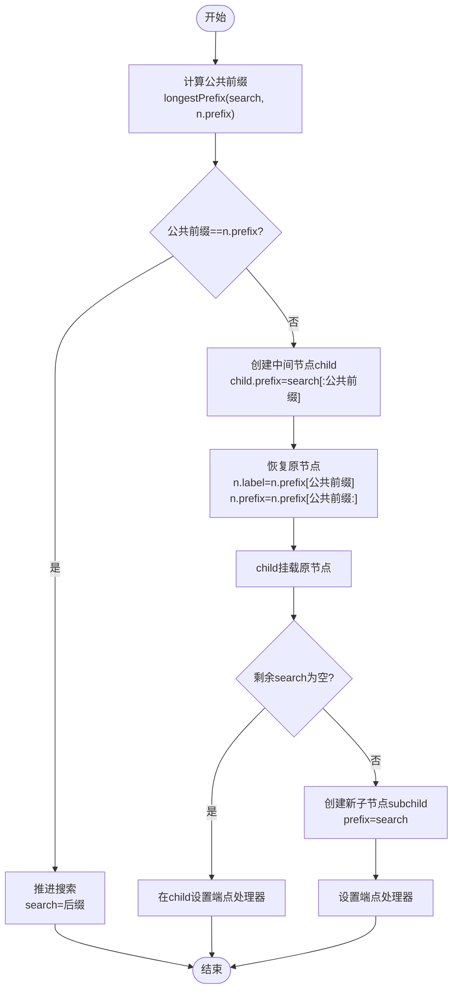
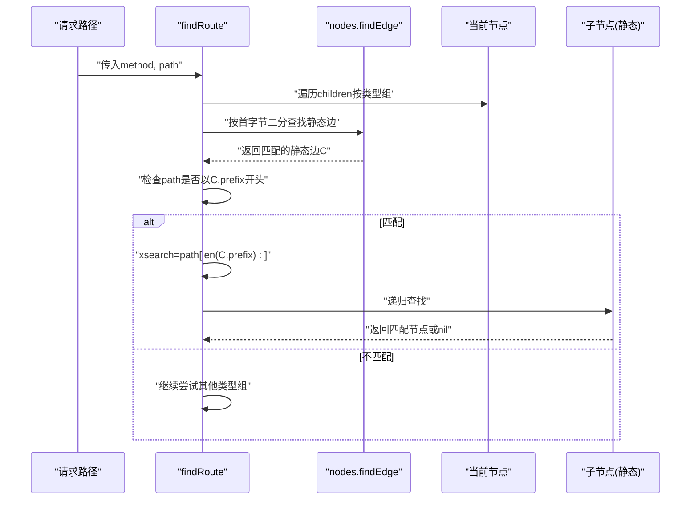
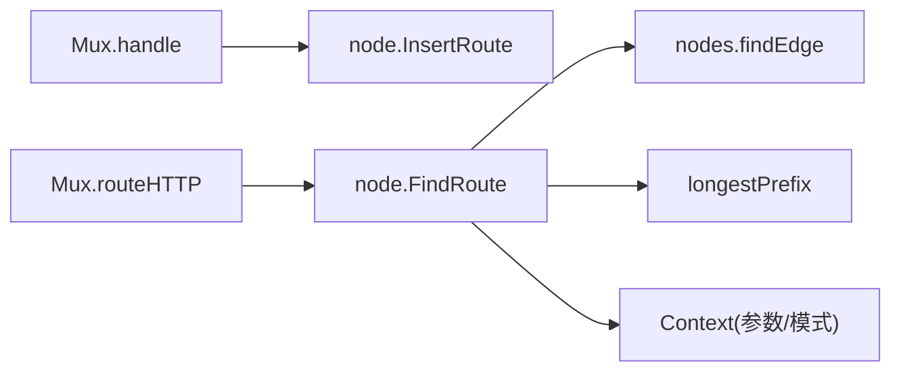

# 静态节点匹配

<cite>
**本文引用的文件**
- [tree.go](file://tree.go)
- [mux.go](file://mux.go)
- [context.go](file://context.go)
- [tree_test.go](file://tree_test.go)
</cite>

## 目录
1. [引言](#引言)
2. [项目结构](#项目结构)
3. [核心组件](#核心组件)
4. [架构总览](#架构总览)
5. [详细组件分析](#详细组件分析)
6. [依赖关系分析](#依赖关系分析)
7. [性能考量](#性能考量)
8. [故障排查指南](#故障排查指南)
9. [结论](#结论)

## 引言
本节聚焦于 chi 框架中“静态节点”（ntStatic）的匹配机制，系统性阐述：
- node 结构体中 prefix 字段如何存储共享前缀；
- longestPrefix 函数如何计算最长公共前缀以支持高效的路径匹配；
- findRoute 方法在处理静态节点时如何通过字符串前缀匹配进行路由查找；
- getEdge 方法如何利用二分查找快速定位子节点；
- 结合代码示例展示当请求路径与节点前缀完全匹配或需要分裂节点时的具体处理流程；
- 节点分裂（node splitting）的实现逻辑与性能影响。

## 项目结构
本主题涉及的核心文件位于路由树实现与入口处：
- tree.go：路由树节点定义、插入与查找算法、静态节点匹配与分裂逻辑；
- mux.go：对外暴露的路由接口、请求进入点与处理器链；
- context.go：路由上下文与参数栈，用于记录匹配到的参数与模式；
- tree_test.go：大量静态路径与参数化路径的测试用例，体现静态节点行为。

图表来源
- [tree.go](file://tree.go#L78-L120)
- [mux.go](file://mux.go#L1-L120)
- [context.go](file://context.go#L45-L110)
- [tree_test.go](file://tree_test.go#L1-L120)

章节来源
- [tree.go](file://tree.go#L78-L120)
- [mux.go](file://mux.go#L1-L120)
- [context.go](file://context.go#L45-L110)
- [tree_test.go](file://tree_test.go#L1-L120)

## 核心组件
- 节点类型与结构
  - 节点类型：ntStatic、ntRegexp、ntParam、ntCatchAll；
  - 节点结构包含 prefix（公共前缀）、children（按类型分组的有序子节点）、label/tail（首字节与尾分隔符）、typ（类型）、endpoints（方法到处理器映射）等。
- 插入与分裂
  - InsertRoute 在插入静态段时，若当前边存在但不完全匹配，则调用 longestPrefix 计算公共前缀并执行节点分裂；
  - 分裂后保留原节点的剩余部分，并为新公共前缀创建中间节点，再在其下挂载原节点与新分支。
- 查找与匹配
  - FindRoute 对每个节点类型分组进行遍历，静态节点使用字符串前缀匹配；参数/正则节点使用分隔符与可选正则约束；
  - getEdge（nodes.findEdge）对同一类型子节点集合采用二分查找，按 label 快速定位目标边。

章节来源
- [tree.go](file://tree.go#L78-L120)
- [tree.go](file://tree.go#L138-L228)
- [tree.go](file://tree.go#L398-L543)
- [tree.go](file://tree.go#L545-L571)
- [tree.go](file://tree.go#L772-L780)

## 架构总览
chi 的路由树是一个多维基数树（radix-like），按节点类型分组存储子节点，静态段优先匹配，参数/正则/通配段次之。请求从根节点出发，按类型组顺序尝试匹配，静态段使用前缀匹配与二分查找加速，参数/正则段使用分隔符与可选正则约束。

图表来源
- [tree.go](file://tree.go#L78-L120)
- [tree.go](file://tree.go#L398-L543)

## 详细组件分析

### 静态节点的前缀存储与匹配
- prefix 字段的作用
  - 存储该节点与父节点之间的共享前缀，避免冗余存储与重复比较；
  - 在插入与查找过程中，prefix 作为“公共前缀”的载体参与匹配与分裂。
- 前缀匹配策略
  - 插入阶段：若当前边存在但与待插入前缀不完全一致，使用 longestPrefix 计算公共长度，然后执行节点分裂；
  - 查找阶段：静态边直接使用 strings.HasPrefix 判断当前搜索串是否以前缀开头，若是则推进搜索位置。

章节来源
- [tree.go](file://tree.go#L97-L112)
- [tree.go](file://tree.go#L190-L227)
- [tree.go](file://tree.go#L418-L425)

### 最长公共前缀计算（longestPrefix）
- 功能：计算两个字符串的最长公共前缀长度；
- 复杂度：O(min(len(k1), len(k2)))；
- 使用场景：
  - 插入时判断当前边与待插入前缀的重叠程度；
  - 模式匹配时辅助判断静态段是否完全匹配。

章节来源
- [tree.go](file://tree.go#L772-L780)

### 节点分裂（node splitting）流程
- 触发条件：插入路径与现有边的 prefix 不完全匹配；
- 步骤概览：
  1) 计算公共前缀长度；
  2) 创建新的中间节点，其 prefix 为公共前缀；
  3) 将原节点的 label/tail/prefix 进行调整，使其成为中间节点的子节点；
  4) 若剩余插入路径非空，则为其创建新的子节点并设置端点处理器；
  5) 若剩余插入路径为空，则直接在中间节点上设置端点处理器。

图表来源
- [tree.go](file://tree.go#L190-L227)

章节来源
- [tree.go](file://tree.go#L190-L227)

### findRoute 中静态节点的匹配流程
- 类型组遍历：按 nodeTyp 分组遍历子节点；
- 静态边匹配：
  - 使用 nodes.findEdge 获取首字节匹配的目标边；
  - 使用 strings.HasPrefix 判断当前搜索串是否以前缀开头；
  - 若匹配成功，移动搜索位置（去掉已匹配的前缀）；
- 递归继续：对匹配到的子节点继续递归查找；
- 参数/正则/通配：在静态边未命中时，尝试其他类型组（参数/正则/通配）。

图表来源
- [tree.go](file://tree.go#L398-L543)
- [tree.go](file://tree.go#L545-L571)

章节来源
- [tree.go](file://tree.go#L398-L543)
- [tree.go](file://tree.go#L545-L571)

### getEdge 的二分查找优化
- 作用：在同类型子节点集合中，按 label 快速定位目标边；
- 实现：对 children[ntyp] 按 label 排序后使用二分查找；
- 性能：O(log n)，n 为同类型子节点数量；
- 注意：children 按 label 排序，且对参数节点有 tailSort 策略，确保以 '/' 结尾的参数节点排在末尾，从而保证匹配顺序合理。

章节来源
- [tree.go](file://tree.go#L782-L800)
- [tree.go](file://tree.go#L790-L799)
- [tree.go](file://tree.go#L545-L571)

### 完整匹配与分裂的示例路径
以下示例展示两种典型场景，均来自测试用例与实现逻辑：
- 场景一：请求路径与节点前缀完全匹配
  - 行为：直接推进搜索位置，继续递归匹配后续段；
  - 参考：静态边前缀匹配与推进逻辑。
- 场景二：请求路径与节点前缀需要分裂
  - 行为：计算公共前缀，创建中间节点，恢复原节点并挂载，必要时创建新子节点；
  - 参考：节点分裂流程与端点设置。

章节来源
- [tree.go](file://tree.go#L190-L227)
- [tree_test.go](file://tree_test.go#L1-L120)

## 依赖关系分析
- Mux.handle -> tree.node.InsertRoute：路由注册时构建路由树；
- Mux.routeHTTP -> tree.node.FindRoute：请求到来时查找匹配处理器；
- tree.node.findRoute -> nodes.findEdge：静态边的快速定位；
- tree.node.findRoute -> longestPrefix：静态段匹配与模式匹配辅助；
- 上下文 Context：在查找过程中累积参数与模式，供后续中间件与处理器使用。

图表来源
- [mux.go](file://mux.go#L414-L437)
- [mux.go](file://mux.go#L439-L487)
- [tree.go](file://tree.go#L398-L543)
- [tree.go](file://tree.go#L545-L571)
- [tree.go](file://tree.go#L772-L780)
- [context.go](file://context.go#L45-L110)

章节来源
- [mux.go](file://mux.go#L414-L487)
- [tree.go](file://tree.go#L398-L543)
- [context.go](file://context.go#L45-L110)

## 性能考量
- 时间复杂度
  - 插入：平均 O(L + log n)，其中 L 为待插入路径长度（受 longestPrefix 影响），log n 为二分查找；
  - 查找：静态边 O(L + log n)，参数/正则/通配边 O(branch × L)（branch 为该类型组的候选数）；
- 空间复杂度
  - 路由树的空间开销主要由节点数量与 prefix 长度决定；节点分裂会增加中间节点数量，但减少重复前缀存储；
- 优化建议
  - 合理设计路由前缀，尽量减少静态段的频繁分裂；
  - 控制参数/正则段数量，避免过多分支导致查找退化；
  - 利用 children 排序与 tailSort，确保匹配顺序稳定且高效。

[本节提供一般性指导，无需特定文件引用]

## 故障排查指南
- 常见问题
  - 路由未命中：检查请求路径是否与静态前缀完全匹配；确认是否存在参数/正则段导致提前截断；
  - 参数值异常：确认 tail 分隔符与正则约束是否正确；检查参数段是否被 '/' 截断；
  - 路由树分裂导致的匹配偏差：核对 longestPrefix 计算与中间节点 prefix 设置。
- 定位手段
  - 使用测试用例覆盖静态/参数/通配路径组合；
  - 打印路由树结构（参考调试打印函数）观察节点分布与 prefix；
  - 检查上下文中的 routeParams 与 routePattern 是否符合预期。

章节来源
- [tree_test.go](file://tree_test.go#L1-L120)
- [context.go](file://context.go#L45-L110)

## 结论
chi 的静态节点匹配通过 prefix 存储共享前缀、longestPrefix 计算公共前缀、nodes.findEdge 的二分查找与 findRoute 的前缀匹配策略，实现了高效稳定的路径匹配。节点分裂在保持树结构紧凑的同时，确保了静态段的快速匹配与良好的扩展性。结合测试用例与上下文参数栈，可以可靠地定位与修复路由匹配问题。