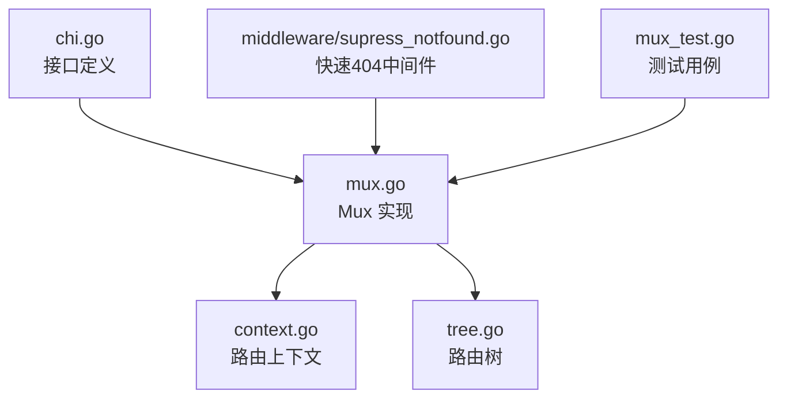
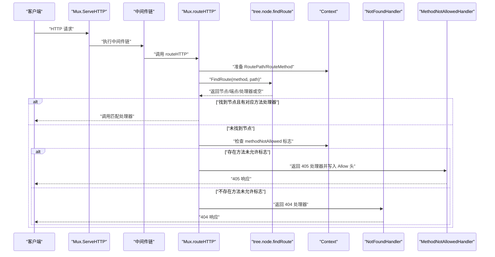
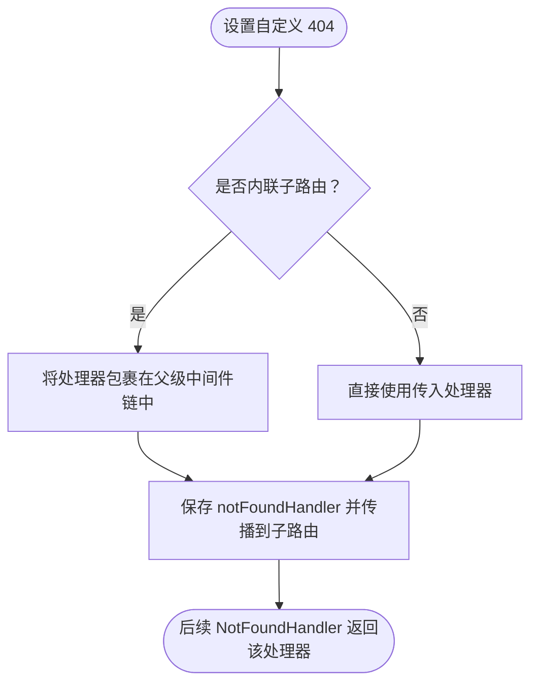
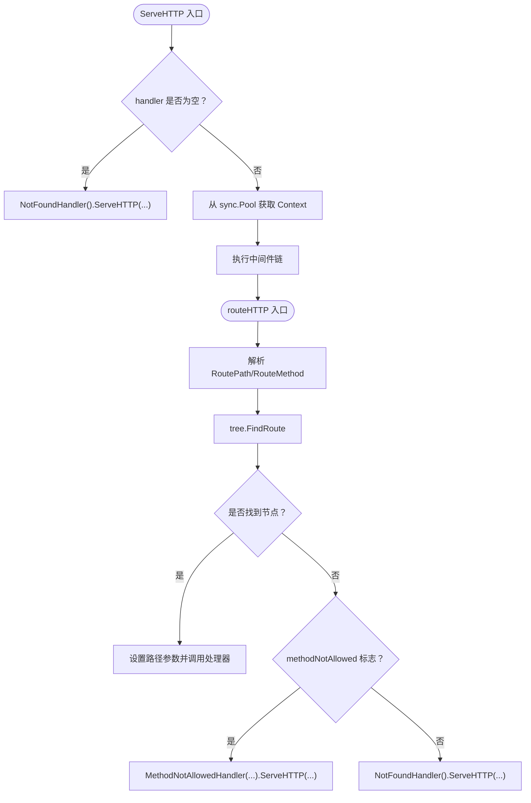
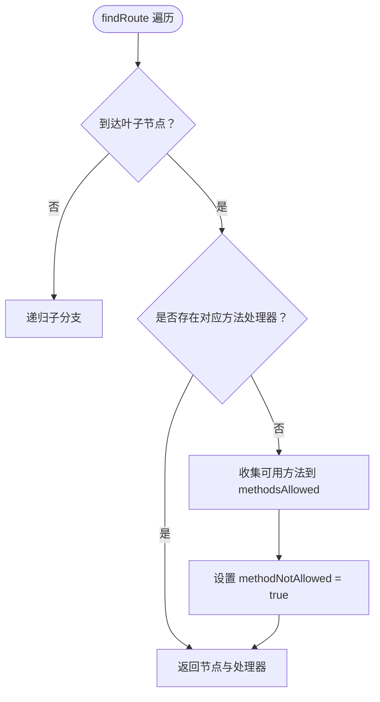
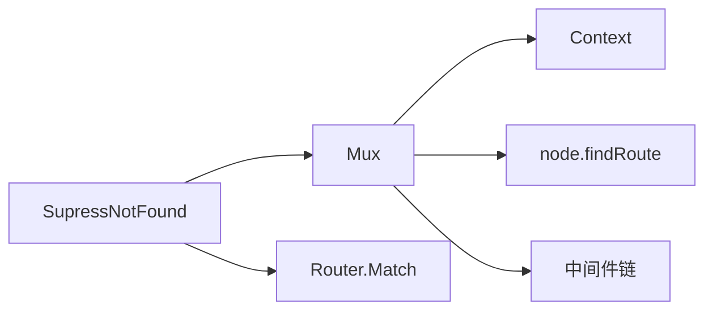

# 路由未找到处理

<cite>
**本文引用的文件列表**
- [chi.go](file://chi.go)
- [mux.go](file://mux.go)
- [context.go](file://context.go)
- [tree.go](file://tree.go)
- [supress_notfound.go](file://middleware/supress_notfound.go)
- [mux_test.go](file://mux_test.go)
</cite>

## 目录
1. [引言](#引言)
2. [项目结构](#项目结构)
3. [核心组件](#核心组件)
4. [架构总览](#架构总览)
5. [详细组件分析](#详细组件分析)
6. [依赖关系分析](#依赖关系分析)
7. [性能考量](#性能考量)
8. [故障排查指南](#故障排查指南)
9. [结论](#结论)
10. [附录](#附录)

## 引言
本篇文档系统性阐述 chi 框架中“路由未找到（404）”的处理机制，重点覆盖：
- 如何通过 Router.NotFound 设置自定义 404 响应处理器
- 当未设置自定义处理器时，默认使用 http.NotFound 的行为
- 在 ServeHTTP 与 routeHTTP 中如何判定路由匹配失败并触发 404 响应
- 路由未找到与“方法未允许（405）”的区别及判定逻辑
- 实战示例：如何自定义 404 页面与响应内容
- 错误处理最佳实践

## 项目结构
围绕 404 处理机制，以下文件最为关键：
- chi.go：定义 Router 接口，包含 NotFound 方法声明
- mux.go：Mux 的实现，包含 ServeHTTP、routeHTTP、NotFound、NotFoundHandler 等核心逻辑
- context.go：路由上下文 Context，记录匹配过程中的方法、参数、模式等信息
- tree.go：路由树节点 node 与查找算法，决定是否命中路由、是否为 405 场景
- middleware/supress_notfound.go：快速抑制 404 的中间件，用于提前短路
- mux_test.go：覆盖 404 与 405 的测试用例，验证行为

图表来源
- [chi.go](file://chi.go#L66-L114)
- [mux.go](file://mux.go#L60-L114)
- [context.go](file://context.go#L42-L96)
- [tree.go](file://tree.go#L373-L543)
- [supress_notfound.go](file://middleware/supress_notfound.go#L1-L28)
- [mux_test.go](file://mux_test.go#L400-L600)

章节来源
- [chi.go](file://chi.go#L66-L114)
- [mux.go](file://mux.go#L60-L114)

## 核心组件
- Router.NotFound：在 Router 接口中声明，用于设置自定义 404 处理器
- Mux.NotFound：实现 Router.NotFound，支持内联子路由链式处理与子路由传播
- Mux.NotFoundHandler：返回当前 404 处理器；若未设置则回退到 http.NotFound
- Mux.ServeHTTP：请求入口，负责初始化路由上下文并调用已构建的中间件链
- Mux.routeHTTP：路由查找与分发，根据 tree 查找结果决定 404 或 405
- tree.node.findRoute：递归查找路由，同时收集“方法未允许”的候选方法集合
- Context：记录路由路径、参数、匹配模式、方法允许集合等状态

章节来源
- [chi.go](file://chi.go#L107-L114)
- [mux.go](file://mux.go#L195-L213)
- [mux.go](file://mux.go#L396-L403)
- [mux.go](file://mux.go#L60-L92)
- [mux.go](file://mux.go#L439-L487)
- [tree.go](file://tree.go#L373-L543)
- [context.go](file://context.go#L42-L96)

## 架构总览
下图展示了从请求进入至 404/405 决策的关键流程。

图表来源
- [mux.go](file://mux.go#L60-L92)
- [mux.go](file://mux.go#L439-L487)
- [tree.go](file://tree.go#L373-L543)
- [context.go](file://context.go#L42-L96)
- [mux.go](file://mux.go#L396-L403)

## 详细组件分析

### NotFoundHandler 与自定义 404 处理器
- Router.NotFound 在接口层声明，Mux.NotFound 实现该方法，支持：
  - 内联子路由场景下的处理器链式包装（将自定义 404 包裹在父级中间件链中）
  - 子路由传播：若子路由未设置自定义 404，则自动继承父路由的 404 处理器
- Mux.NotFoundHandler 返回当前 404 处理器；若未设置则回退到 http.NotFound

图表来源
- [mux.go](file://mux.go#L195-L213)

章节来源
- [chi.go](file://chi.go#L107-L114)
- [mux.go](file://mux.go#L195-L213)
- [mux.go](file://mux.go#L396-L403)

### ServeHTTP 与 routeHTTP 中的 404 判定
- ServeHTTP：若尚未构建中间件链（handler 为空），直接调用 NotFoundHandler；否则复用路由上下文并执行中间件链
- routeHTTP：
  - 解析 RoutePath 与 RouteMethod
  - 调用 tree.FindRoute 获取节点与处理器
  - 若找到处理器：设置路径参数并调用
  - 若未找到：
    - 若 Context.methodNotAllowed 为真：调用 MethodNotAllowedHandler（405）
    - 否则：调用 NotFoundHandler（404）

图表来源
- [mux.go](file://mux.go#L60-L92)
- [mux.go](file://mux.go#L439-L487)
- [tree.go](file://tree.go#L373-L543)

章节来源
- [mux.go](file://mux.go#L60-L92)
- [mux.go](file://mux.go#L439-L487)

### 路由树与 405 判定
- tree.node.findRoute 在遍历过程中：
  - 若到达叶子节点但无对应方法处理器，会收集所有可用方法到 Context.methodsAllowed，并标记 Context.methodNotAllowed = true
  - 这是 405 的判定依据：routeHTTP 未找到处理器且 methodNotAllowed 为真时返回 405，并在响应头中设置 Allow

图表来源
- [tree.go](file://tree.go#L400-L543)
- [context.go](file://context.go#L42-L96)

章节来源
- [tree.go](file://tree.go#L400-L543)
- [context.go](file://context.go#L42-L96)

### 默认 404 行为与快速抑制中间件
- 默认 404：Mux.NotFoundHandler 未设置时返回 http.NotFound
- 快速抑制中间件 SupressNotFound：在中间件栈顶部检查路由是否匹配，不匹配则立即返回 404，避免后续中间件开销

章节来源
- [mux.go](file://mux.go#L396-L403)
- [supress_notfound.go](file://middleware/supress_notfound.go#L1-L28)

### 测试用例与行为验证
- 405 行为：注册 GET/HEAD 的 /hi，访问 POST /hi 应返回 405，并设置 Allow 头
- 404 行为：在多层级路由与子路由挂载场景下，未命中的路径应统一返回自定义 404
- 子路由传播：父路由设置的 404 会传播到子路由，即使子路由未显式设置

章节来源
- [mux_test.go](file://mux_test.go#L400-L458)
- [mux_test.go](file://mux_test.go#L497-L587)

## 依赖关系分析
- Mux 依赖 Context 维护路由状态
- Mux 依赖 tree.node 实现高效路由查找
- Mux 依赖中间件链在 ServeHTTP 中先行执行
- SupressNotFound 依赖 Router.Match 与 Mux.NotFoundHandler 提前短路

图表来源
- [mux.go](file://mux.go#L60-L92)
- [mux.go](file://mux.go#L439-L487)
- [tree.go](file://tree.go#L373-L543)
- [supress_notfound.go](file://middleware/supress_notfound.go#L1-L28)

章节来源
- [mux.go](file://mux.go#L60-L92)
- [mux.go](file://mux.go#L439-L487)
- [tree.go](file://tree.go#L373-L543)
- [supress_notfound.go](file://middleware/supress_notfound.go#L1-L28)

## 性能考量
- 使用 SupressNotFound 中间件可减少无效请求进入后续中间件链，降低日志噪声与资源消耗
- 404 与 405 的判定均发生在路由查找阶段，避免重复扫描
- Context 使用 sync.Pool 复用，减少 GC 压力

## 故障排查指南
- 自定义 404 未生效
  - 确认在挂载任何路由之前设置了 Router.NotFound
  - 若使用 With/Group/Route/Mount，请确认子路由未覆盖了 404 处理器
- 405 未按预期返回
  - 检查目标路径是否存在其他方法的处理器，导致被判定为“方法未允许”
  - 确认 Context.methodsAllowed 是否被正确填充
- 404 仍返回默认行为
  - 确认 Mux.NotFoundHandler 是否被正确设置
  - 检查 ServeHTTP 是否提前返回（如 handler 为空时直接走 NotFoundHandler）

章节来源
- [mux.go](file://mux.go#L195-L213)
- [mux.go](file://mux.go#L396-L403)
- [mux.go](file://mux.go#L60-L92)
- [tree.go](file://tree.go#L400-L543)

## 结论
chi 框架通过清晰的接口与实现分离，将 404 与 405 的判定逻辑集中在路由查找阶段，并提供了灵活的自定义能力与子路由传播机制。默认情况下未设置自定义处理器时，将回退到 http.NotFound；通过 SupressNotFound 可在早期快速短路未命中请求，提升整体性能与可观测性。

## 附录
- 自定义 404 页面与响应内容的实战建议
  - 在根路由上设置 Router.NotFound，确保全局生效
  - 对于静态站点或 API 文档，可返回 HTML 或 JSON
  - 注意区分 404 与 405：前者表示路径不存在，后者表示方法不支持
  - 在生产环境结合 SupressNotFound 减少无效日志与资源消耗