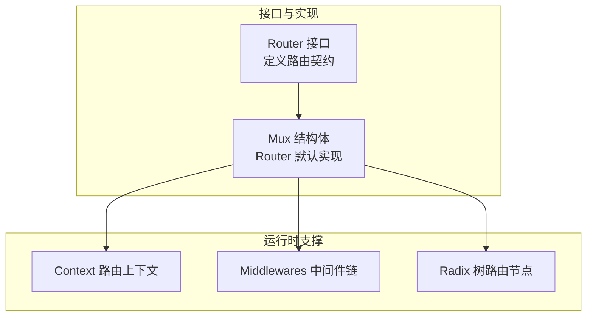
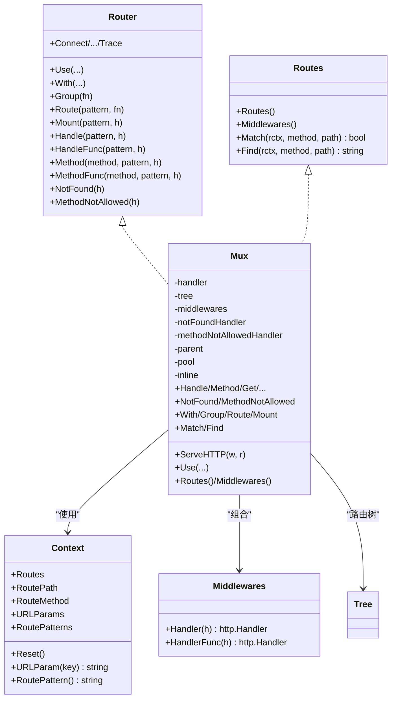
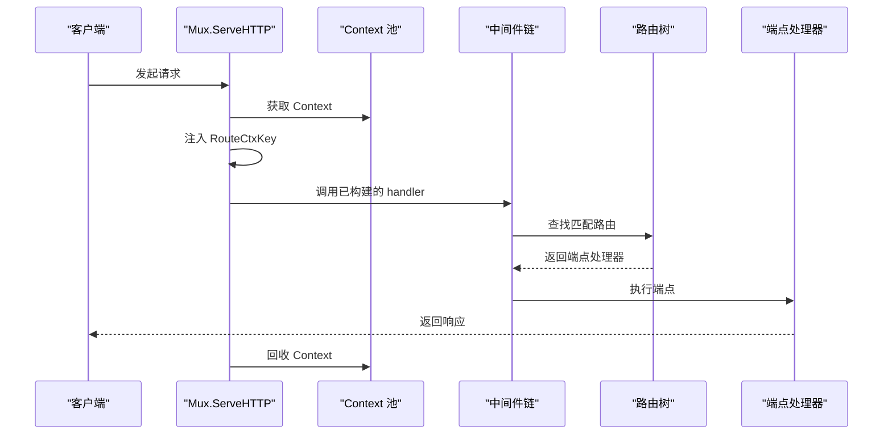
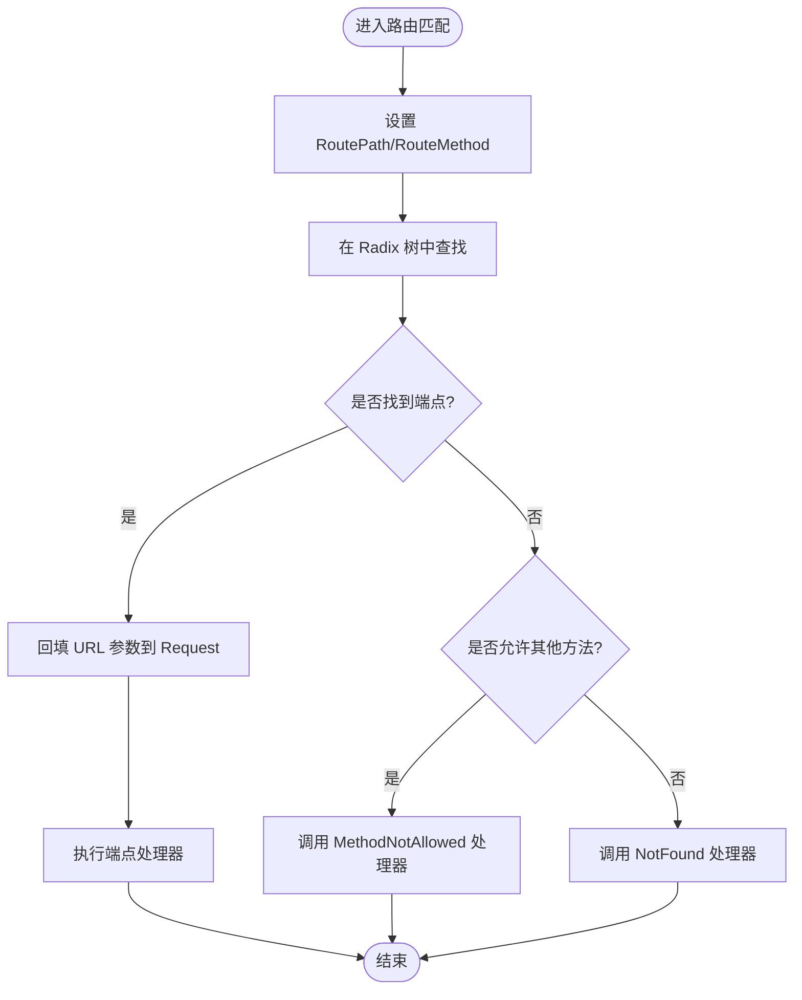
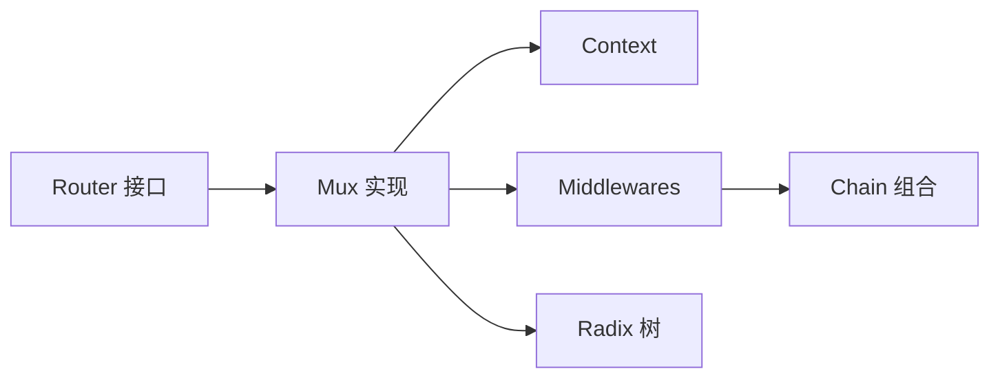

# 路由器接口契约

<cite>
**本文引用的文件**
- [chi.go](file://chi.go)
- [mux.go](file://mux.go)
- [context.go](file://context.go)
- [chain.go](file://chain.go)
- [tree.go](file://tree.go)
- [README.md](file://README.md)
- [_examples/hello-world/main.go](file://_examples/hello-world/main.go)
- [_examples/custom-handler/main.go](file://_examples/custom-handler/main.go)
- [mux_test.go](file://mux_test.go)
</cite>

## 目录
1. [引言](#引言)
2. [项目结构](#项目结构)
3. [核心组件](#核心组件)
4. [架构总览](#架构总览)
5. [详细组件分析](#详细组件分析)
6. [依赖分析](#依赖分析)
7. [性能考量](#性能考量)
8. [故障排查指南](#故障排查指南)
9. [结论](#结论)
10. [附录](#附录)

## 引言
本文件围绕 chi.Router 接口的契约设计进行系统化解析，重点阐述：
- Router 接口与标准库 net/http.Handler 的兼容性
- Router 接口中各方法（Use、Handle、Get、Post 等）的职责与使用模式
- Mux 结构体如何实现 Router 接口
- 接口设计背后的架构哲学：组合性、可扩展性、中间件链构建
- 通过源码分析展示接口与实现之间的关系，以及该设计如何支撑框架的模块化与可测试性

## 项目结构
chi 采用“接口 + 实现”的分层设计，核心位于 chi.go 定义 Router 接口，mux.go 提供默认实现 Mux，配合 context.go 的路由上下文、chain.go 的中间件链工具、tree.go 的前缀树路由实现，形成完整的 HTTP 路由体系。

图表来源
- [chi.go](file://chi.go#L64-L138)
- [mux.go](file://mux.go#L1-L120)
- [context.go](file://context.go#L1-L120)
- [chain.go](file://chain.go#L1-L50)
- [tree.go](file://tree.go#L1-L120)

章节来源
- [chi.go](file://chi.go#L64-L138)
- [mux.go](file://mux.go#L1-L120)
- [context.go](file://context.go#L1-L120)
- [chain.go](file://chain.go#L1-L50)
- [tree.go](file://tree.go#L1-L120)

## 核心组件
- Router 接口：定义了路由的核心能力，包含标准库 Handler 兼容、中间件栈管理、子路由挂载、HTTP 方法路由注册、未找到与方法不允许处理等。
- Mux 实现：实现了 Router 接口，内部维护中间件栈、路由树、上下文池、父 Mux 引用等，提供 ServeHTTP、Handle/Method/Get/Put/Delete 等方法。
- Context 路由上下文：在请求生命周期内携带路由路径、参数、匹配模式等信息，贯穿中间件与处理器。
- Middlewares 链：通过 Chain/Middlewares 组合中间件，形成从外到内的执行链。
- Radix 树：高效存储与查找路由模式，支持静态、参数、正则、通配符等节点类型。

章节来源
- [chi.go](file://chi.go#L64-L138)
- [mux.go](file://mux.go#L1-L120)
- [context.go](file://context.go#L1-L120)
- [chain.go](file://chain.go#L1-L50)
- [tree.go](file://tree.go#L1-L120)

## 架构总览
chi 的整体架构遵循“接口驱动 + 组合优先”的设计原则：
- 接口 Router 将“路由行为”与“具体实现”解耦，便于替换与扩展
- Mux 作为默认实现，聚合中间件链与路由树，统一对外暴露 http.Handler
- Context 在请求上下文中传递路由状态，避免全局变量
- 中间件链通过 Middlewares 组合，支持全局与端点级 Inline 中间件
- Radix 树提供高性能路由匹配，支持复杂模式与子路由

图表来源
- [chi.go](file://chi.go#L64-L138)
- [mux.go](file://mux.go#L1-L120)
- [context.go](file://context.go#L1-L120)
- [chain.go](file://chain.go#L1-L50)
- [tree.go](file://tree.go#L1-L120)

## 详细组件分析

### Router 接口契约与标准库兼容性
- 兼容性：Router 显式嵌入 http.Handler，确保任何 Router 实例均可直接作为 http.Handler 使用，完全兼容标准库生态。
- 契约完整性：除 Handler 外，Router 还包含 Routes 能力，用于遍历路由树、查询中间件、匹配与查找路由模式，便于文档生成与调试。
- 方法族覆盖：提供通用 Handle/HandleFunc 与各 HTTP 方法的专用方法（Get、Post、Put、Delete、Patch、Head、Options、Connect、Trace），并支持自定义方法（通过 Method/MethodFunc 注册）。

章节来源
- [chi.go](file://chi.go#L64-L138)
- [README.md](file://README.md#L28-L40)

### Mux 如何实现 Router 接口
- ServeHTTP：实现 http.Handler，负责从同步池获取 Context、注入路由上下文、调用已构建的 handler（中间件链 + 路由树），并在请求结束后回收 Context。
- 中间件栈：Use 在 handler 未构建前追加；一旦路由或 With/Group 触发 handler 构建，再添加中间件会触发 panic，保证中间件注册时机正确。
- 路由注册：Handle/Method/Get/Put/Delete/Patch/Head/Options/Connect/Trace 等方法最终委托给内部 handle，后者在必要时构建路由 handler 并插入 Radix 树。
- 子路由与挂载：With/Group 创建内联 Mux，复制父 Mux 的中间件栈；Route/Mount 支持子路由挂载与通配符路由，自动传播未找到与方法不允许处理器。
- 未命中与方法不允许：NotFound/MethodNotAllowed 支持自定义处理器，并在内联场景下将处理器链入父 Mux 的中间件栈。

章节来源
- [mux.go](file://mux.go#L60-L120)
- [mux.go](file://mux.go#L94-L120)
- [mux.go](file://mux.go#L107-L193)
- [mux.go](file://mux.go#L195-L233)
- [mux.go](file://mux.go#L235-L341)
- [mux.go](file://mux.go#L342-L413)
- [mux.go](file://mux.go#L414-L487)
- [mux.go](file://mux.go#L489-L529)

### 中间件链与组合性
- Middlewares 类型：切片形式的中间件函数，提供 Handler/HandlerFunc 将端点包装为 http.Handler。
- Chain：将多个中间件按从外到内的顺序组合，返回一个单一的 http.Handler，作为 Mux 的 handler。
- 内联中间件：With/Group 会在端点级创建新的 Mux，复制父 Mux 的中间件栈并追加 Inline 中间件，形成局部链路。

图表来源
- [mux.go](file://mux.go#L60-L120)
- [chain.go](file://chain.go#L1-L50)
- [tree.go](file://tree.go#L1-L120)

章节来源
- [chain.go](file://chain.go#L1-L50)
- [mux.go](file://mux.go#L235-L341)
- [mux.go](file://mux.go#L489-L529)

### 路由上下文 Context 的作用与数据流
- 上下文承载：RoutePath、RouteMethod、URLParams、RoutePatterns、methodsAllowed、methodNotAllowed 等，贯穿请求生命周期。
- 参数提取：在路由匹配后，将 URL 参数写回 http.Request，便于后续中间件与处理器读取。
- 模式拼接：RoutePattern 可在链路中动态拼接，反映当前子路由栈的完整模式。

图表来源
- [context.go](file://context.go#L1-L120)
- [mux.go](file://mux.go#L439-L487)

章节来源
- [context.go](file://context.go#L1-L120)
- [mux.go](file://mux.go#L439-L487)

### 路由树与模式匹配
- 节点类型：静态、参数、正则、通配符，支持复杂模式与嵌套子路由。
- 插入与查找：InsertRoute/FindRoute 将路由模式映射到端点处理器，支持子路由递归查找。
- 自定义方法：RegisterMethod 动态扩展 HTTP 方法集合，增强路由灵活性。

章节来源
- [tree.go](file://tree.go#L1-L120)
- [tree.go](file://tree.go#L120-L200)

### 使用模式与最佳实践
- 全局中间件：通过 Use 在路由注册前添加，适用于日志、恢复、限流等横切关注点。
- 端点级中间件：通过 With/Group 为特定路由组添加 Inline 中间件，实现细粒度控制。
- 子路由与挂载：Route/Mount 将大型服务拆分为独立模块，提升可维护性与可测试性。
- 自定义方法：使用 Method/MethodFunc 注册非标准 HTTP 方法，满足业务需求。

章节来源
- [_examples/hello-world/main.go](file://_examples/hello-world/main.go#L1-L22)
- [_examples/custom-handler/main.go](file://_examples/custom-handler/main.go#L1-L36)
- [mux.go](file://mux.go#L235-L341)
- [tree.go](file://tree.go#L58-L77)

## 依赖分析
- 接口与实现：Router 是抽象契约，Mux 是唯一内置实现，二者通过显式实现关系绑定。
- 运行时依赖：Mux 依赖 Context（请求上下文）、Middlewares（中间件链）、Radix 树（路由匹配）。
- 测试验证：mux_test.go 展示了 Use、With、Route、Mount、Method、Handle 等方法的典型用法与行为。

图表来源
- [chi.go](file://chi.go#L64-L138)
- [mux.go](file://mux.go#L1-L120)
- [chain.go](file://chain.go#L1-L50)
- [context.go](file://context.go#L1-L120)
- [tree.go](file://tree.go#L1-L120)

章节来源
- [mux_test.go](file://mux_test.go#L1-L200)

## 性能考量
- 同步池复用：Mux 使用 sync.Pool 复用 Context，降低每次请求的分配开销。
- 中间件链一次性构建：在路由或 With/Group 首次触发时构建 handler，避免每次请求重复组装。
- Radix 树匹配：前缀树结构提供高效的路由查找，适合高并发与多层级路由场景。
- 最佳实践：尽量在路由注册前完成中间件配置，减少运行时分支判断。

章节来源
- [mux.go](file://mux.go#L60-L120)
- [mux.go](file://mux.go#L509-L516)
- [tree.go](file://tree.go#L1-L120)

## 故障排查指南
- 中间件注册时机错误：在已有路由或已构建 handler 后再 Use 会触发 panic，应确保在路由注册前完成中间件配置。
- 路由模式不合法：路由模式必须以斜杠开头，否则会抛出异常。
- 子路由挂载冲突：在同一路径上重复 Mount 会触发 panic，需检查挂载路径唯一性。
- 方法未支持：请求方法不在已知集合中时，将返回 405 并设置 Allow 头。
- 未找到路由：未匹配到端点时返回 404，默认处理器为 http.NotFound。

章节来源
- [mux.go](file://mux.go#L94-L120)
- [mux.go](file://mux.go#L414-L487)
- [mux.go](file://mux.go#L282-L341)
- [mux.go](file://mux.go#L396-L413)

## 结论
chi 的 Router 接口通过“最小契约 + 组合优先”的设计，实现了与标准库的无缝兼容与强大的可扩展性。Mux 作为默认实现，将中间件链、路由树与请求上下文有机结合，既保证了性能，又提供了清晰的模块化与可测试性。该设计使得开发者可以轻松地在全局与端点级层面组织中间件，灵活地拆分与组合子路由，从而构建可维护、可演进的 HTTP 服务。

## 附录
- 示例参考
  - Hello World 示例展示了基本路由与中间件使用
  - 自定义处理器示例展示了如何将自定义错误处理集成到路由链
- 文档与特性
  - README 强调了与 net/http 的 100% 兼容性与模块化设计

章节来源
- [_examples/hello-world/main.go](file://_examples/hello-world/main.go#L1-L22)
- [_examples/custom-handler/main.go](file://_examples/custom-handler/main.go#L1-L36)
- [README.md](file://README.md#L28-L40)