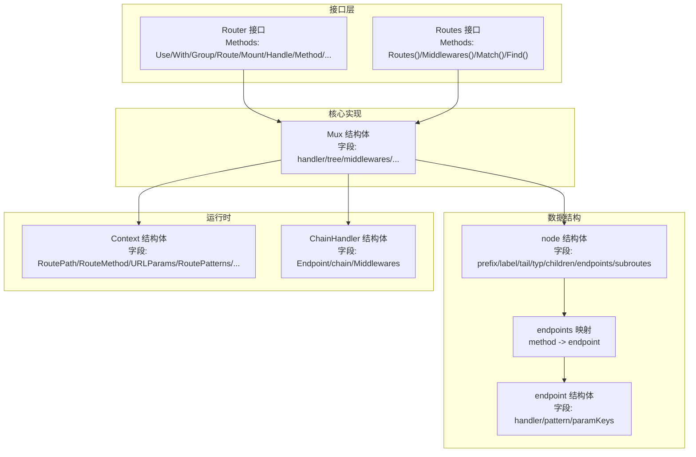
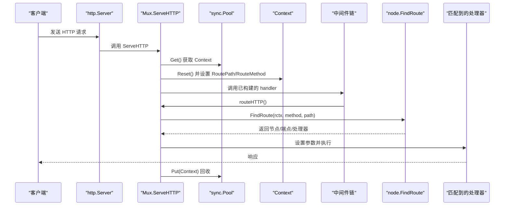
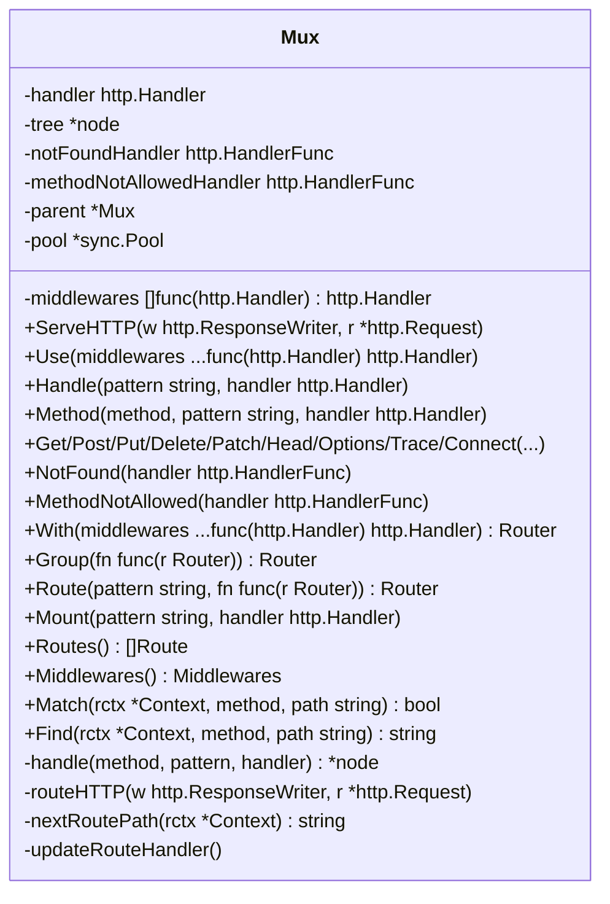
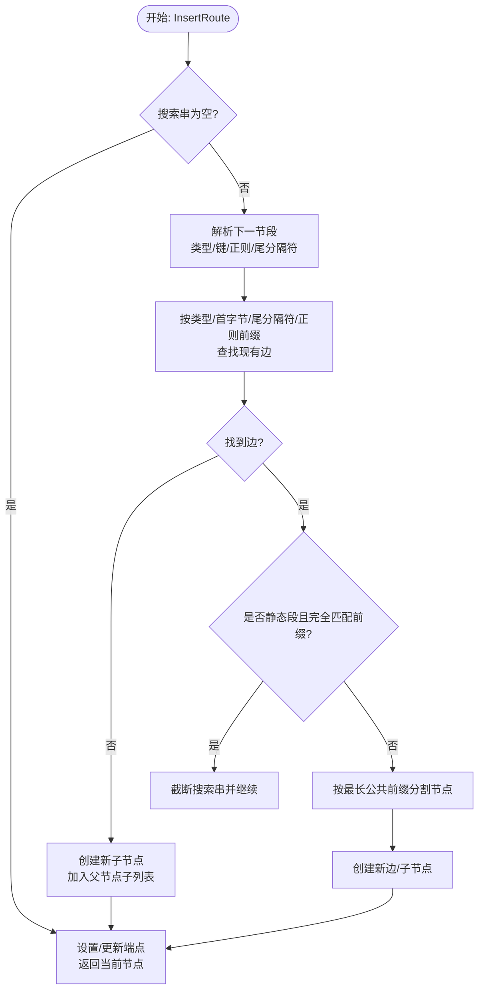
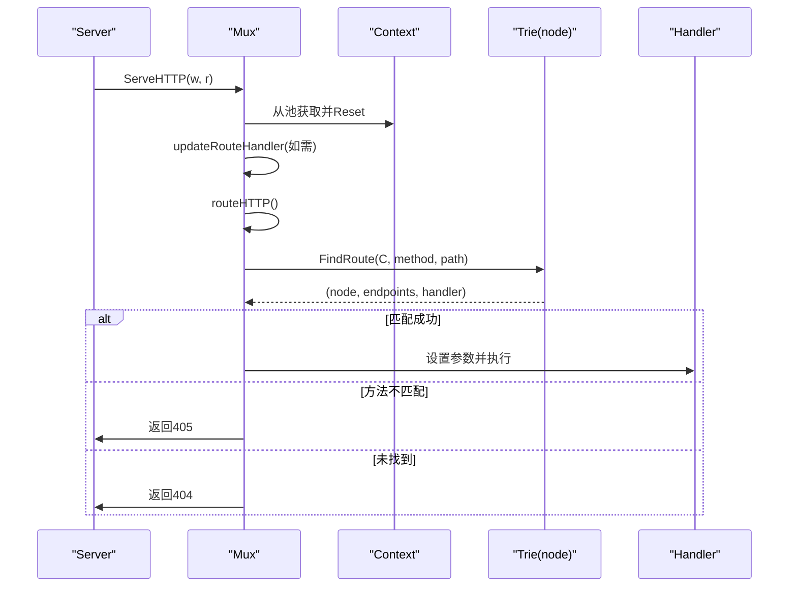
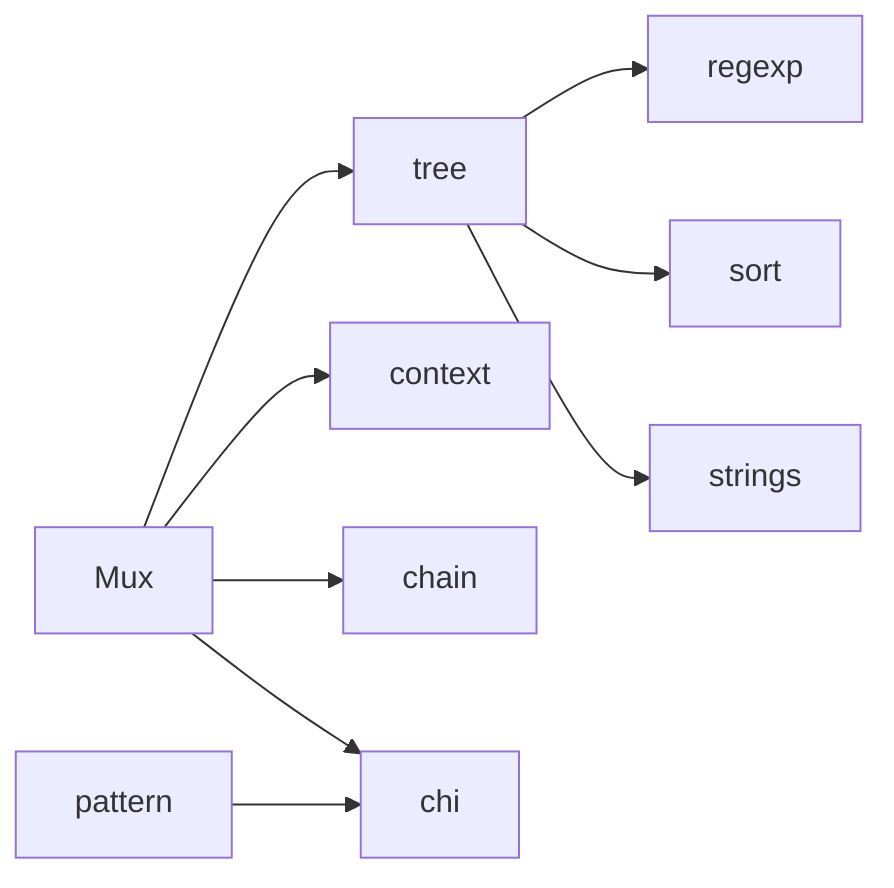

# 路由器设计

<cite>
**本文引用的文件列表**
- [chi.go](file://chi.go)
- [mux.go](file://mux.go)
- [tree.go](file://tree.go)
- [context.go](file://context.go)
- [chain.go](file://chain.go)
- [pattern.go](file://pattern.go)
- [hello-world/main.go](file://_examples/hello-world/main.go)
- [todos-resource/main.go](file://_examples/todos-resource/main.go)
</cite>

## 目录
1. [引言](#引言)
2. [项目结构](#项目结构)
3. [核心组件](#核心组件)
4. [架构总览](#架构总览)
5. [详细组件分析](#详细组件分析)
6. [依赖关系分析](#依赖关系分析)
7. [性能考量](#性能考量)
8. [故障排查指南](#故障排查指南)
9. [结论](#结论)
10. [附录](#附录)

## 引言
本文件系统性阐述 chi 框架基于 Patricia Radix Trie 的路由器架构设计，重点解释其如何通过树形结构实现高效路由匹配，覆盖精确匹配、参数化路由（如 /{id}）、正则表达式路由、通配符路由等能力；并深入分析 Mux 结构体在路由节点的插入、查找与遍历中的实现机制，说明 Router 接口与标准 net/http.Handler 的兼容性，以及 HTTP 请求从进入路由器到最终命中处理器的完整流程。最后给出性能优化建议，包括路由定义顺序与模式选择策略。

## 项目结构
chi 采用“接口 + 多实现”的分层设计：
- 接口层：定义 Router、Routes 等核心接口，统一对外暴露路由能力与中间件栈管理。
- 核心实现层：Mux 作为主要路由器实现，内部以 Radix Trie 存储路由节点。
- 数据结构层：node、endpoints、endpoint 等类型描述树节点、方法到处理器映射及参数键集合。
- 上下文与链路层：Context 负责请求生命周期内的路由上下文记录，ChainHandler 实现中间件链组合。
- 可选增强：pattern.go 在特定 Go 版本下启用 Request.Pattern 字段写入。

图表来源
- [chi.go](file://chi.go#L64-L138)
- [mux.go](file://mux.go#L21-L48)
- [tree.go](file://tree.go#L87-L128)
- [context.go](file://context.go#L42-L113)
- [chain.go](file://chain.go#L22-L33)

章节来源
- [chi.go](file://chi.go#L64-L138)
- [mux.go](file://mux.go#L21-L48)
- [tree.go](file://tree.go#L87-L128)
- [context.go](file://context.go#L42-L113)
- [chain.go](file://chain.go#L22-L33)

## 核心组件
- Router 接口：继承 http.Handler 与 Routes，提供中间件挂载、子路由组、路由挂载、方法路由注册等能力，确保与标准库无缝集成。
- Mux：实现 Router 接口，内部维护中间件栈、Radix Trie 树、上下文池、NotFound/MethodNotAllowed 处理器等，负责 ServeHTTP、路由注册、查找与遍历。
- node：Radix Trie 节点，按静态、参数、正则、通配四类节点组织，支持子路由嵌套与方法到处理器映射。
- Context：请求生命周期内记录路由路径、方法、参数、匹配模式串等信息，支持跨子路由器累积。
- ChainHandler：中间件链包装器，按声明顺序从后向前包裹端点处理器。

章节来源
- [chi.go](file://chi.go#L64-L138)
- [mux.go](file://mux.go#L21-L48)
- [tree.go](file://tree.go#L87-L128)
- [context.go](file://context.go#L42-L113)
- [chain.go](file://chain.go#L22-L33)

## 架构总览
chi 的请求处理链路如下：
- 标准库 http.Server 将请求交给 Mux.ServeHTTP。
- Mux 从 sync.Pool 获取 Context 并注入到请求上下文，随后调用已构建的中间件链 handler。
- 中间件链内部调用 Mux.routeHTTP 进入路由查找阶段。
- Mux.routeHTTP 解析请求方法与路径，委托给 Radix Trie 的 node.FindRoute 完成匹配。
- 匹配成功后，将参数回填到请求对象，执行对应处理器；否则根据上下文状态返回 405 或 404。

图表来源
- [mux.go](file://mux.go#L63-L92)
- [mux.go](file://mux.go#L440-L487)
- [tree.go](file://tree.go#L373-L396)

章节来源
- [mux.go](file://mux.go#L63-L92)
- [mux.go](file://mux.go#L440-L487)
- [tree.go](file://tree.go#L373-L396)

## 详细组件分析

### Mux 结构体与路由注册
- 字段职责
  - handler：已构建的中间件链 + 路由器自身，作为统一入口。
  - tree：Radix Trie 根节点，承载所有路由模式与处理器映射。
  - middlewares：全局中间件栈，按顺序包裹端点处理器。
  - notFoundHandler/methodNotAllowedHandler：自定义 404/405 处理器。
  - parent：用于子路由器挂载场景。
  - pool：Context 对象池，减少分配开销。
- 关键方法
  - ServeHTTP：复用 Context，注入到请求上下文，调用 handler。
  - Use：在未生成 handler 前追加中间件。
  - Handle/Method/各 HTTP 方法快捷注册：统一委托到内部 handle。
  - handle：在必要时构建 handler，再调用 tree.InsertRoute 注册节点。
  - routeHTTP：解析方法与路径，调用 FindRoute，回填参数并执行处理器或返回 405/404。

图表来源
- [mux.go](file://mux.go#L21-L48)
- [mux.go](file://mux.go#L100-L193)
- [mux.go](file://mux.go#L414-L487)

章节来源
- [mux.go](file://mux.go#L21-L48)
- [mux.go](file://mux.go#L100-L193)
- [mux.go](file://mux.go#L414-L487)

### Radix Trie 节点与路由匹配
- 节点类型
  - ntStatic：静态路径段。
  - ntParam：命名参数段，如 /{id}。
  - ntRegexp：带正则约束的参数段，如 /{id:\\d+}。
  - ntCatchAll：通配符段，如 /api/v1/*。
- 插入逻辑
  - InsertRoute：自顶向下扫描模式，按段类型拆分并创建子节点；对静态段进行最长公共前缀分割；对参数/正则/通配段分别设置 tail、prefix、rex 等属性。
  - addChild：递归将每一段加入树，必要时创建静态尾节点；对正则段编译并缓存。
- 查找逻辑
  - FindRoute：重置上下文，调用 findRoute 递归遍历；按节点类型优先匹配静态、参数、正则、通配；避免跨段匹配（如正则不跨越 /），并在叶子节点检查方法映射。
  - findRoute：按 children 分组遍历，静态段直接前缀匹配；参数/正则段按 tail 分隔计算匹配长度，正则段需满足匹配；通配段吞掉剩余路径。
- 遍历与导出
  - routes：深度遍历树，聚合同模式的不同方法处理器，输出标准化 Route 列表。
  - walk：通用遍历函数，供 Walk 使用。

图表来源
- [tree.go](file://tree.go#L138-L228)
- [tree.go](file://tree.go#L230-L316)

章节来源
- [tree.go](file://tree.go#L87-L128)
- [tree.go](file://tree.go#L138-L228)
- [tree.go](file://tree.go#L230-L316)
- [tree.go](file://tree.go#L373-L543)
- [tree.go](file://tree.go#L619-L682)

### 参数化、正则与通配符匹配细节
- 参数化路由（如 /{id}）
  - 节点类型为 ntParam；按 tail 分隔计算匹配长度，避免跨段匹配；将值压入 rctx.routeParams。
- 正则表达式路由（如 /{id:\\d+}）
  - 节点类型为 ntRegexp；编译正则并缓存于 node.rex；匹配时先按 tail 分隔，再用正则验证。
- 通配符路由（如 /api/v1/*）
  - 节点类型为 ntCatchAll；吞掉剩余路径，参数值即为剩余字符串；支持在子路由器中继续匹配。

章节来源
- [tree.go](file://tree.go#L418-L500)
- [tree.go](file://tree.go#L496-L500)
- [tree.go](file://tree.go#L684-L752)

### 路由优先级与冲突处理
- 节点排序与遍历顺序
  - nodes.Sort：按 label 升序排序；tailSort：将以 '/' 为 tail 的参数节点排到最后，确保更具体的静态路径优先匹配。
- 冲突处理
  - 当同一模式注册多个方法时，endpoints 会为每个方法保存独立端点；若仅存在通配或桩方法而无具体方法，则标记 methodNotAllowed 并收集允许的方法列表，最终返回 405。
  - Mount 场景：若挂载路径与已有路由冲突，会 panic 提示；子路由器未显式设置 404/405 时继承父路由器配置。
- 模式冲突检测
  - findPattern：在挂载前检测是否存在相同前缀模式，防止重复挂载。

章节来源
- [tree.go](file://tree.go#L782-L800)
- [tree.go](file://tree.go#L790-L799)
- [mux.go](file://mux.go#L294-L307)
- [mux.go](file://mux.go#L498-L507)
- [tree.go](file://tree.go#L577-L617)

### Router 接口与 net/http.Handler 兼容性
- Router 继承 http.Handler，因此可直接作为 http.Server 的处理器。
- Router 同时实现 Routes，提供路由树遍历、中间件查询、匹配/查找等能力，便于文档生成与调试。
- Mux 在 ServeHTTP 中通过 sync.Pool 复用 Context，避免每次请求额外分配；并通过 RouteCtxKey 将路由上下文注入到请求上下文中，供后续中间件与处理器使用。

章节来源
- [chi.go](file://chi.go#L64-L138)
- [mux.go](file://mux.go#L63-L92)
- [context.go](file://context.go#L37-L41)

### 请求到处理器的完整流程
- 入口：http.Server -> Mux.ServeHTTP -> 中间件链 -> Mux.routeHTTP
- 解析：从 Context 读取 RoutePath/RouteMethod，转换为内部 methodTyp
- 匹配：node.FindRoute 返回节点、端点映射与处理器
- 执行：回填 URL 参数到请求对象，设置 Request.Pattern（Go 1.23+），执行处理器
- 回退：若 methodNotAllowed 标记为真，返回 405；否则返回 404

图表来源
- [mux.go](file://mux.go#L63-L92)
- [mux.go](file://mux.go#L440-L487)
- [tree.go](file://tree.go#L373-L396)

章节来源
- [mux.go](file://mux.go#L63-L92)
- [mux.go](file://mux.go#L440-L487)
- [tree.go](file://tree.go#L373-L396)

### 示例与最佳实践
- Hello World 示例展示了基本路由注册与中间件使用。
- Todos Resource 示例展示了子路由挂载与资源化组织。

章节来源
- [hello-world/main.go](file://_examples/hello-world/main.go#L1-L22)
- [todos-resource/main.go](file://_examples/todos-resource/main.go#L1-L31)

## 依赖关系分析
- Mux 依赖
  - tree：路由树操作（插入、查找、遍历）
  - context：请求上下文与参数存储
  - chain：中间件链构建
  - chi：Router/Routes 接口定义
- node 依赖
  - regexp：正则编译与匹配
  - sort：节点排序
  - strings：前缀匹配、分隔符处理
- pattern.go（Go 1.23+）
  - supportsPattern：启用 Request.Pattern 写入
  - setPattern：将匹配到的路由模式写入请求对象

图表来源
- [mux.go](file://mux.go#L21-L48)
- [tree.go](file://tree.go#L1-L14)
- [pattern.go](file://pattern.go#L1-L17)

章节来源
- [mux.go](file://mux.go#L21-L48)
- [tree.go](file://tree.go#L1-L14)
- [pattern.go](file://pattern.go#L1-L17)

## 性能考量
- 节点排序与遍历
  - nodes.Sort + tailSort：确保静态段优先于参数段匹配，减少回溯；在高频路径上提升命中效率。
- Context 复用
  - sync.Pool：每请求一次 Context 获取/释放，降低 GC 压力。
- 中间件链构建时机
  - 仅在首次注册路由或显式 With/Group 时构建 handler，避免重复构建带来的额外成本。
- 模式设计建议
  - 将更具体的静态路径置于参数/正则之前，利用 tailSort 优先匹配静态段。
  - 避免在同一层级上同时出现大量参数段与正则段，减少分支探索。
  - 通配符仅在路由末尾使用，避免过宽的匹配导致回溯。
  - 合理组织子路由挂载，避免重复挂载与冲突检测失败。
- Go 版本特性
  - Go 1.23+ 下启用 Request.Pattern 写入，便于可观测与日志追踪。

章节来源
- [tree.go](file://tree.go#L782-L800)
- [tree.go](file://tree.go#L790-L799)
- [mux.go](file://mux.go#L63-L92)
- [mux.go](file://mux.go#L235-L257)
- [pattern.go](file://pattern.go#L1-L17)

## 故障排查指南
- 路由未命中
  - 检查是否正确设置 RoutePath/RouteMethod；确认方法是否受支持。
  - 使用 Mux.Find/Mux.Match 辅助定位匹配模式。
- 405 Method Not Allowed
  - 检查是否仅注册了通配或桩方法；查看 Context.methodsAllowed 收集到的允许方法。
- 404 Not Found
  - 确认路径大小写与尾斜杠；检查是否被中间件提前拦截。
- 挂载冲突
  - 挂载前会检测冲突并 panic；请调整挂载路径或移除重复挂载。
- 参数丢失
  - 确保在处理器中通过 URLParam/URLParamFromCtx 从 Context 读取参数；注意参数键唯一性校验。

章节来源
- [mux.go](file://mux.go#L353-L413)
- [mux.go](file://mux.go#L489-L529)
- [tree.go](file://tree.go#L577-L617)
- [context.go](file://context.go#L9-L23)

## 结论
chi 通过 Radix Trie 将路由模式以树形结构组织，结合节点类型细分与排序策略，实现了高效率的路径匹配。Mux 作为统一入口，将中间件链与路由查找解耦，既保持了与标准库的完全兼容，又提供了强大的路由能力与可观测性。开发者在设计路由时应遵循“静态优先于参数/正则、通配符置于末尾”的原则，并合理组织中间件与子路由，以获得最佳性能与可维护性。

## 附录
- 示例参考
  - 基础示例：[hello-world/main.go](file://_examples/hello-world/main.go#L1-L22)
  - 子路由挂载示例：[todos-resource/main.go](file://_examples/todos-resource/main.go#L1-L31)