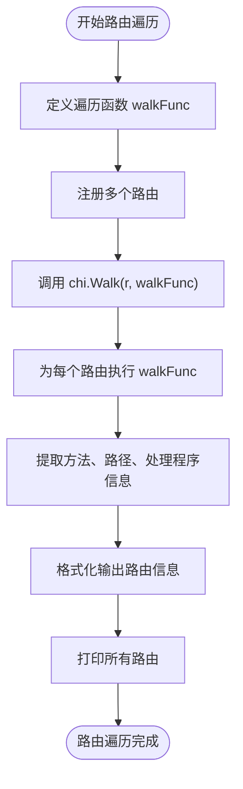
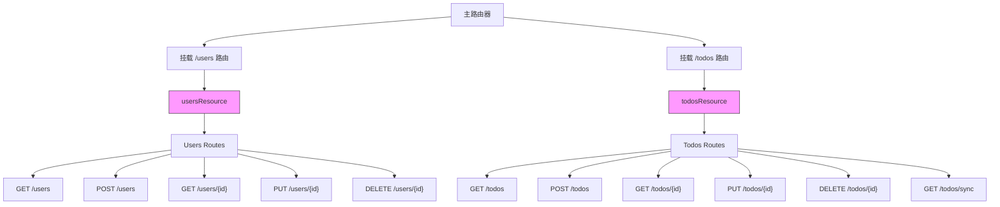
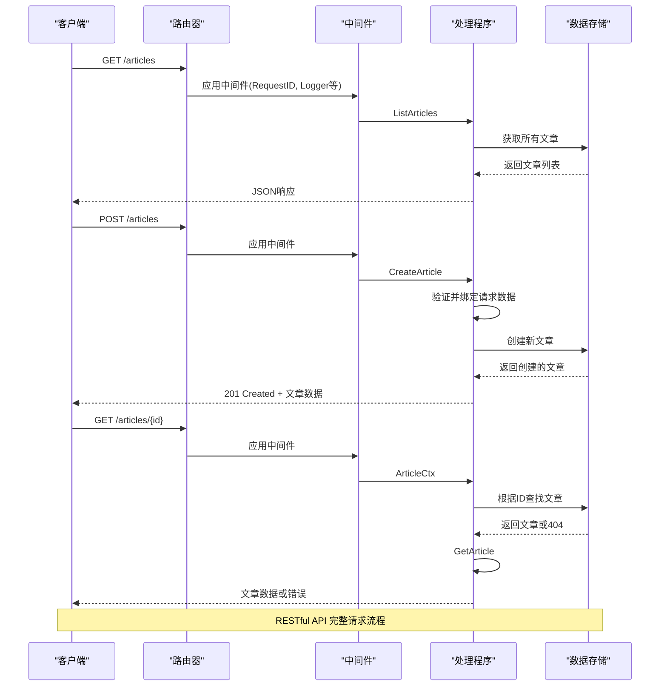
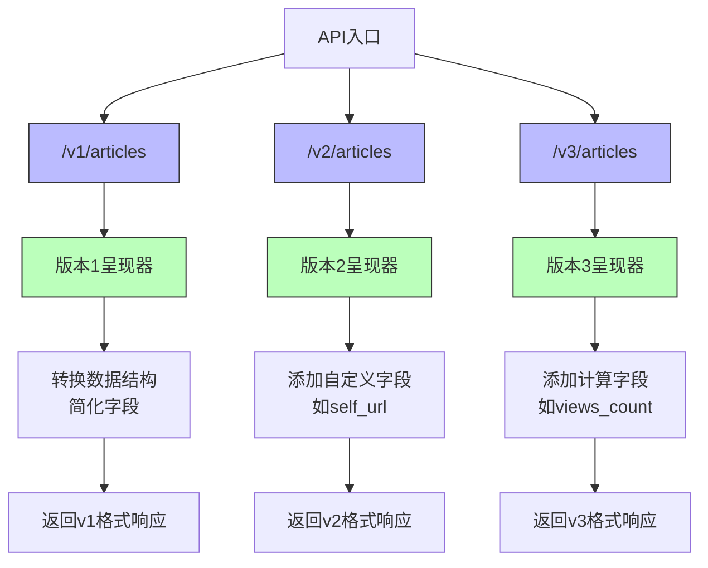
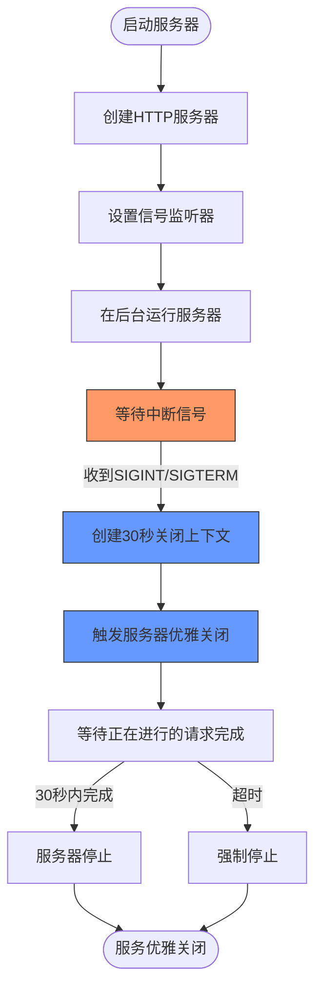

# 示例代码

<cite>
**本文档中引用的文件**  
- [hello-world/main.go](file://_examples/hello-world/main.go)
- [custom-handler/main.go](file://_examples/custom-handler/main.go)
- [fileserver/main.go](file://_examples/fileserver/main.go)
- [graceful/main.go](file://_examples/graceful/main.go)
- [custom-method/main.go](file://_examples/custom-method/main.go)
- [limits/main.go](file://_examples/limits/main.go)
- [logging/main.go](file://_examples/logging/main.go)
- [pathvalue/main.go](file://_examples/pathvalue/main.go)
- [router-walk/main.go](file://_examples/router-walk/main.go)
- [todos-resource/main.go](file://_examples/todos-resource/main.go)
- [todos-resource/todos.go](file://_examples/todos-resource/todos.go)
- [todos-resource/users.go](file://_examples/todos-resource/users.go)
- [rest/main.go](file://_examples/rest/main.go)
- [versions/main.go](file://_examples/versions/main.go)
- [versions/data/article.go](file://_examples/versions/data/article.go)
- [versions/data/errors.go](file://_examples/versions/data/errors.go)
- [versions/presenter/v1/article.go](file://_examples/versions/presenter/v1/article.go)
- [versions/presenter/v2/article.go](file://_examples/versions/presenter/v2/article.go)
- [versions/presenter/v3/article.go](file://_examples/versions/presenter/v3/article.go)
</cite>

## 目录
1. [简介](#简介)
2. [示例代码学习路径](#示例代码学习路径)
3. [基础示例](#基础示例)
   - [hello-world](#hello-world)
   - [custom-handler](#custom-handler)
   - [custom-method](#custom-method)
4. [路由与参数处理](#路由与参数处理)
   - [pathvalue](#pathvalue)
   - [router-walk](#router-walk)
5. [静态文件与资源管理](#静态文件与资源管理)
   - [fileserver](#fileserver)
   - [todos-resource](#todos-resource)
6. [REST API 示例](#rest-api-示例)
   - [rest](#rest)
7. [高级功能示例](#高级功能示例)
   - [versions](#versions)
   - [limits](#limits)
   - [logging](#logging)
8. [服务管理示例](#服务管理示例)
   - [graceful](#graceful)

## 简介
本指南系统性地介绍了 `chi` 框架的 `_examples` 目录下的所有示例代码，旨在为开发者提供一个从简单到复杂的完整学习路径。每个示例都展示了框架的特定功能和最佳实践，帮助开发者快速掌握 `chi` 路由器的各种用法。通过这些实际代码示例，开发者可以理解如何构建高效、可维护的 Go Web 应用程序。

## 示例代码学习路径
`chi` 框架的示例代码设计为一个渐进式的学习路径，从最基础的用法开始，逐步引入更复杂的功能和概念。建议开发者按照以下顺序学习：
1. 从 `hello-world` 开始，了解最基本的路由设置
2. 学习 `custom-handler` 和 `custom-method`，掌握自定义处理程序和HTTP方法
3. 探索 `pathvalue` 和 `router-walk`，理解参数提取和路由遍历
4. 实践 `fileserver` 和 `todos-resource`，学习静态文件服务和资源组织
5. 深入 `rest` 示例，掌握RESTful API设计
6. 研究 `versions`、`limits` 和 `logging`，了解高级功能
7. 最后学习 `graceful`，掌握优雅关闭等生产级特性

## 基础示例

### hello-world
`hello-world` 示例展示了 `chi` 框架最基础的用法，是学习的起点。它演示了如何创建一个简单的HTTP服务器，设置基本的路由，并返回响应。

该示例创建了一个路由器实例，注册了请求ID、日志和恢复中间件，然后定义了一个根路径的GET路由，返回"hello world"文本。最后，服务器在3333端口上启动。

**Section sources**
- [hello-world/main.go](file://_examples/hello-world/main.go#L1-L22)

### custom-handler
`custom-handler` 示例展示了如何创建自定义的HTTP处理程序类型。它演示了通过定义一个返回错误的函数类型，并实现 `ServeHTTP` 方法来创建可重用的错误处理逻辑。

该示例定义了一个 `Handler` 类型，它是一个返回错误的函数。通过实现 `ServeHTTP` 方法，这个类型可以作为HTTP处理程序使用。当处理程序返回错误时，会在中间件中统一处理，返回503状态码和"bad"响应。

**Section sources**
- [custom-handler/main.go](file://_examples/custom-handler/main.go#L1-L36)

### custom-method
`custom-method` 示例展示了如何注册和使用自定义的HTTP方法。它演示了 `chi` 框架的灵活性，允许开发者定义标准HTTP方法之外的自定义方法。

该示例在 `init` 函数中注册了 "LINK"、"UNLINK" 和 "WOOHOO" 三个自定义HTTP方法。然后使用 `MethodFunc` 方法为这些自定义方法创建路由处理程序。这展示了如何扩展框架以支持非标准的HTTP动词。

**Section sources**
- [custom-method/main.go](file://_examples/custom-method/main.go#L1-L34)

## 路由与参数处理

### pathvalue
`pathvalue` 示例展示了如何使用 `PathValue` 方法从URL路径中提取参数。它演示了现代Go 1.22+中推荐的参数提取方式。

该示例创建了一个路由 `/users/{userID}`，并在处理程序中使用 `r.PathValue("userID")` 方法提取路径参数。这种方法比传统的 `chi.URLParam` 更加类型安全和直观，是处理路径参数的现代方式。

**Section sources**
- [pathvalue/main.go](file://_examples/pathvalue/main.go#L1-L26)

### router-walk
`router-walk` 示例展示了如何遍历路由器中的所有路由。它演示了 `chi.Walk` 函数的使用，这对于生成文档、调试或分析路由结构非常有用。

该示例创建了一个包含多个路由的路由器，然后定义了一个 `walkFunc` 函数，该函数会被 `chi.Walk` 调用，为每个路由提供方法、路径和处理程序信息。这可以用于生成API文档或进行路由审计。

**Diagram sources**
- [router-walk/main.go](file://_examples/router-walk/main.go#L1-L43)

**Section sources**
- [router-walk/main.go](file://_examples/router-walk/main.go#L1-L43)

## 静态文件与资源管理

### fileserver
`fileserver` 示例展示了如何使用 `chi` 框架提供静态文件服务。它演示了如何创建一个文件服务器来服务本地文件系统中的文件。

该示例实现了一个 `FileServer` 辅助函数，该函数设置了一个HTTP文件服务器来服务指定目录中的文件。它处理了路径规范化、重定向和前缀剥离等细节，展示了如何安全地提供静态文件服务。

**Section sources**
- [fileserver/main.go](file://_examples/fileserver/main.go#L1-L66)

### todos-resource
`todos-resource` 示例展示了如何使用结构体和方法来组织相关的路由和处理程序。它演示了将相关功能分组为"资源"的最佳实践。

该示例定义了 `todosResource` 和 `usersResource` 两个结构体，每个结构体都有一个 `Routes` 方法返回配置好的路由器。然后使用 `Mount` 方法将这些子路由器挂载到主路由器上。这种模式有助于保持代码的模块化和可维护性。

**Diagram sources**
- [todos-resource/main.go](file://_examples/todos-resource/main.go#L1-L31)
- [todos-resource/todos.go](file://_examples/todos-resource/todos.go#L1-L54)
- [todos-resource/users.go](file://_examples/todos-resource/users.go#L1-L49)

**Section sources**
- [todos-resource/main.go](file://_examples/todos-resource/main.go#L1-L31)
- [todos-resource/todos.go](file://_examples/todos-resource/todos.go#L1-L54)
- [todos-resource/users.go](file://_examples/todos-resource/users.go#L1-L49)

## REST API 示例

### rest
`rest` 示例展示了如何构建一个完整的RESTful API服务。它演示了REST架构风格的最佳实践，包括资源路由、中间件使用、错误处理和数据呈现。

该示例实现了一个文章管理API，支持CRUD操作。它使用了 `Route` 方法创建嵌套路由，`With` 方法应用中间件，以及 `render` 包进行响应渲染。还展示了如何使用上下文中间件（如 `ArticleCtx`）来加载资源，并演示了API文档生成。

**Diagram sources**
- [rest/main.go](file://_examples/rest/main.go#L1-L521)

**Section sources**
- [rest/main.go](file://_examples/rest/main.go#L1-L521)

## 高级功能示例

### versions
`versions` 示例展示了如何实现API版本控制。它演示了使用不同的路由前缀（/v1, /v2, /v3）来支持多个API版本，并为每个版本提供不同的数据呈现。

该示例使用 `Route` 方法为每个API版本创建独立的路由组，并使用上下文中间件来标识当前API版本。然后根据版本号选择不同的数据呈现器（presenter），这些呈现器可以修改字段、添加计算属性或改变数据结构，从而实现向后兼容的API演进。

**Diagram sources**
- [versions/main.go](file://_examples/versions/main.go#L1-L155)
- [versions/presenter/v1/article.go](file://_examples/versions/presenter/v1/article.go#L1-L23)
- [versions/presenter/v2/article.go](file://_examples/versions/presenter/v2/article.go#L1-L31)
- [versions/presenter/v3/article.go](file://_examples/versions/presenter/v3/article.go#L1-L40)

**Section sources**
- [versions/main.go](file://_examples/versions/main.go#L1-L155)
- [versions/data/article.go](file://_examples/versions/data/article.go#L1-L10)
- [versions/data/errors.go](file://_examples/versions/data/errors.go#L1-L29)
- [versions/presenter/v1/article.go](file://_examples/versions/presenter/v1/article.go#L1-L23)
- [versions/presenter/v2/article.go](file://_examples/versions/presenter/v2/article.go#L1-L31)
- [versions/presenter/v3/article.go](file://_examples/versions/presenter/v3/article.go#L1-L40)

### limits
`limits` 示例展示了如何使用超时和节流中间件来控制请求处理。它演示了如何防止长时间运行的操作和限制并发请求数量。

该示例使用 `Timeout` 中间件设置2.5秒的处理超时，如果处理时间超过这个限制，请求将被取消并返回网关超时错误。还使用 `Throttle` 中间件限制特定路由的并发请求数量，只允许一个请求同时处理，其他请求将排队等待。

**Section sources**
- [limits/main.go](file://_examples/limits/main.go#L1-L93)

### logging
`logging` 示例展示了日志记录的配置和使用。虽然这个示例本身很简单，但它指向了更完整的日志实现。

该示例说明了如何使用 `github.com/go-chi/httplog` 包来实现结构化日志记录，基于Go 1.21+的 `log/slog` 包。它强调了在生产环境中使用结构化日志的重要性，以及如何与 `chi` 框架集成。

**Section sources**
- [logging/main.go](file://_examples/logging/main.go#L1-L10)

## 服务管理示例

### graceful
`graceful` 示例展示了如何实现优雅关闭。它演示了如何正确处理中断信号，允许正在进行的请求完成处理，而不是立即终止服务。

该示例创建了一个HTTP服务器，并设置了一个信号监听器来捕获SIGINT和SIGTERM信号。当收到这些信号时，服务器启动一个30秒的关闭上下文，允许正在进行的请求完成。这确保了服务的平滑重启和零停机部署。

**Diagram sources**
- [graceful/main.go](file://_examples/graceful/main.go#L1-L70)

**Section sources**
- [graceful/main.go](file://_examples/graceful/main.go#L1-L70)