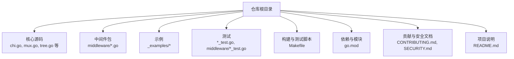
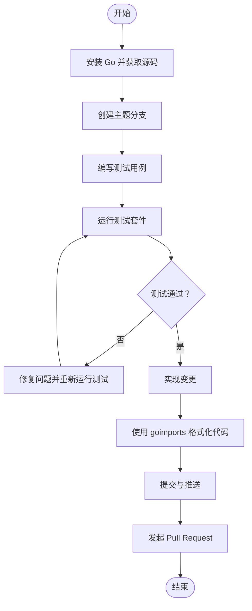
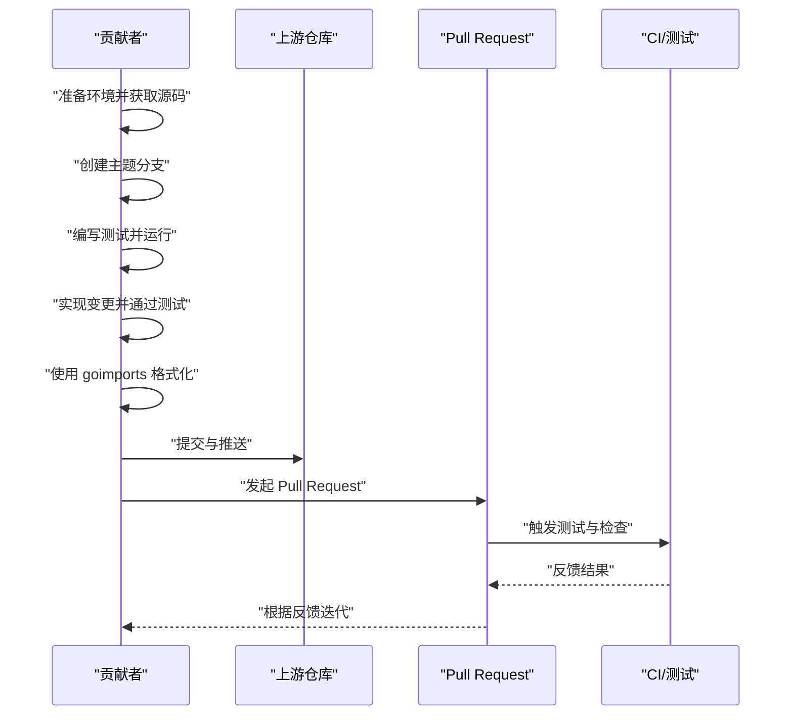
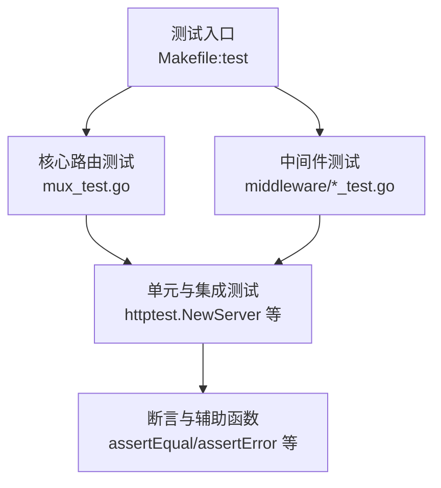
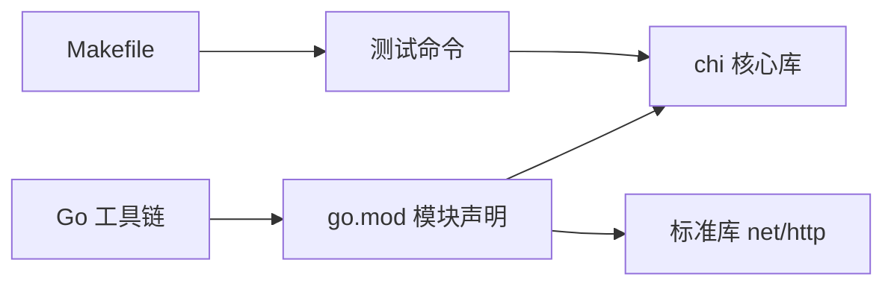

# 贡献指南

<cite>
**本文引用的文件**
- [CONTRIBUTING.md](file://CONTRIBUTING.md)
- [SECURITY.md](file://SECURITY.md)
- [README.md](file://README.md)
- [Makefile](file://Makefile)
- [go.mod](file://go.mod)
- [mux_test.go](file://mux_test.go)
- [middleware/middleware_test.go](file://middleware/middleware_test.go)
</cite>

## 目录
1. [简介](#简介)
2. [项目结构](#项目结构)
3. [核心组件](#核心组件)
4. [架构总览](#架构总览)
5. [详细组件分析](#详细组件分析)
6. [依赖关系分析](#依赖关系分析)
7. [性能与测试注意事项](#性能与测试注意事项)
8. [故障排查指南](#故障排查指南)
9. [结论](#结论)
10. [附录](#附录)

## 简介
本贡献指南面向希望为 chi 项目做出贡献的开发者，基于仓库中的贡献与安全文档，提供从环境准备到提交 Pull Request 的完整流程说明。重点涵盖：
- 如何设置本地开发环境
- 如何创建主题分支与编写测试
- 如何使用 goimports 进行代码格式化
- 如何运行测试套件
- 安全问题的正确上报渠道

本指南力求让新贡献者快速上手，同时确保代码质量与一致性。

## 项目结构
chi 是一个轻量、惯用且可组合的 Go HTTP 路由器，围绕标准库 net/http 构建，强调可维护性与模块化设计。项目包含核心路由器、中间件包、示例与测试等部分。贡献流程与测试执行主要围绕以下文件展开：
- 贡献与安全：CONTRIBUTING.md、SECURITY.md
- 测试与构建：Makefile、mux_test.go、middleware/middleware_test.go
- 依赖与版本：go.mod
- 项目概览与安装：README.md



图表来源
- [Makefile](file://Makefile#L1-L23)
- [go.mod](file://go.mod#L1-L200)

章节来源
- [README.md](file://README.md#L1-L120)
- [Makefile](file://Makefile#L1-L23)

## 核心组件
- 贡献流程（CONTRIBUTING.md）
  - 环境要求：安装 Go 并获取源码
  - 提交流程：Fork 仓库 -> 创建主题分支 -> 编写测试 -> 运行测试 -> 实现变更 -> 使用 goimports 格式化 -> 提交与推送 -> 发起 Pull Request
- 安全披露（SECURITY.md）
  - 通过 GitHub Security Advisory 的“Report a Vulnerability”页面进行负责任的披露
- 测试与构建（Makefile）
  - 提供统一的测试入口，分别运行核心路由测试与中间件测试，并启用竞态检测

章节来源
- [CONTRIBUTING.md](file://CONTRIBUTING.md#L1-L32)
- [SECURITY.md](file://SECURITY.md#L1-L6)
- [Makefile](file://Makefile#L1-L23)

## 架构总览
下图展示了贡献者在本地进行开发与测试的整体流程，从环境准备到提交 PR 的关键步骤。



图表来源
- [CONTRIBUTING.md](file://CONTRIBUTING.md#L13-L24)
- [Makefile](file://Makefile#L8-L19)

## 详细组件分析

### 贡献流程（从零到 PR）
- 环境准备
  - 安装 Go 并获取源码，切换工作目录
- 主题分支
  - Fork 仓库后创建独立分支，避免直接在主分支上修改
- 编写测试
  - 针对新增功能或修复问题，补充最小可复现的测试用例
- 运行测试
  - 使用统一的测试命令运行核心路由与中间件测试，并开启竞态检测
- 实现变更
  - 在保证测试通过的前提下，实现所需功能或修复
- 代码格式化
  - 使用 goimports 对新增代码进行格式化，确保遵循 Go 格式规范
- 提交与推送
  - 添加、提交并推送变更
- 发起 PR
  - 在 GitHub 上提交 Pull Request，等待审查与合并



图表来源
- [CONTRIBUTING.md](file://CONTRIBUTING.md#L13-L24)
- [Makefile](file://Makefile#L8-L19)

章节来源
- [CONTRIBUTING.md](file://CONTRIBUTING.md#L1-L32)
- [Makefile](file://Makefile#L8-L19)

### 安全问题报告流程
- 贡献者在发现安全漏洞时，应通过 GitHub Security Advisory 的“Report a Vulnerability”页面进行负责任的披露
- 项目维护团队会尽力确认并处理报告，感谢贡献者的协作

```mermaid
flowchart TD
A["发现安全问题"] --> B["访问 GitHub Security Advisory<br/>\"Report a Vulnerability\" 页面"]
B --> C["填写漏洞详情并提交"]
C --> D["维护团队接收与评估"]
D --> E["修复与发布计划"]
E --> F["公开披露与致谢"]
```

图表来源
- [SECURITY.md](file://SECURITY.md#L1-L6)

章节来源
- [SECURITY.md](file://SECURITY.md#L1-L6)

### 测试策略与最佳实践
- 测试组织
  - 核心路由测试集中在 mux_test.go 中，覆盖路由匹配、中间件栈、404/405 行为等
  - 中间件测试集中在 middleware/*_test.go 中，验证各中间件的行为与兼容性
- 测试工具与辅助函数
  - 使用 httptest.NewServer 搭建临时服务进行端到端测试
  - 使用自定义辅助函数封装请求发送与断言逻辑，提升可读性与可维护性
- 并发与竞态
  - Makefile 中的测试命令启用竞态检测，有助于提前发现并发问题
- 建议
  - 新增功能必须配套测试；修改现有行为需确保不破坏既有测试
  - 尽量使用最小化的测试用例，聚焦边界条件与错误路径



图表来源
- [Makefile](file://Makefile#L8-L19)
- [mux_test.go](file://mux_test.go#L1-L120)
- [middleware/middleware_test.go](file://middleware/middleware_test.go#L1-L155)

章节来源
- [Makefile](file://Makefile#L8-L19)
- [mux_test.go](file://mux_test.go#L1-L120)
- [middleware/middleware_test.go](file://middleware/middleware_test.go#L1-L155)

## 依赖关系分析
- 语言与工具
  - Go 版本与模块管理：go.mod
  - 构建与测试：Makefile
- 项目与生态
  - chi 与标准库 net/http 全面兼容，便于与生态中间件配合使用
  - README 提供了安装与使用说明，有助于贡献者理解项目定位与接口约定



图表来源
- [go.mod](file://go.mod#L1-L200)
- [Makefile](file://Makefile#L1-L23)
- [README.md](file://README.md#L20-L40)

章节来源
- [go.mod](file://go.mod#L1-L200)
- [Makefile](file://Makefile#L1-L23)
- [README.md](file://README.md#L20-L40)

## 性能与测试注意事项
- 竞态检测
  - Makefile 中的测试命令启用了竞态检测，建议在提交前始终运行完整测试套件
- 测试覆盖率
  - 建议在实现功能时同步补充测试，确保关键路径与边界条件被覆盖
- 性能回归
  - README 中提供了基准测试参考，贡献者可在必要时关注性能影响

章节来源
- [Makefile](file://Makefile#L8-L19)
- [README.md](file://README.md#L437-L468)

## 故障排查指南
- 测试失败
  - 使用 Makefile 的测试命令运行完整套件，定位失败用例并缩小问题范围
  - 若涉及中间件，参考 middleware/*_test.go 中的测试模式与断言方式
- 格式化问题
  - 使用 goimports 对新增代码进行格式化，确保导入顺序与缩进符合规范
- 并发问题
  - 启用竞态检测，优先修复竞态警告后再提交 PR

章节来源
- [Makefile](file://Makefile#L8-L19)
- [CONTRIBUTING.md](file://CONTRIBUTING.md#L18-L24)
- [middleware/middleware_test.go](file://middleware/middleware_test.go#L1-L155)

## 结论
通过遵循本指南，贡献者可以高效地完成从环境准备到提交 PR 的全流程。请务必重视测试质量与代码格式化，并在发现安全问题时走正确的披露渠道。我们欢迎每一位贡献者的加入，共同推动 chi 项目的演进与完善。

## 附录
- 快速参考
  - 环境准备：安装 Go 并获取源码
  - 分支策略：Fork 后创建主题分支
  - 测试：运行完整测试套件，确保通过
  - 格式化：使用 goimports
  - 提交：添加、提交并推送，发起 PR
  - 安全：通过 GitHub Security Advisory 报告

章节来源
- [CONTRIBUTING.md](file://CONTRIBUTING.md#L1-L32)
- [SECURITY.md](file://SECURITY.md#L1-L6)
- [Makefile](file://Makefile#L8-L19)