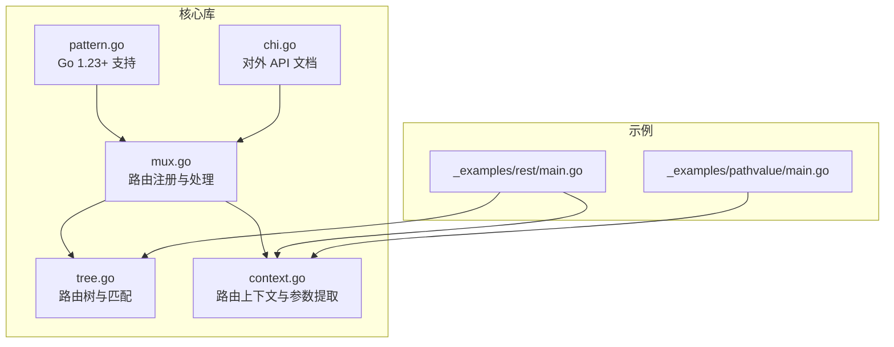
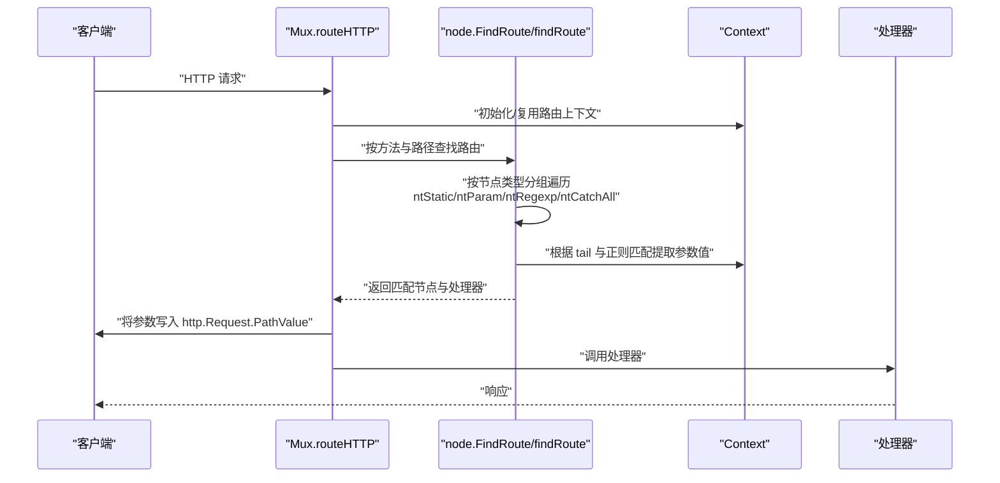
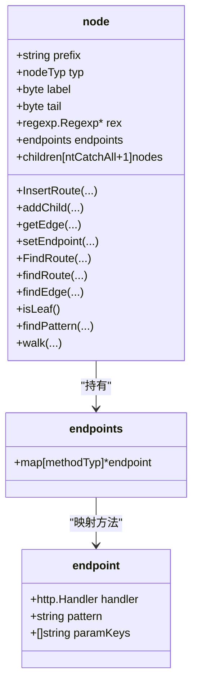
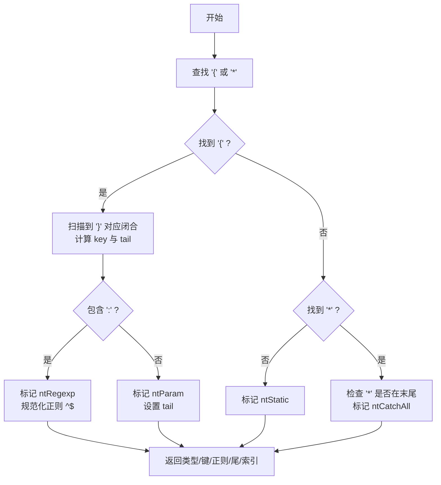
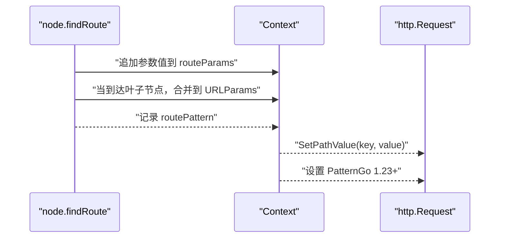
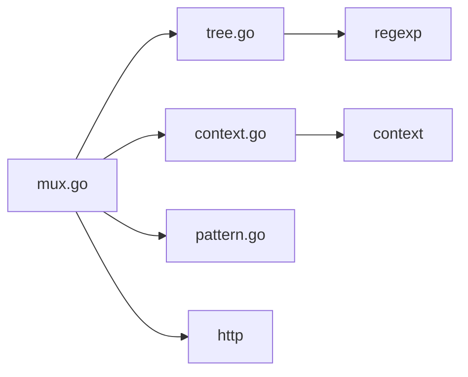

# 参数路由

<cite>
**本文引用的文件列表**
- [_examples/pathvalue/main.go](file://_examples/pathvalue/main.go)
- [_examples/rest/main.go](file://_examples/rest/main.go)
- [tree.go](file://tree.go)
- [context.go](file://context.go)
- [mux.go](file://mux.go)
- [chi.go](file://chi.go)
- [pattern.go](file://pattern.go)
- [tree_test.go](file://tree_test.go)
</cite>

## 目录
1. [简介](#简介)
2. [项目结构与入口](#项目结构与入口)
3. [核心组件](#核心组件)
4. [架构总览](#架构总览)
5. [详细组件分析](#详细组件分析)
6. [依赖关系分析](#依赖关系分析)
7. [性能考量](#性能考量)
8. [故障排查指南](#故障排查指南)
9. [结论](#结论)

## 简介
本篇文档围绕 chi 框架的“参数路由”能力进行系统化说明，重点覆盖两类路径参数：
- 简单参数：形如 /users/{userID}
- 正则表达式参数：形如 /{articleSlug:[a-z-]+}

文档结合示例程序与源码，解释如何在路由中定义参数、如何在处理器中通过 chi.URLParam() 提取参数值；并深入解析 tree.go 中 node 结构体的 ntParam 和 ntRegexp 类型，以及 patNextSegment 如何解析参数模式；同时说明参数尾字符（tail byte）在路由匹配中的作用，以及参数键的唯一性约束。

## 项目结构与入口
- 示例程序位于 _examples 目录，分别演示了基于 PathValue 的参数读取与基于 URLParam 的参数读取。
- 路由树与匹配逻辑集中在 tree.go；请求上下文与参数提取在 context.go；路由注册与处理流程在 mux.go；对外 API 文档在 chi.go；Go 1.23+ 对 Request.Pattern 的支持在 pattern.go；tree_test.go 包含大量参数路由行为的测试用例。

图表来源
- [_examples/pathvalue/main.go](file://_examples/pathvalue/main.go#L1-L26)
- [_examples/rest/main.go](file://_examples/rest/main.go#L1-L120)
- [tree.go](file://tree.go#L1-L120)
- [context.go](file://context.go#L1-L120)
- [mux.go](file://mux.go#L1-L120)
- [chi.go](file://chi.go#L1-L60)
- [pattern.go](file://pattern.go#L1-L17)

章节来源
- [chi.go](file://chi.go#L28-L55)

## 核心组件
- 路由树节点与类型
  - node.typ：静态、参数、正则、通配符
  - node.rex：正则节点的预编译正则
  - node.tail：参数节点的尾分隔符（决定参数边界）
- 参数解析与校验
  - patNextSegment：从路由模式中解析下一个段（参数/正则/通配符），返回类型、键、正则串、尾字节等
  - patParamKeys：收集模式中的参数键，检测重复键
- 匹配与参数回填
  - node.FindRoute/findRoute：按多维节点组遍历，依据 tail 与正则匹配提取参数值，填充到 Context.URLParams
  - mux.routeHTTP：将 Context 中的参数写入 http.Request.PathValue，并设置 Pattern（Go 1.23+）

章节来源
- [tree.go](file://tree.go#L78-L128)
- [tree.go](file://tree.go#L684-L770)
- [context.go](file://context.go#L1-L120)
- [mux.go](file://mux.go#L440-L487)
- [pattern.go](file://pattern.go#L1-L17)

## 架构总览
下图展示了从请求进入，到路由匹配、参数提取、处理器执行的关键流程。

图表来源
- [mux.go](file://mux.go#L440-L487)
- [tree.go](file://tree.go#L373-L543)
- [context.go](file://context.go#L1-L120)

## 详细组件分析

### 一、参数路由的两种形式与示例
- 简单参数
  - 定义：在路由中使用 {key} 即可捕获一段非 / 的片段
  - 示例：_examples/pathvalue/main.go 注册 /users/{userID}，处理器通过 r.PathValue("userID") 获取值
- 正则表达式参数
  - 定义：在路由中使用 {key:regexp}，其中 regexp 为 Go 正则（RE2），且 / 不会被匹配
  - 示例：_examples/rest/main.go 在 /articles 下注册 /{articleSlug:[a-z-]+}，处理器通过 chi.URLParam(r, "articleSlug") 获取值

章节来源
- [_examples/pathvalue/main.go](file://_examples/pathvalue/main.go#L10-L26)
- [_examples/rest/main.go](file://_examples/rest/main.go#L78-L93)
- [chi.go](file://chi.go#L28-L47)

### 二、参数键的唯一性约束
- 在路由模式中，每个参数键必须唯一，否则会触发 panic
- 检测位置：patParamKeys 遍历模式段时，若发现重复键即 panic

章节来源
- [tree.go](file://tree.go#L754-L770)
- [tree_test.go](file://tree_test.go#L194-L200)

### 三、参数尾字符（tail byte）的作用
- 尾字符用于界定参数的结束位置，不同类型的参数节点采用不同的尾字符策略：
  - ntParam：默认尾字符为 '/'，表示参数在遇到下一个 '/' 或路径末尾时结束
  - ntRegexp：同样以 tail 作为分隔，但会先用正则验证匹配片段
  - ntStatic：静态前缀不涉及 tail
  - ntCatchAll：'*' 作为通配符，匹配剩余路径（可包含 '/'）
- 匹配过程：findRoute 对于参数类节点，先定位到以 tail 为分隔的片段，再进行正则或分段校验，避免跨段匹配

章节来源
- [tree.go](file://tree.go#L418-L460)
- [tree.go](file://tree.go#L492-L543)

### 四、node 结构体与参数节点类型
- nodeTyp 常量
  - ntStatic：静态段
  - ntRegexp：正则参数段
  - ntParam：简单参数段
  - ntCatchAll：通配符段
- node 字段
  - typ：节点类型
  - prefix：静态前缀或正则字符串
  - rex：正则节点的预编译正则
  - tail：参数节点的尾分隔符
  - children：按类型分组的子节点数组
  - endpoints：方法到处理器的映射，包含 pattern 与 paramKeys

图表来源
- [tree.go](file://tree.go#L78-L128)
- [tree.go](file://tree.go#L114-L128)

章节来源
- [tree.go](file://tree.go#L78-L128)

### 五、参数模式解析：patNextSegment
- 功能：从路由模式中解析下一个段，返回：
  - nodeTyp：段类型（静态/参数/正则/通配符）
  - key：参数键
  - rexpat：正则表达式（带 ^$）
  - tail：尾分隔符
  - start/end：段在模式中的起止索引
- 关键点：
  - 解析 {key:rex} 形式的正则参数
  - 自动为正则添加 ^$ 边界
  - 通配符 '*' 必须位于模式末尾
  - 处理嵌套大括号（如 {a:{b}}）

图表来源
- [tree.go](file://tree.go#L684-L770)

章节来源
- [tree.go](file://tree.go#L684-L770)

### 六、参数提取与回填：findRoute 与 Context
- 匹配流程要点：
  - 静态段：按前缀匹配
  - 参数段：按 tail 分隔，避免跨段；正则段需正则匹配
  - 叶子节点：记录 paramKeys 与 pattern
- 参数回填：
  - Context.routeParams 保存当前子路由器的参数
  - Context.URLParams 合并父/子路由器参数
  - mux.routeHTTP 将参数写入 http.Request.PathValue，并在 Go 1.23+ 设置 Pattern

图表来源
- [tree.go](file://tree.go#L373-L543)
- [context.go](file://context.go#L1-L120)
- [mux.go](file://mux.go#L440-L487)
- [pattern.go](file://pattern.go#L1-L17)

章节来源
- [tree.go](file://tree.go#L373-L543)
- [context.go](file://context.go#L1-L120)
- [mux.go](file://mux.go#L440-L487)
- [pattern.go](file://pattern.go#L1-L17)

### 七、处理器中提取参数值
- 使用 r.PathValue("key")：适用于示例 _examples/pathvalue/main.go
- 使用 chi.URLParam(r, "key")：适用于示例 _examples/rest/main.go
- 两者均依赖 Context 中的参数栈，最终由 mux.routeHTTP 写入 http.Request

章节来源
- [_examples/pathvalue/main.go](file://_examples/pathvalue/main.go#L10-L26)
- [_examples/rest/main.go](file://_examples/rest/main.go#L121-L145)
- [context.go](file://context.go#L1-L40)
- [mux.go](file://mux.go#L440-L487)

## 依赖关系分析
- 组件耦合
  - mux.go 依赖 tree.go 进行路由注册与查找
  - mux.go 依赖 context.go 进行参数回填与上下文管理
  - tree.go 依赖 pattern.go（Go 1.23+）设置 Request.Pattern
- 外部依赖
  - Go 标准库 regexp 用于正则编译与匹配
  - Go 标准库 http/context 用于请求与上下文

图表来源
- [mux.go](file://mux.go#L1-L120)
- [tree.go](file://tree.go#L1-L120)
- [context.go](file://context.go#L1-L120)
- [pattern.go](file://pattern.go#L1-L17)

章节来源
- [mux.go](file://mux.go#L1-L120)
- [tree.go](file://tree.go#L1-L120)
- [context.go](file://context.go#L1-L120)
- [pattern.go](file://pattern.go#L1-L17)

## 性能考量
- 路由树为多维基数树（按节点类型分组），查找复杂度与路径长度成线性关系
- 正则参数需要预编译一次，匹配时仅做正则判断
- 参数尾分隔与静态前缀匹配减少无效分支，提高命中率
- Context 使用 sync.Pool 复用，降低每次请求的分配成本

## 故障排查指南
- “参数键重复”错误
  - 现象：注册路由时 panic
  - 原因：同一模式中存在重复的参数键
  - 处理：修改参数键，确保唯一
  - 参考：[tree.go](file://tree.go#L754-L770)，[tree_test.go](file://tree_test.go#L194-L200)
- “'}' 缺失”错误
  - 现象：注册路由时 panic
  - 原因：参数段未正确闭合
  - 处理：补全大括号
  - 参考：[tree.go](file://tree.go#L719-L721)
- “'*' 位置非法”错误
  - 现象：注册路由时 panic
  - 原因：通配符不在模式末尾
  - 处理：将 '*' 移至末尾或改用参数段
  - 参考：[tree.go](file://tree.go#L747-L751)
- “正则无效”错误
  - 现象：注册路由时 panic
  - 原因：参数段正则语法错误
  - 处理：修正正则表达式
  - 参考：[tree.go](file://tree.go#L254-L261)
- “处理器无法获取参数”
  - 现象：chi.URLParam()/r.PathValue() 返回空
  - 排查：确认路由是否匹配、参数键是否正确、处理器是否在参数写入后执行
  - 参考：[context.go](file://context.go#L1-L40)，[mux.go](file://mux.go#L440-L487)

章节来源
- [tree.go](file://tree.go#L254-L261)
- [tree.go](file://tree.go#L719-L751)
- [tree.go](file://tree.go#L754-L770)
- [context.go](file://context.go#L1-L40)
- [mux.go](file://mux.go#L440-L487)

## 结论
- chi 的参数路由通过“参数键 + 尾分隔符 + 可选正则”的组合，实现了灵活而高效的路径参数提取
- 简单参数与正则参数在路由树中分别对应 ntParam 与 ntRegexp，匹配时严格遵守 tail 边界，避免跨段误匹配
- 参数键唯一性约束保证了路由模式的可预测性与一致性
- 处理器通过 chi.URLParam() 或 r.PathValue() 获取参数，得益于 Context 的参数栈与 mux 的参数回填机制