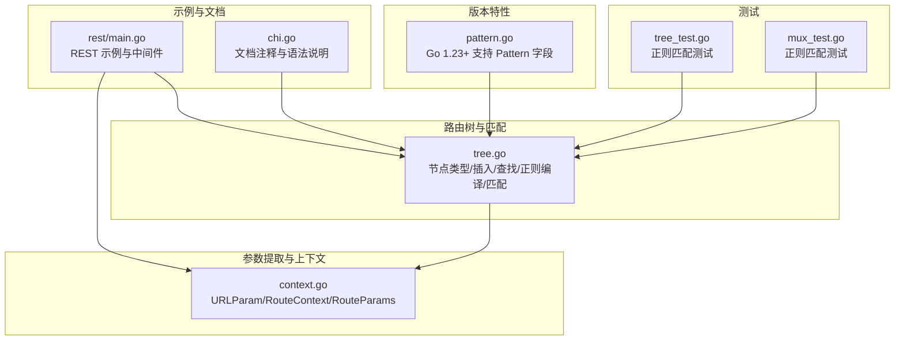
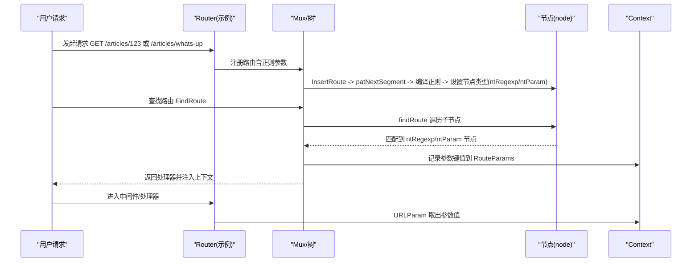
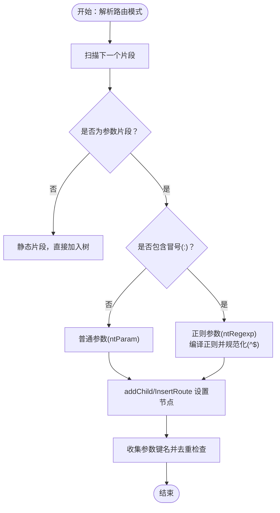
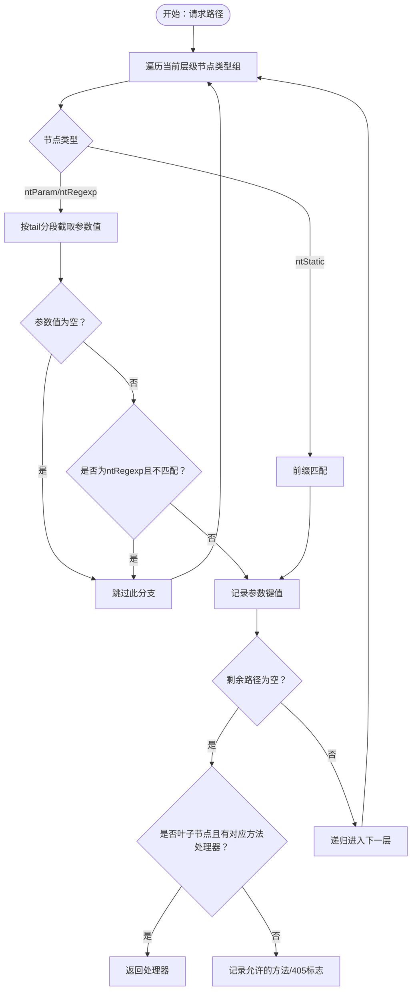
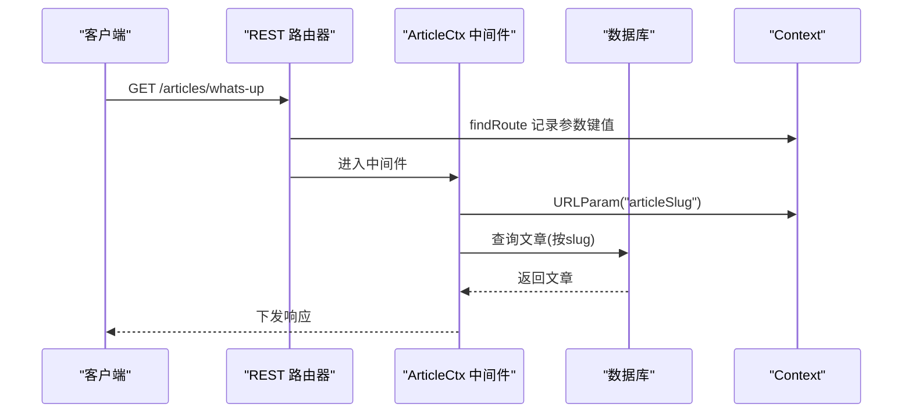
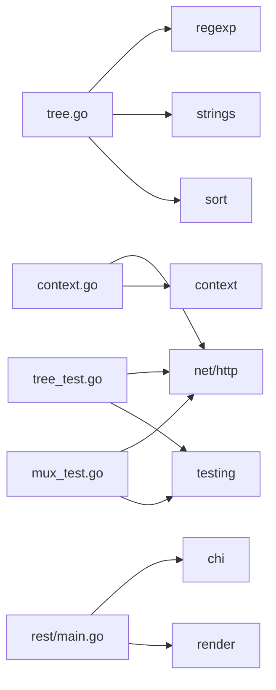

# 正则表达式参数

<cite>
**本文引用的文件列表**
- [_examples/rest/main.go](file://_examples/rest/main.go)
- [tree.go](file://tree.go)
- [pattern.go](file://pattern.go)
- [context.go](file://context.go)
- [chi.go](file://chi.go)
- [tree_test.go](file://tree_test.go)
- [mux_test.go](file://mux_test.go)
</cite>

## 目录
1. [简介](#简介)
2. [项目结构](#项目结构)
3. [核心组件](#核心组件)
4. [架构总览](#架构总览)
5. [详细组件分析](#详细组件分析)
6. [依赖关系分析](#依赖关系分析)
7. [性能考量](#性能考量)
8. [故障排查指南](#故障排查指南)
9. [结论](#结论)
10. [附录](#附录)

## 简介
本篇文档围绕 chi 框架的“正则表达式参数路由”能力展开，系统讲解如何通过形如 “/{articleSlug:[a-z-]+}” 的语法为路径参数添加约束；结合 _examples/rest/main.go 中的 ArticleCtx 中间件示例，演示参数提取与业务处理流程；深入解析 tree.go 中 TestTreeRegexMatchWholeParam 测试用例所体现的匹配逻辑，以及 node 结构体中的 ntRegexp 类型如何存储与匹配正则表达式；同时说明 pattern.go 中相关函数对正则表达式模式的解析、校验与规范化处理；最后讨论正则表达式参数在路由优先级与安全性方面的优势与注意事项。

## 项目结构
围绕正则表达式参数路由的相关代码主要分布在以下模块：
- 路由树与匹配：tree.go（节点类型、插入、查找、正则编译与匹配）
- 参数提取与上下文：context.go（URLParam、RouteContext、RouteParams）
- 文档与示例：chi.go（文档注释说明）、_examples/rest/main.go（REST 示例）
- Go 版本特性支持：pattern.go（Go 1.23+ Request.Pattern 字段支持）
- 单元测试：tree_test.go、mux_test.go（覆盖正则匹配、边界行为）

图表来源
- [tree.go](file://tree.go#L1-L120)
- [context.go](file://context.go#L1-L120)
- [chi.go](file://chi.go#L30-L55)
- [pattern.go](file://pattern.go#L1-L17)
- [tree_test.go](file://tree_test.go#L387-L450)
- [_examples/rest/main.go](file://_examples/rest/main.go#L74-L145)

章节来源
- [tree.go](file://tree.go#L1-L120)
- [context.go](file://context.go#L1-L120)
- [chi.go](file://chi.go#L30-L55)
- [pattern.go](file://pattern.go#L1-L17)
- [tree_test.go](file://tree_test.go#L387-L450)
- [_examples/rest/main.go](file://_examples/rest/main.go#L74-L145)

## 核心组件
- 节点类型与正则存储
  - ntRegexp：用于表示带正则约束的参数节点，包含正则表达式对象与前缀信息。
  - node.rex：保存编译后的正则表达式对象，用于运行时匹配。
- 路径解析与验证
  - patNextSegment：从路由模式中解析下一个片段，识别是否为正则参数，生成键名与规范化后的正则串（自动加 ^/$）。
  - patParamKeys：收集参数键名，检测重复键名并报错。
- 插入与匹配
  - addChild/InsertRoute：在构建路由树时编译正则并设置节点类型与 tail 分隔符。
  - findRoute：在查找阶段按节点类型分组遍历，对 ntRegexp 节点使用正则匹配，避免跨段匹配（防止 “/a/b” 误匹配到 “/ab”）。
- 参数提取
  - URLParam/RouteContext：从请求上下文的 RouteParams 中按键名取值，支持多层子路由器参数栈。

章节来源
- [tree.go](file://tree.go#L78-L128)
- [tree.go](file://tree.go#L230-L316)
- [tree.go](file://tree.go#L684-L752)
- [tree.go](file://tree.go#L398-L543)
- [context.go](file://context.go#L8-L23)
- [context.go](file://context.go#L97-L107)

## 架构总览
下图展示了从路由注册到请求匹配的关键流程，重点标注了正则表达式参数的解析、编译与匹配环节。

图表来源
- [_examples/rest/main.go](file://_examples/rest/main.go#L74-L145)
- [tree.go](file://tree.go#L230-L316)
- [tree.go](file://tree.go#L684-L752)
- [tree.go](file://tree.go#L398-L543)
- [context.go](file://context.go#L97-L107)

## 详细组件分析

### 组件A：正则表达式参数的注册与解析
- 模式解析
  - 在 patNextSegment 中，当检测到 “{key:rex}” 形式时，标记为 ntRegexp，并将键名与正则串返回；若存在正则串，会自动补全为以 ^ 开头、以 $ 结尾的完整匹配模式，确保整段匹配。
- 节点构建
  - addChild/InsertRoute 在构建节点时，对 ntRegexp 节点调用 regexp.Compile 编译正则；若正则非法，直接 panic，避免运行期错误。
- 参数键名收集
  - patParamKeys 对整个模式进行扫描，收集参数键名，若发现重复键名则 panic，保证路由定义的唯一性。

图表来源
- [tree.go](file://tree.go#L684-L752)
- [tree.go](file://tree.go#L230-L316)
- [tree.go](file://tree.go#L754-L770)

章节来源
- [tree.go](file://tree.go#L684-L752)
- [tree.go](file://tree.go#L230-L316)
- [tree.go](file://tree.go#L754-L770)

### 组件B：正则表达式参数的匹配逻辑
- 匹配策略
  - findRoute 对每个节点类型分组遍历，对 ntRegexp 节点使用 child.rex.MatchString 对截取到的参数值进行匹配；同时通过 tail 分隔符定位参数边界，避免跨段匹配（例如 “/a/b” 不应误匹配到 “/ab”）。
  - 若匹配失败或越界，回溯并尝试其他分支，直到找到匹配或穷尽所有可能。
- 测试用例体现
  - TestTreeRegexMatchWholeParam 展示了整段匹配的行为：仅当参数完整覆盖整个段落时才命中，例如 “/{id:[0-9]+}” 对 “/13” 命中，但对 “/a13”、“/13.jpg” 不命中；同时验证了 “/{x:.+}/foo” 和 “/{param:[0-9]*}/test” 的不同行为。

图表来源
- [tree.go](file://tree.go#L398-L543)
- [tree_test.go](file://tree_test.go#L387-L450)

章节来源
- [tree.go](file://tree.go#L398-L543)
- [tree_test.go](file://tree_test.go#L387-L450)

### 组件C：参数提取与中间件应用（REST 示例）
- REST 示例
  - 在 _examples/rest/main.go 中，使用 “/{articleSlug:[a-z-]+}” 定义带正则约束的 slug 参数；ArticleCtx 中间件通过 chi.URLParam 提取 articleID 或 articleSlug，并据此加载文章数据。
- 参数提取机制
  - URLParam/URLParamFromCtx 从 Context 的 RouteParams 中按键名反向查找最近一次匹配的值；多层子路由器会叠加参数栈，最终在处理器中可稳定获取到最新匹配的参数。

图表来源
- [_examples/rest/main.go](file://_examples/rest/main.go#L74-L145)
- [context.go](file://context.go#L97-L107)

章节来源
- [_examples/rest/main.go](file://_examples/rest/main.go#L74-L145)
- [context.go](file://context.go#L97-L107)

### 组件D：Go 版本特性与 Request.Pattern
- Go 1.23+ 支持
  - pattern.go 在满足条件时导出 supportsPattern 并提供 setPattern 将匹配到的路由模式写入 http.Request.Pattern，便于可观测与调试。

章节来源
- [pattern.go](file://pattern.go#L1-L17)

## 依赖关系分析
- 路由树与匹配
  - tree.go 依赖 regexp 库进行正则编译与匹配；依赖 strings 进行前缀与分隔符处理；依赖 sort 对节点排序。
- 参数提取
  - context.go 依赖 net/http 与 context，提供 URLParam/RouteContext 接口。
- 示例与测试
  - _examples/rest/main.go 依赖 chi 路由与 render；tree_test.go/mux_test.go 依赖 http 与 testing。

图表来源
- [tree.go](file://tree.go#L1-L20)
- [context.go](file://context.go#L1-L20)
- [_examples/rest/main.go](file://_examples/rest/main.go#L36-L51)
- [tree_test.go](file://tree_test.go#L1-L20)
- [mux_test.go](file://mux_test.go#L1580-L1641)

章节来源
- [tree.go](file://tree.go#L1-L20)
- [context.go](file://context.go#L1-L20)
- [_examples/rest/main.go](file://_examples/rest/main.go#L36-L51)
- [tree_test.go](file://tree_test.go#L1-L20)
- [mux_test.go](file://mux_test.go#L1580-L1641)

## 性能考量
- 正则编译成本
  - 在路由注册阶段编译正则，避免每次请求都进行编译；若正则非法会立即 panic，有助于尽早暴露问题。
- 匹配顺序与剪枝
  - findRoute 对节点类型分组遍历，并通过 tail 分隔符快速定位参数边界，减少无效匹配；对 ntRegexp 节点先做正则判定再递归，提升命中效率。
- 参数栈管理
  - RouteParams 使用切片追加与回溯，避免频繁分配；在多层子路由器场景下，URLParams 会叠加参数，建议在中间件链末端使用参数值，降低上下文污染风险。

[本节为通用性能讨论，无需列出具体文件来源]

## 故障排查指南
- 常见错误与定位
  - 正则非法：在 addChild/InsertRoute 中编译正则时 panic，检查 “{key:rex}” 的正则语法。
  - 重复参数键名：patParamKeys 检测到重复键名会 panic，修正路由定义。
  - 跨段误匹配：findRoute 明确避免跨段匹配，若期望跨段请使用通配符 “*”，否则确认路径设计是否合理。
- 调试建议
  - 利用 Go 1.23+ 的 Request.Pattern（pattern.go），在中间件或日志中输出匹配到的路由模式，辅助定位问题。
  - 在 _examples/rest/main.go 中，可在中间件中打印 URLParam 提取到的参数值，验证匹配是否符合预期。

章节来源
- [tree.go](file://tree.go#L254-L261)
- [tree.go](file://tree.go#L754-L770)
- [tree.go](file://tree.go#L418-L455)
- [pattern.go](file://pattern.go#L1-L17)
- [_examples/rest/main.go](file://_examples/rest/main.go#L121-L145)

## 结论
chi 的正则表达式参数路由通过“模式解析—编译—存储—匹配”的完整链路，实现了对路径参数的强约束与高精度匹配。配合中间件与上下文参数提取，开发者可以以最小代价实现语义清晰、安全可靠的 REST 路由。在实践中，建议：
- 明确参数边界与分隔符，避免跨段误匹配；
- 使用 ^/$ 规范化正则，确保整段匹配；
- 合理组织路由层次，利用子路由器叠加参数栈；
- 在 Go 1.23+ 环境启用 Request.Pattern，增强可观测性。

[本节为总结性内容，无需列出具体文件来源]

## 附录

### 语法与示例要点
- 语法说明（来自 chi.go 文档注释）
  - 普通参数：{name} 匹配到下一个 / 或 URL 末尾，不会匹配 /。
  - 正则参数：{name:rex} 使用 Go 的 RE2 语法，不会匹配 /。
  - 通配符：* 匹配剩余 URL，可匹配 /。
- 示例参考
  - REST 示例中使用 “/{articleSlug:[a-z-]+}” 定义 slug 参数，并在中间件中通过 chi.URLParam 提取。

章节来源
- [chi.go](file://chi.go#L30-L55)
- [_examples/rest/main.go](file://_examples/rest/main.go#L74-L145)