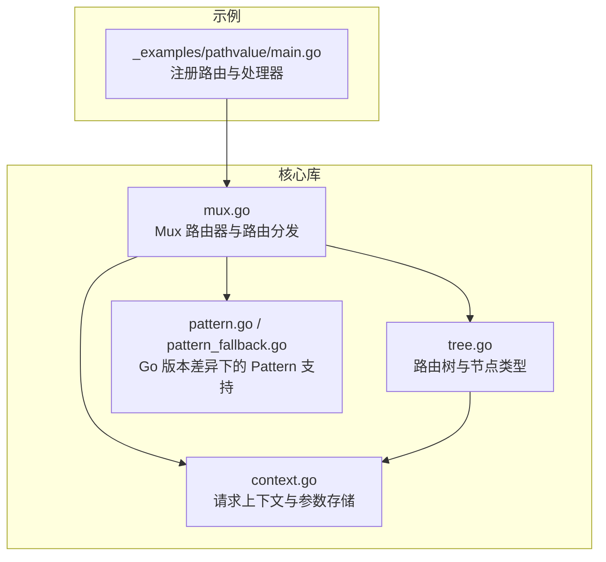
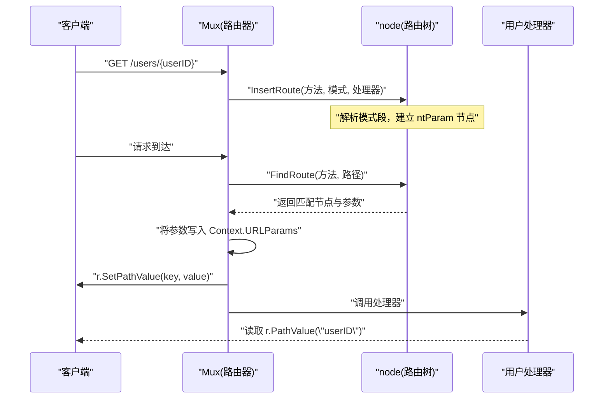
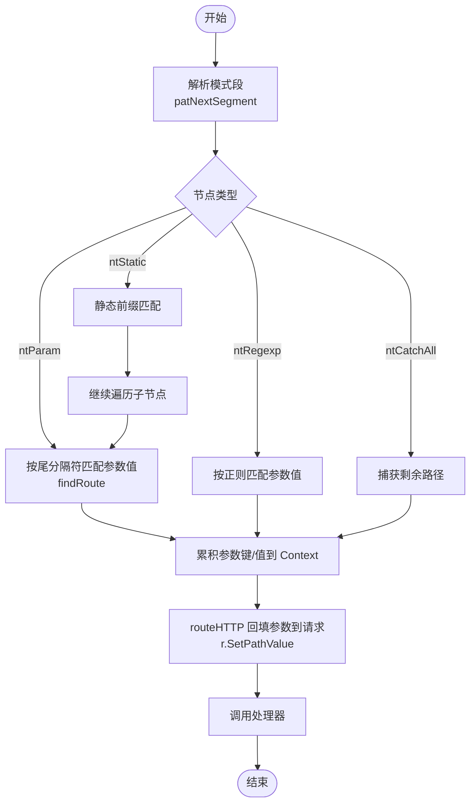
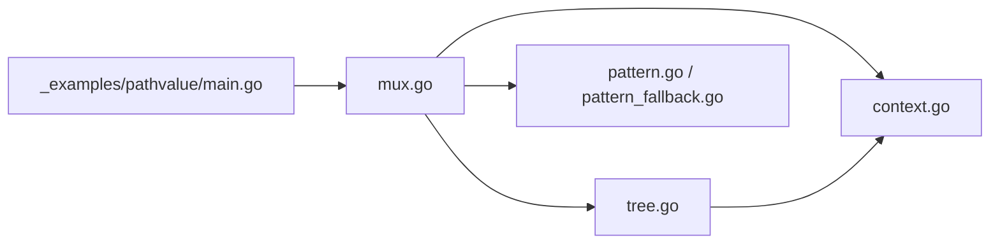

# 简单参数

<cite>
**本文引用的文件列表**
- [_examples/pathvalue/main.go](file://_examples/pathvalue/main.go)
- [mux.go](file://mux.go)
- [tree.go](file://tree.go)
- [context.go](file://context.go)
- [pattern.go](file://pattern.go)
- [pattern_fallback.go](file://pattern_fallback.go)
- [path_value_test.go](file://path_value_test.go)
</cite>

## 目录
1. [简介](#简介)
2. [项目结构](#项目结构)
3. [核心组件](#核心组件)
4. [架构总览](#架构总览)
5. [详细组件分析](#详细组件分析)
6. [依赖关系分析](#依赖关系分析)
7. [性能考量](#性能考量)
8. [故障排查指南](#故障排查指南)
9. [结论](#结论)
10. [附录](#附录)

## 简介
本篇文档围绕 chi 框架的“简单参数”路由能力展开，重点解释如何使用花括号语法（如 /users/{userID}）定义路径参数，并结合示例与源码剖析以下关键点：
- 如何在路由模式中声明简单参数（无正则限定），并在匹配后从请求上下文中提取参数值；
- mux.go 中 handle 方法如何将路由注册到内部树形结构；
- tree.go 中 node 结构体的 ntParam 类型在路由树中的作用；
- patNextSegment 函数如何解析简单参数段；
- 参数键的唯一性约束及其在 URLParam 提取中的重要性；
- 实际用法：通过 r.PathValue() 从请求上下文中获取参数值。

## 项目结构
- 示例程序位于 _examples/pathvalue/main.go，演示了如何在路由中使用 {key} 形式的简单参数，并在处理器中通过 r.PathValue("userID") 获取参数值。
- 路由核心逻辑集中在 mux.go、tree.go、context.go 中；Go 版本差异导致的 Pattern 字段支持由 pattern.go 与 pattern_fallback.go 分别提供。

图表来源
- [_examples/pathvalue/main.go](file://_examples/pathvalue/main.go#L1-L26)
- [mux.go](file://mux.go#L414-L487)
- [tree.go](file://tree.go#L78-L128)
- [context.go](file://context.go#L98-L107)
- [pattern.go](file://pattern.go#L8-L16)
- [pattern_fallback.go](file://pattern_fallback.go#L1-L18)

章节来源
- [mux.go](file://mux.go#L414-L487)
- [tree.go](file://tree.go#L78-L128)
- [context.go](file://context.go#L98-L107)
- [pattern.go](file://pattern.go#L8-L16)
- [pattern_fallback.go](file://pattern_fallback.go#L1-L18)

## 核心组件
- 路由注册与分发：Mux 在 handle 方法中将路由模式插入到树中，并在 routeHTTP 中完成匹配与参数回填。
- 路由树与节点类型：node 结构体包含多种节点类型，其中 ntParam 用于表示简单参数段。
- 请求上下文与参数存储：Context 维护 routeParams 与 URLParams，最终通过 r.SetPathValue 将参数写入请求对象。
- Go 版本差异：Go 1.23 及以上版本支持 Request.Pattern 字段，低版本通过空函数兼容。

章节来源
- [mux.go](file://mux.go#L414-L487)
- [tree.go](file://tree.go#L78-L128)
- [context.go](file://context.go#L98-L107)
- [pattern.go](file://pattern.go#L8-L16)
- [pattern_fallback.go](file://pattern_fallback.go#L1-L18)

## 架构总览
下面的时序图展示了从注册路由到请求处理的完整流程，包括参数解析与回填的关键步骤。

图表来源
- [mux.go](file://mux.go#L414-L487)
- [tree.go](file://tree.go#L373-L543)
- [context.go](file://context.go#L98-L107)

## 详细组件分析

### 简单参数的定义与示例
- 使用花括号语法定义简单参数，例如 /users/{userID}。该语法在示例中直接注册为 GET 路由。
- 处理器中通过 r.PathValue("userID") 获取参数值，示例展示了如何将参数写入响应。

章节来源
- [_examples/pathvalue/main.go](file://_examples/pathvalue/main.go#L10-L25)

### mux.go 中 handle 方法如何处理参数模式
- handle 方法负责将路由模式注册到树中。它会确保模式以斜杠开头，并在需要时构建中间件链，然后委托给 tree.InsertRoute 完成插入。
- 在路由分发阶段，routeHTTP 会根据当前请求路径与方法在树中查找匹配节点，成功后将 Context 中累积的参数写回到请求对象（r.SetPathValue），再调用匹配的处理器。

章节来源
- [mux.go](file://mux.go#L414-L487)

### tree.go 中 node 结构体的 ntParam 类型
- node 结构体定义了多种节点类型，其中 ntParam 表示简单参数段（如 {key}）。addChild 与 InsertRoute 会根据 patNextSegment 的解析结果创建对应类型的子节点。
- findRoute 在遍历过程中，对 ntParam 节点按尾分隔符进行匹配，避免跨路径段匹配，从而保证参数边界正确。

章节来源
- [tree.go](file://tree.go#L78-L128)
- [tree.go](file://tree.go#L230-L316)
- [tree.go](file://tree.go#L373-L543)

### patNextSegment 如何解析简单参数段
- patNextSegment 从模式字符串中识别下一个段的类型、键名、可选的正则表达式、尾分隔符等信息。
- 对于简单参数（如 {key}），会返回 ntParam 类型；对于带正则的参数（如 {key:reg}），会返回 ntRegexp 并预处理正则边界。
- 该函数还负责校验花括号闭合、通配符位置等规则，确保模式合法。

章节来源
- [tree.go](file://tree.go#L684-L752)

### 参数键的唯一性约束与 URLParam 提取
- patParamKeys 会在解析模式时收集所有参数键，并检查重复键，若发现重复将抛出错误。这保证了参数键在同一路由模式内的唯一性。
- 在路由匹配完成后，Context.URLParams 会累积所有匹配到的参数键与值。URLParam 与 r.PathValue 基于此结构进行提取，优先返回最近一次匹配到的同名参数值。

章节来源
- [tree.go](file://tree.go#L754-L770)
- [context.go](file://context.go#L98-L107)

### r.PathValue 的工作原理
- 在 routeHTTP 中，匹配成功后会遍历 Context.URLParams.Keys，逐个调用 r.SetPathValue(key, value)，将参数写入请求对象。
- 处理器可通过 r.PathValue(key) 获取对应参数值；同时，URLParam 与 URLParamFromCtx 提供从上下文或请求中直接读取参数的便捷方法。

章节来源
- [mux.go](file://mux.go#L468-L487)
- [context.go](file://context.go#L9-L23)

### Go 版本差异与 Pattern 字段
- 在 Go 1.23 及以上版本，Request.Pattern 字段可用；pattern.go 提供 supportsPattern 与 setPattern 实现。
- 在低版本或 tinygo 环境下，pattern_fallback.go 提供空实现，确保编译通过。

章节来源
- [pattern.go](file://pattern.go#L8-L16)
- [pattern_fallback.go](file://pattern_fallback.go#L1-L18)

### 流程图：参数匹配与回填

图表来源
- [tree.go](file://tree.go#L373-L543)
- [mux.go](file://mux.go#L468-L487)

## 依赖关系分析
- Mux 依赖 tree 实现路由树的插入与查找；
- Mux 在分发阶段依赖 context 存储与回填参数；
- pattern.go 与 pattern_fallback.go 提供不同 Go 版本下的 Pattern 支持；
- _examples/pathvalue/main.go 展示了简单参数的典型用法。

图表来源
- [_examples/pathvalue/main.go](file://_examples/pathvalue/main.go#L10-L25)
- [mux.go](file://mux.go#L414-L487)
- [tree.go](file://tree.go#L373-L543)
- [context.go](file://context.go#L98-L107)
- [pattern.go](file://pattern.go#L8-L16)
- [pattern_fallback.go](file://pattern_fallback.go#L1-L18)

## 性能考量
- 路由树采用多维基数树结构，按节点类型分组排序，查找效率高；
- 参数匹配时避免跨段匹配，减少无效分支；
- 通过 sync.Pool 复用 Context，降低分配开销；
- 在 Go 1.23+ 下设置 Request.Pattern 仅在支持的版本启用，避免不必要的运行时操作。

## 故障排查指南
- 路由模式不以斜杠开头：handle 会触发断言，需确保模式以 “/” 开头。
- 重复参数键：patParamKeys 会在检测到重复键时抛出错误，请检查路由模式中的参数命名。
- 通配符位置非法：patNextSegment 会对通配符位置进行校验，确保其位于模式末尾。
- 参数未匹配：findRoute 在参数为空或跨段匹配时会跳过该分支，确认路径与尾分隔符是否符合预期。
- Go 版本不支持 Pattern：在低版本环境中，Request.Pattern 不可用，但不影响参数提取与路由匹配。

章节来源
- [mux.go](file://mux.go#L414-L487)
- [tree.go](file://tree.go#L684-L752)
- [tree.go](file://tree.go#L754-L770)
- [pattern_fallback.go](file://pattern_fallback.go#L1-L18)

## 结论
- chi 的简单参数通过花括号语法定义，底层基于多维路由树与节点类型 ntParam 实现高效匹配；
- 参数键必须唯一，否则在注册阶段即会报错；
- 匹配成功后，参数会被累积到 Context，并在分发阶段回填至请求对象，处理器可通过 r.PathValue 获取；
- 代码对 Go 版本差异进行了兼容处理，确保在不同环境下均可正常工作。

## 附录
- 示例参考：_examples/pathvalue/main.go 展示了如何注册 /users/{userID} 路由并在处理器中读取参数值。
- 单元测试参考：path_value_test.go 验证了 r.PathValue 的行为，覆盖基本参数、多参数与通配符场景。

章节来源
- [_examples/pathvalue/main.go](file://_examples/pathvalue/main.go#L10-L25)
- [path_value_test.go](file://path_value_test.go#L1-L74)