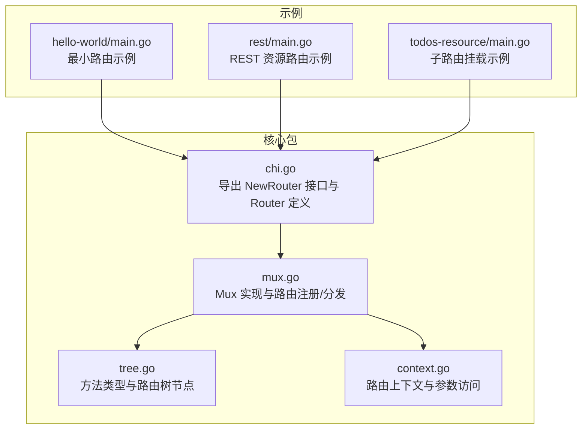
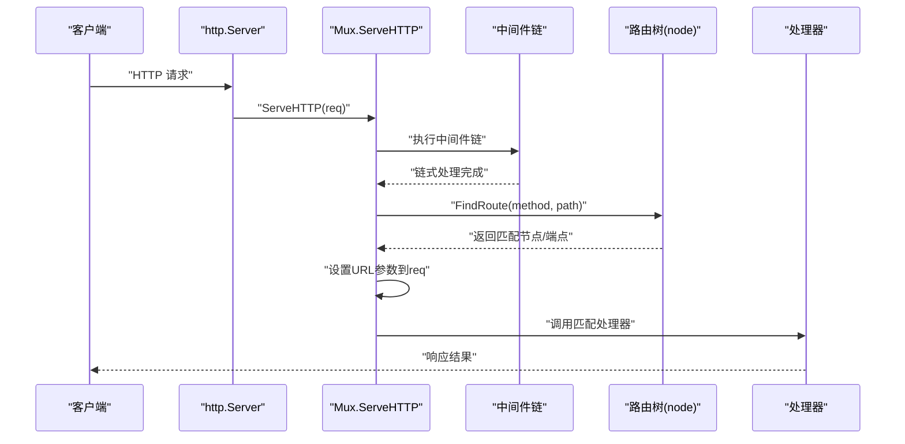
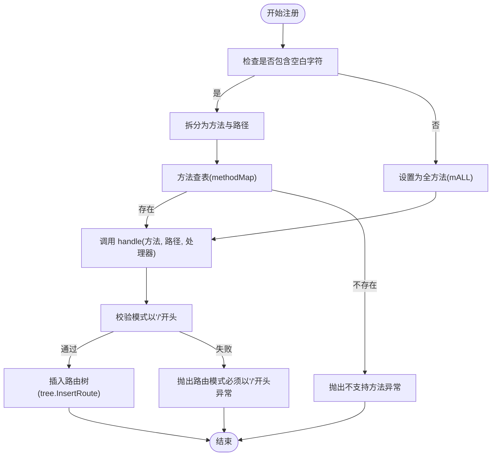
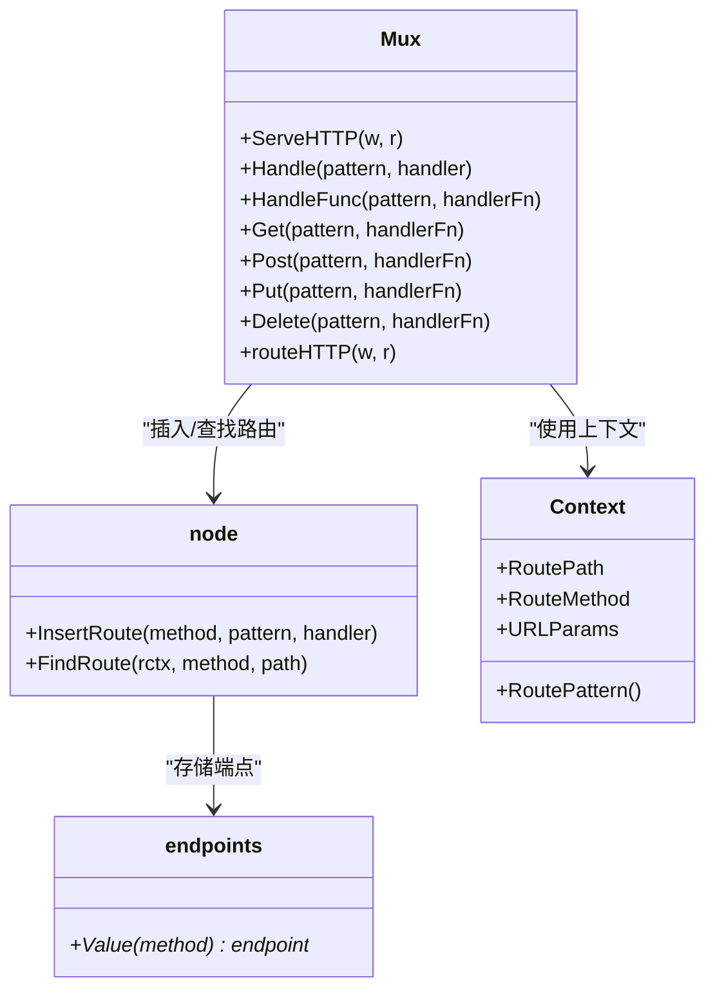
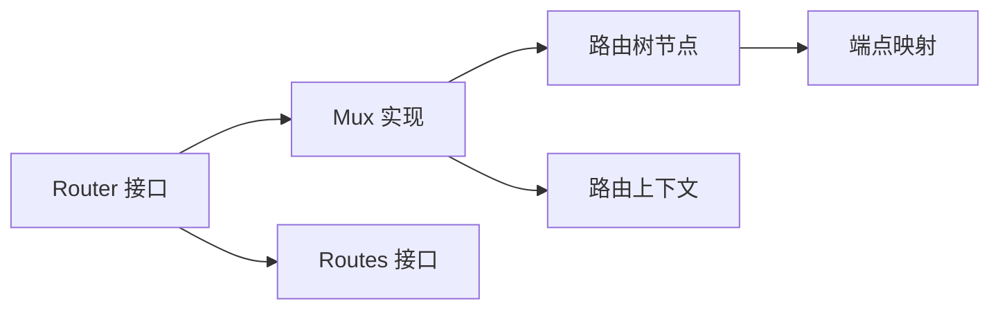

# 基本路由

<cite>
**本文引用的文件**
- [chi.go](file://chi.go)
- [mux.go](file://mux.go)
- [tree.go](file://tree.go)
- [context.go](file://context.go)
- [_examples/hello-world/main.go](file://_examples/hello-world/main.go)
- [_examples/rest/main.go](file://_examples/rest/main.go)
- [_examples/todos-resource/main.go](file://_examples/todos-resource/main.go)
- [README.md](file://README.md)
</cite>

## 目录
1. [简介](#简介)
2. [项目结构](#项目结构)
3. [核心组件](#核心组件)
4. [架构总览](#架构总览)
5. [详细组件分析](#详细组件分析)
6. [依赖关系分析](#依赖关系分析)
7. [性能考量](#性能考量)
8. [故障排查指南](#故障排查指南)
9. [结论](#结论)
10. [附录](#附录)

## 简介
本章节聚焦于 chi 路由器的基本路由能力，系统讲解如何使用 Get、Post、Put、Delete 等 HTTP 方法注册路由处理器，以及 Handle 和 HandleFunc 的适用场景；结合示例程序展示最简路由定义方式；明确路由模式必须以“/”开头的约束；深入解析 mux.go 中 handle 方法如何处理不同 HTTP 方法的路由注册与匹配流程；最后给出创建路由器实例并绑定基本路由的实际步骤指引。

## 项目结构
- chi 包提供核心路由器接口 Router 与实现 Mux，负责路由树构建、中间件链、请求分发与错误处理。
- tree.go 定义了基于前缀树（Radix Trie）的路由节点与方法映射，支撑高效路径匹配与参数提取。
- context.go 提供路由上下文与 URL 参数访问工具，贯穿请求生命周期。
- _examples 下包含多个示例，如 hello-world 展示最小化路由定义，rest 展示 REST 风格资源路由，todos-resource 展示子路由挂载。

图表来源
- [chi.go](file://chi.go#L59-L138)
- [mux.go](file://mux.go#L1-L120)
- [tree.go](file://tree.go#L16-L76)
- [context.go](file://context.go#L1-L80)
- [_examples/hello-world/main.go](file://_examples/hello-world/main.go#L1-L22)
- [_examples/rest/main.go](file://_examples/rest/main.go#L55-L112)
- [_examples/todos-resource/main.go](file://_examples/todos-resource/main.go#L14-L31)

章节来源
- [chi.go](file://chi.go#L59-L138)
- [mux.go](file://mux.go#L1-L120)
- [tree.go](file://tree.go#L16-L76)
- [context.go](file://context.go#L1-L80)
- [_examples/hello-world/main.go](file://_examples/hello-world/main.go#L1-L22)
- [_examples/rest/main.go](file://_examples/rest/main.go#L55-L112)
- [_examples/todos-resource/main.go](file://_examples/todos-resource/main.go#L14-L31)

## 核心组件
- Router 接口：定义路由核心方法（Get、Post、Put、Delete、Handle、HandleFunc、Method、MethodFunc 等），并提供中间件栈、子路由、挂载等能力。
- Mux：Router 的具体实现，内部维护路由树、中间件链、上下文池，负责 ServeHTTP、路由注册与分发。
- node/endpoints：路由树节点与端点映射，支持静态、参数、正则、通配符等段落，记录每个方法对应的处理器与参数键。
- Context：请求上下文，承载路由路径、匹配到的参数、允许的方法集合等信息。

章节来源
- [chi.go](file://chi.go#L66-L138)
- [mux.go](file://mux.go#L21-L92)
- [tree.go](file://tree.go#L87-L128)
- [context.go](file://context.go#L42-L110)

## 架构总览
下图展示了从请求进入路由器到最终匹配处理器的完整流程，包括中间件链、路由树查找与参数回填。

图表来源
- [mux.go](file://mux.go#L63-L120)
- [mux.go](file://mux.go#L440-L487)
- [tree.go](file://tree.go#L373-L400)

章节来源
- [mux.go](file://mux.go#L63-L120)
- [mux.go](file://mux.go#L440-L487)
- [tree.go](file://tree.go#L373-L400)

## 详细组件分析

### 路由器接口与基本方法
- NewRouter/Router：提供路由注册入口，支持任意标准库 http.Handler/HandlerFunc。
- HTTP 方法快捷注册：Get、Post、Put、Delete、Patch、Head、Options、Trace、Connect 等。
- 通用注册：Handle(pattern, handler) 注册所有方法；HandleFunc 同理。
- 自定义方法：Method(method, pattern, handler) 与 MethodFunc 支持自定义或扩展方法名。

章节来源
- [chi.go](file://chi.go#L66-L138)
- [mux.go](file://mux.go#L107-L189)

### 路由模式约束与注册流程
- 模式约束：路由模式必须以“/”开头，否则在 handle 中触发异常。
- 注册入口：Handle/HandleFunc 先尝试解析“方法+空格+路径”的复合模式；否则统一注册为全方法（mALL）。
- 方法映射：通过 methodMap 将字符串方法映射为内部常量，不支持的方法会抛出异常。
- 内部插入：调用 tree.InsertRoute 将处理器与参数键写入路由树。

图表来源
- [mux.go](file://mux.go#L107-L189)
- [mux.go](file://mux.go#L414-L437)
- [tree.go](file://tree.go#L34-L56)

章节来源
- [mux.go](file://mux.go#L107-L189)
- [mux.go](file://mux.go#L414-L437)
- [tree.go](file://tree.go#L34-L56)

### 路由树与匹配机制
- 方法类型：mALL、mCONNECT、mDELETE、mGET、mHEAD、mOPTIONS、mPATCH、mPOST、mPUT、mTRACE。
- 节点类型：静态、参数、正则、通配符；参数节点按尾分隔符排序，优先匹配更严格的分支。
- 匹配过程：按段遍历，静态段精确匹配，参数/正则段按尾分隔与正则约束匹配，通配符捕获剩余路径。
- 参数回填：匹配成功后将参数键值写入请求上下文，供后续处理器读取。

图表来源
- [mux.go](file://mux.go#L21-L92)
- [mux.go](file://mux.go#L414-L487)
- [tree.go](file://tree.go#L87-L128)
- [context.go](file://context.go#L42-L110)

章节来源
- [mux.go](file://mux.go#L21-L92)
- [mux.go](file://mux.go#L414-L487)
- [tree.go](file://tree.go#L87-L128)
- [context.go](file://context.go#L42-L110)

### 示例：最简单路由定义
- hello-world：创建路由器、添加少量中间件、注册根路径 GET 处理器、启动服务。
- rest：演示资源路由、子路由、挂载与参数提取。
- todos-resource：演示子路由挂载到父路由器。

章节来源
- [_examples/hello-world/main.go](file://_examples/hello-world/main.go#L10-L21)
- [_examples/rest/main.go](file://_examples/rest/main.go#L55-L112)
- [_examples/todos-resource/main.go](file://_examples/todos-resource/main.go#L14-L31)

### 使用建议与最佳实践
- 优先使用 HTTP 方法快捷注册（Get、Post、Put、Delete 等）以明确语义。
- 需要同时支持多种方法时使用 Handle；需要支持自定义方法时使用 Method。
- 路由模式必须以“/”开头，避免运行时异常。
- 使用中间件链对请求进行预处理（日志、超时、鉴权等），并在处理器中通过 URLParam 访问参数。

章节来源
- [chi.go](file://chi.go#L66-L138)
- [README.md](file://README.md#L175-L250)

## 依赖关系分析
- Router 接口依赖 http.Handler 与 Routes 接口，确保与标准库完全兼容。
- Mux 实现 Router，内部持有 node 路由树与 Context 池，ServeHTTP 串联中间件与路由树。
- tree.go 定义方法类型与节点结构，提供 InsertRoute 与 FindRoute。
- context.go 提供 URLParam 访问与上下文封装。

图表来源
- [chi.go](file://chi.go#L66-L138)
- [mux.go](file://mux.go#L21-L92)
- [tree.go](file://tree.go#L87-L128)
- [context.go](file://context.go#L42-L110)

章节来源
- [chi.go](file://chi.go#L66-L138)
- [mux.go](file://mux.go#L21-L92)
- [tree.go](file://tree.go#L87-L128)
- [context.go](file://context.go#L42-L110)

## 性能考量
- 路由树采用前缀树（Radix Trie）结构，查找效率高，适合大规模路由与高频请求。
- 使用 sync.Pool 复用路由上下文，减少分配开销。
- 中间件链在首次注册路由前构建一次，之后不再允许新增中间件，保证运行期稳定与性能。

章节来源
- [mux.go](file://mux.go#L63-L92)
- [mux.go](file://mux.go#L509-L516)
- [README.md](file://README.md#L28-L40)

## 故障排查指南
- 路由模式未以“/”开头：在 handle 中触发异常，修正为以“/”开头的模式。
- 不支持的 HTTP 方法：Method 查表失败抛出异常，确认方法名大小写与标准一致。
- 405 Method Not Allowed：路由命中但方法不匹配，检查已注册方法或设置 MethodNotAllowed 处理器。
- 404 Not Found：无匹配路由，检查路径拼写或设置 NotFound 处理器。
- 子路由挂载冲突：Mount 时若已有相同模式会 panic，确保挂载路径唯一。

章节来源
- [mux.go](file://mux.go#L414-L437)
- [mux.go](file://mux.go#L125-L139)
- [mux.go](file://mux.go#L458-L487)
- [mux.go](file://mux.go#L195-L213)
- [mux.go](file://mux.go#L215-L233)
- [mux.go](file://mux.go#L282-L340)

## 结论
chi 的基本路由能力以简洁的接口与高效的路由树为核心，既满足最小化使用场景（如 hello-world），也能支撑复杂的 REST 服务（如 rest）。掌握 Get、Post、Put、Delete 等方法注册、Handle/HandleFunc 的适用场景、路由模式以“/”开头的约束，以及 mux.handle 的注册与匹配流程，即可快速搭建高性能、可维护的 HTTP 服务。

## 附录

### 快速上手：创建路由器并绑定基本路由
- 创建路由器实例：参考 [NewRouter](file://chi.go#L59-L62)。
- 添加中间件：参考 [_examples/hello-world/main.go](file://_examples/hello-world/main.go#L10-L21)。
- 注册路由：
  - GET 根路径：参考 [_examples/hello-world/main.go](file://_examples/hello-world/main.go#L16-L18)。
  - REST 资源路由：参考 [_examples/rest/main.go](file://_examples/rest/main.go#L78-L93)。
  - 子路由挂载：参考 [_examples/todos-resource/main.go](file://_examples/todos-resource/main.go#L22-L29)。
- 启动服务：参考 [_examples/hello-world/main.go](file://_examples/hello-world/main.go#L20-L21)。

章节来源
- [chi.go](file://chi.go#L59-L62)
- [_examples/hello-world/main.go](file://_examples/hello-world/main.go#L10-L21)
- [_examples/rest/main.go](file://_examples/rest/main.go#L78-L93)
- [_examples/todos-resource/main.go](file://_examples/todos-resource/main.go#L22-L29)