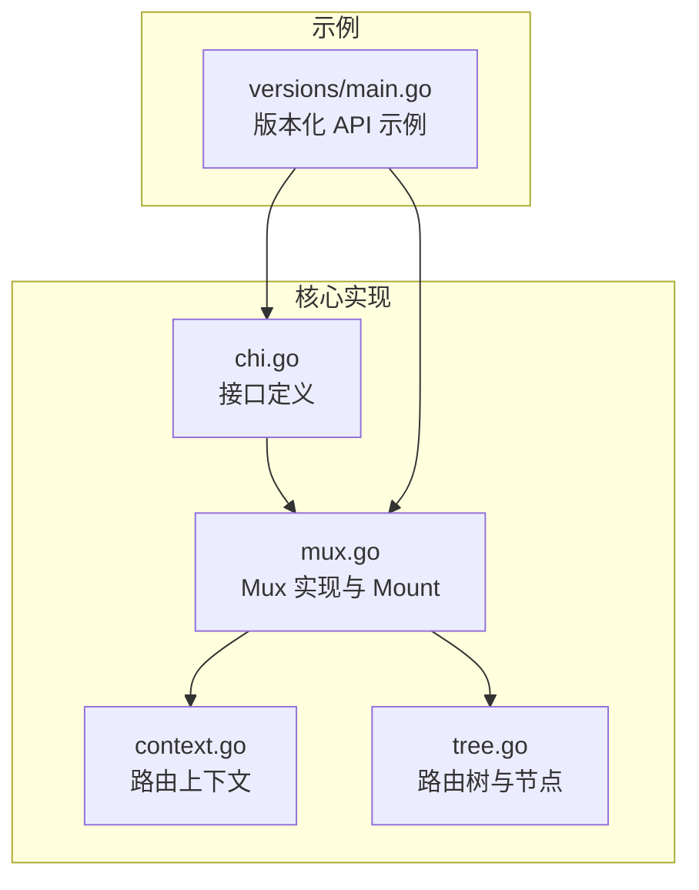
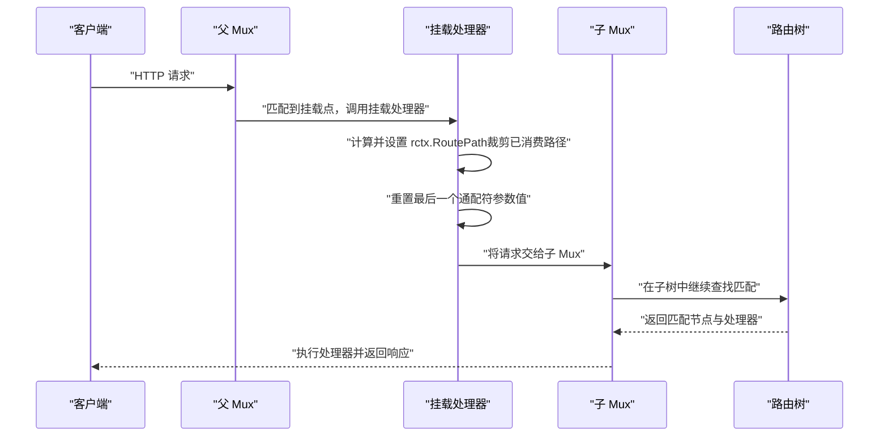
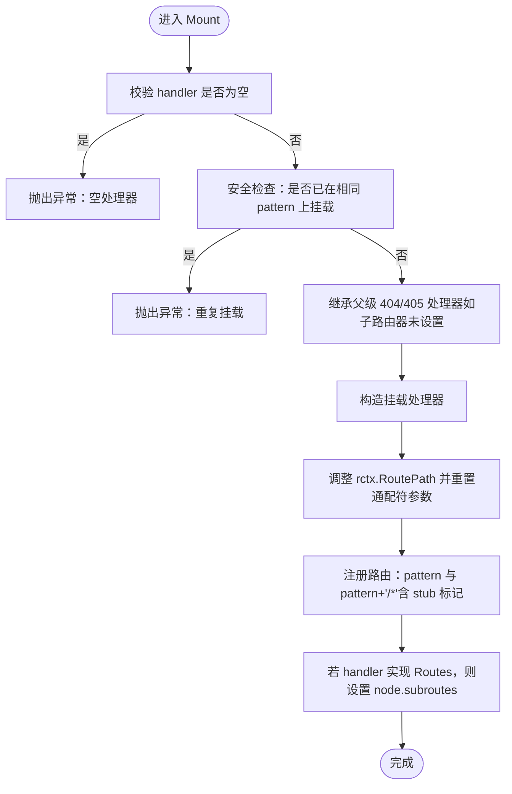
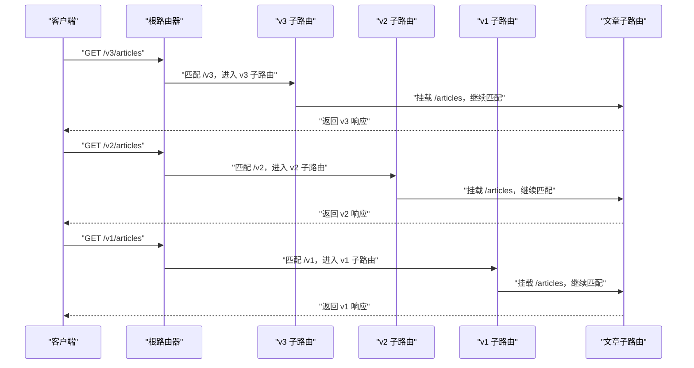
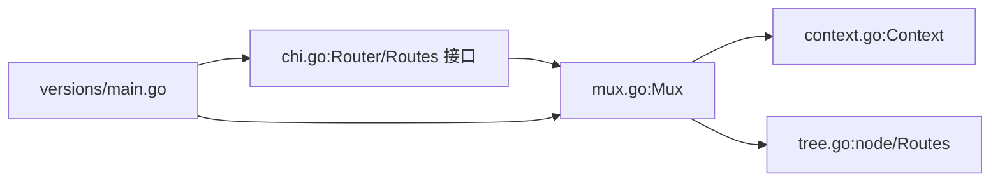

# 子路由器挂载

<cite>
**本文引用的文件列表**
- [mux.go](file://mux.go)
- [context.go](file://context.go)
- [chi.go](file://chi.go)
- [_examples/versions/main.go](file://_examples/versions/main.go)
- [mux_test.go](file://mux_test.go)
- [tree.go](file://tree.go)
</cite>

## 目录
1. [引言](#引言)
2. [项目结构](#项目结构)
3. [核心组件](#核心组件)
4. [架构总览](#架构总览)
5. [详细组件分析](#详细组件分析)
6. [依赖关系分析](#依赖关系分析)
7. [性能考量](#性能考量)
8. [故障排查指南](#故障排查指南)
9. [结论](#结论)
10. [附录](#附录)

## 引言
本篇文档围绕 chi 框架的“子路由器挂载”能力展开，重点解释 Mount 方法如何将一个完整的 http.Handler 或 chi Router 作为子路由器挂载到指定路径下，并结合 _examples/versions/main.go 中 v1、v2、v3 版本 API 的挂载示例，系统讲解如何组织 API 版本控制。我们将深入分析 mux.go 中 Mount 方法的实现细节，包括：
- 挂载处理器如何调整请求路径，使子路由器能正确解析剩余路径
- 子路由器的 404 和 405 处理器如何从父路由器继承
- 防止在已有路径上重复挂载的安全检查
- 通配符模式在挂载中的作用
- 子路由器通过 subroutes 字段与父路由器关联的方式

## 项目结构
本仓库包含 chi 路由器的核心实现（mux.go、context.go、tree.go、chi.go），以及多个示例程序。其中 _examples/versions/main.go 展示了通过 Route/Mount 组织多版本 API 的实践。

图表来源
- [chi.go](file://chi.go#L64-L138)
- [mux.go](file://mux.go#L1-L120)
- [context.go](file://context.go#L42-L110)
- [tree.go](file://tree.go#L820-L872)
- [_examples/versions/main.go](file://_examples/versions/main.go#L22-L49)

章节来源
- [chi.go](file://chi.go#L64-L138)
- [mux.go](file://mux.go#L1-L120)
- [context.go](file://context.go#L42-L110)
- [tree.go](file://tree.go#L820-L872)
- [_examples/versions/main.go](file://_examples/versions/main.go#L22-L49)

## 核心组件
- Mux：实现 Router 接口的路由分发器，负责路由树构建、中间件链、请求分发与挂载逻辑
- Context：路由上下文，承载当前请求的匹配参数、路径、模式栈等信息
- Routes 接口：提供遍历路由树、匹配与查找的能力
- 路由树 node：存储路由节点、子路由、通配符等信息

章节来源
- [mux.go](file://mux.go#L21-L80)
- [context.go](file://context.go#L42-L110)
- [chi.go](file://chi.go#L116-L138)
- [tree.go](file://tree.go#L820-L872)

## 架构总览
下图展示了父路由器与子路由器通过 Mount 关联的整体流程，以及挂载后请求在父子路由器之间的传递与路径裁剪过程。

图表来源
- [mux.go](file://mux.go#L282-L340)
- [mux.go](file://mux.go#L489-L510)
- [context.go](file://context.go#L42-L110)

## 详细组件分析

### Mount 方法实现与行为
Mount 是将另一个 http.Handler 或 chi Router 作为子路由器挂载到指定 pattern 下的关键入口。其主要职责包括：
- 安全检查：禁止在同一 pattern 上重复挂载
- 继承父级处理器：当子路由器未显式设置时，继承父路由器的 404 与 405 处理器
- 构造挂载处理器：在请求进入子路由器前，调整请求路径并清理通配符参数
- 注册路由：以 pattern + “/*” 的方式注册到父路由树，并在必要时记录子路由接口

图表来源
- [mux.go](file://mux.go#L282-L340)

章节来源
- [mux.go](file://mux.go#L282-L340)

### 请求路径调整与通配符参数处理
挂载处理器在调用子路由器前会做两件事：
- 计算新的 RoutePath：基于当前匹配到的挂载点的最后一个参数（通常为通配符）裁剪掉已消费的部分，确保子路由器只看到剩余路径
- 清理通配符参数：将最后一个参数键为“*”的值清空，避免影响子路由器的参数捕获

这些操作由 nextRoutePath 与挂载处理器内部逻辑共同完成，保证父子路由器间路径传递的一致性。

章节来源
- [mux.go](file://mux.go#L489-L510)
- [mux.go](file://mux.go#L309-L322)

### 404 与 405 处理器继承
当子路由器未显式设置 NotFound 或 MethodNotAllowed 时，Mount 会自动将其设置为与父路由器相同的处理器，从而保持一致的错误响应风格。这一行为通过 updateSubRoutes 对所有已注册的子路由进行递归更新实现。

章节来源
- [mux.go](file://mux.go#L195-L233)
- [mux.go](file://mux.go#L498-L507)

### 重复挂载的安全检查
Mount 在注册前会检查父路由树中是否存在与 pattern 同样的静态或通配符路由，若存在则直接 panic，防止覆盖或冲突。

章节来源
- [mux.go](file://mux.go#L294-L299)

### 通配符模式与子路由关联
- 通配符模式要求位于路由末尾，且仅能匹配“/”字符；在挂载场景中，pattern + “/*” 用于将请求交由子路由器继续匹配
- 子路由器通过 node.subroutes 字段与父路由器建立关联，使得在父树中定位到挂载点后，可直接委托给子树继续查找

章节来源
- [mux.go](file://mux.go#L330-L340)
- [tree.go](file://tree.go#L820-L872)
- [tree.go](file://tree.go#L747-L752)

### API 版本控制示例：v1、v2、v3
_versions/main.go 展示了如何使用 Route/Mount 组织多版本 API：
- 使用 r.Route("/v3|/v2|/v1", ...) 为每个版本创建独立的子路由
- 在每个版本块内使用 r.Use(...) 应用版本特定的中间件（例如注入版本上下文）
- 使用 r.Mount("/articles", articleRouter()) 将文章资源路由挂载到各版本路径下
- 文章处理器根据请求上下文中的版本信息选择不同版本的响应呈现层

图表来源
- [_examples/versions/main.go](file://_examples/versions/main.go#L22-L49)
- [_examples/versions/main.go](file://_examples/versions/main.go#L60-L69)

章节来源
- [_examples/versions/main.go](file://_examples/versions/main.go#L22-L49)
- [_examples/versions/main.go](file://_examples/versions/main.go#L60-L69)

### 路由树与子路由字段
- node 结构体包含 SubRoutes 字段，用于保存挂载的子路由接口
- tree.walk 会递归遍历子路由，生成完整路由表，便于文档生成与调试

章节来源
- [tree.go](file://tree.go#L820-L872)

## 依赖关系分析
- Mux 依赖 Context 提供路由上下文，用于在父子路由器之间传递参数与路径
- Mux 依赖 tree.go 的路由树结构，用于插入与查找路由节点
- Mux 通过 Routes 接口与子路由器建立关联，实现挂载后的继续匹配
- 示例程序 _examples/versions/main.go 通过 chi.NewRouter() 与 Mux 实现交互

图表来源
- [mux.go](file://mux.go#L21-L80)
- [context.go](file://context.go#L42-L110)
- [tree.go](file://tree.go#L820-L872)
- [chi.go](file://chi.go#L64-L138)
- [_examples/versions/main.go](file://_examples/versions/main.go#L22-L49)

章节来源
- [mux.go](file://mux.go#L21-L80)
- [context.go](file://context.go#L42-L110)
- [tree.go](file://tree.go#L820-L872)
- [chi.go](file://chi.go#L64-L138)
- [_examples/versions/main.go](file://_examples/versions/main.go#L22-L49)

## 性能考量
- 挂载处理器为轻量包装，仅做路径裁剪与参数清理，开销极低
- 重复挂载检测在注册前进行，避免后续查找阶段的冲突与回溯
- 子路由继承处理器减少重复配置，降低运行时分支判断成本
- 路由树采用静态/参数/通配符混合结构，查找效率高

## 故障排查指南
- 重复挂载 panic：若在同一 pattern 上多次调用 Mount，将触发 panic。请检查路由定义，确保每个挂载点唯一
  - 参考：[mux.go](file://mux.go#L294-L299)
- 空处理器 panic：传入 nil 作为 handler 会触发 panic。请确认 handler 已正确初始化
  - 参考：[mux.go](file://mux.go#L290-L293)
- 通配符位置错误：通配符必须位于路由末尾，否则会 panic。请修正路由模式
  - 参考：[tree.go](file://tree.go#L747-L752)
- 404/405 行为不一致：若子路由器未设置 NotFound/MethodNotAllowed，将继承父路由器的处理器。如需自定义，请显式设置
  - 参考：[mux.go](file://mux.go#L195-L233)

章节来源
- [mux.go](file://mux.go#L290-L340)
- [tree.go](file://tree.go#L747-L752)
- [mux_test.go](file://mux_test.go#L1470-L1506)

## 结论
通过 Mount，chi 能够以最小代价将复杂的业务模块拆分为独立的子路由器，并在父路由器中以清晰的路径前缀进行组合。Mount 的实现兼顾安全性（重复挂载检查）、一致性（404/405 继承）与易用性（路径裁剪与通配符参数清理）。结合 _examples/versions/main.go 的示例，开发者可以轻松实现 API 版本化管理，按版本隔离中间件与响应层，提升系统的可维护性与演进能力。

## 附录
- 版本化 API 示例路径参考
  - [主函数与版本挂载](file://_examples/versions/main.go#L22-L49)
  - [文章子路由定义](file://_examples/versions/main.go#L60-L69)