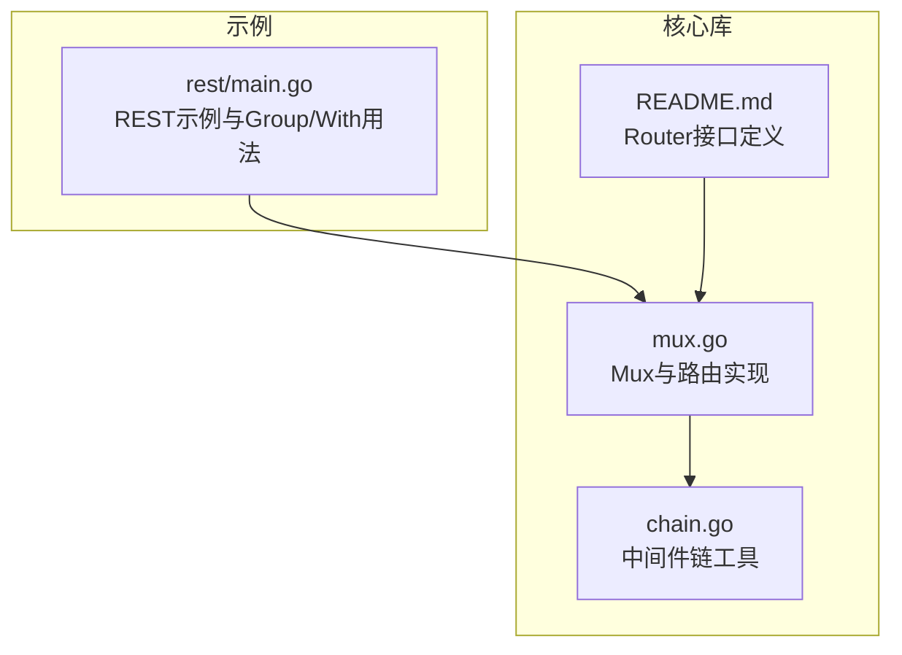
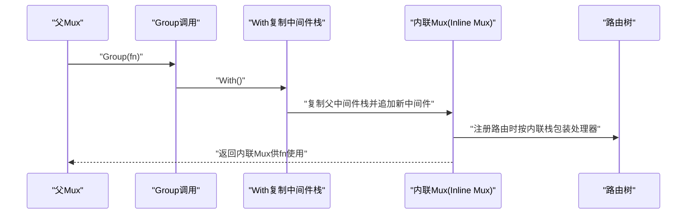
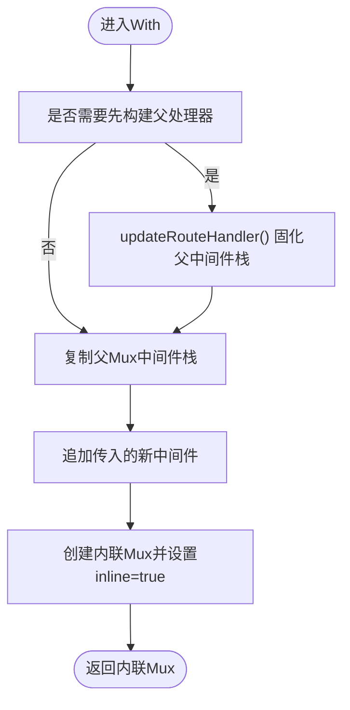
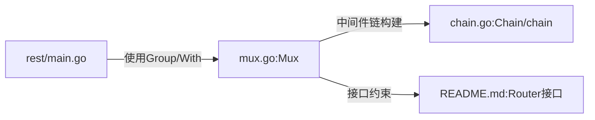

# Group方法

<cite>
**本文引用的文件**
- [mux.go](file://mux.go)
- [_examples/rest/main.go](file://_examples/rest/main.go)
- [chain.go](file://chain.go)
- [README.md](file://README.md)
- [mux_test.go](file://mux_test.go)
</cite>

## 目录
1. [引言](#引言)
2. [项目结构](#项目结构)
3. [核心组件](#核心组件)
4. [架构总览](#架构总览)
5. [详细组件分析](#详细组件分析)
6. [依赖关系分析](#依赖关系分析)
7. [性能考量](#性能考量)
8. [故障排查指南](#故障排查指南)
9. [结论](#结论)
10. [附录](#附录)

## 引言
本篇文档围绕chi框架中的Group方法展开，系统性解析其如何创建“内联Mux”（inline Mux），以组合额外的中间件而无需创建独立的子路由器。我们将结合_mux.go_中Group与With方法的实现，说明其通过复制父级中间件栈并生成临时路由器的过程；同时参考_examples/rest/main.go_中/articles/{articleID}路由使用ArticleCtx中间件的示例，展示如何为特定路由组添加上下文加载逻辑。最后给出实际应用建议，帮助读者在“共享中间件但不需独立路由命名空间”的场景下正确选择Group与Route。

## 项目结构
- 核心实现位于mux.go，包含Mux类型、路由注册、中间件链构建、Group与With等关键方法。
- 示例位于_examples/rest/main.go，演示了Group与With在REST服务中的典型用法，包括为文章资源组添加上下文中间件。
- 中间件链工具位于chain.go，提供Chain与chain函数，用于将多个中间件按序组合。
- 接口定义位于README.md，明确Router接口对Group、With等方法的要求。

图表来源
- [mux.go](file://mux.go#L1-L120)
- [chain.go](file://chain.go#L1-L50)
- [README.md](file://README.md#L182-L249)
- [_examples/rest/main.go](file://_examples/rest/main.go#L70-L110)

章节来源
- [mux.go](file://mux.go#L1-L120)
- [README.md](file://README.md#L182-L249)

## 核心组件
- Mux：实现了Router接口，负责路由树、中间件栈、请求处理与内联Mux的生成。
- Router接口：定义了Group、With、Route、Mount等方法签名，确保不同实现的一致行为。
- Chain/chain：提供中间件链式组合能力，是With/Group内部构建处理器链的关键。

章节来源
- [mux.go](file://mux.go#L1-L120)
- [chain.go](file://chain.go#L1-L50)
- [README.md](file://README.md#L182-L249)

## 架构总览
Group方法的核心思想是“在同一父路由下创建一个共享中间件栈的临时子路由”，而非挂载一个独立的子路由器。这使得：
- 路由路径保持原样，不引入新的命名空间前缀；
- 可以叠加额外中间件，形成局部化的中间件作用域；
- 不破坏父路由的路由树结构，便于统一管理NotFound/MethodNotAllowed等全局行为。

图表来源
- [mux.go](file://mux.go#L235-L268)
- [chain.go](file://chain.go#L10-L20)

## 详细组件分析

### Group方法的实现与语义
- 方法签名与职责
  - Group(fn func(r Router)) Router：创建一个新的内联Mux，复制当前中间件栈，并将fn传入该内联Mux，以便在其上注册路由。
- 关键步骤
  - 调用With()复制父级中间件栈；
  - 将fn回调传入内联Mux，允许在此组内继续注册路由与中间件；
  - 返回内联Mux，供外部继续使用。
- 与Route的区别
  - Group不改变路由路径前缀，仅在当前路径下叠加中间件；
  - Route会创建一个独立子路由器并挂载到指定pattern，形成新的命名空间。

章节来源
- [mux.go](file://mux.go#L259-L268)

### With方法：内联中间件栈的复制与临时路由器生成
- 复制父级中间件栈
  - 当父Mux处于非内联状态且尚未构建最终处理器时，先构建一次处理器以固定中间件顺序；
  - 若父Mux已是内联，则从其复制已有的中间件数组。
- 追加新中间件
  - 将传入的新中间件追加到复制后的中间件数组末尾，形成新的内联中间件栈。
- 生成内联Mux
  - 创建新的Mux实例，设置inline=true、parent指向父Mux、共享pool/tree等资源；
  - 复制父Mux的NotFound/MethodNotAllowed处理器，保证内联组内的错误处理一致性。
- 注册路由时的处理器包装
  - 在handle中，若当前Mux处于内联模式，则将内联中间件栈与端点处理器按序链式组合，再插入路由树。

图表来源
- [mux.go](file://mux.go#L235-L257)
- [mux.go](file://mux.go#L414-L437)
- [mux.go](file://mux.go#L509-L516)

章节来源
- [mux.go](file://mux.go#L235-L257)
- [mux.go](file://mux.go#L414-L437)
- [mux.go](file://mux.go#L509-L516)

### 内联Mux在路由注册时的处理器链构建
- 内联模式下的路由注册
  - 当Mux处于内联模式时，handle不再直接使用父处理器，而是将内联中间件栈与端点处理器链式组合后，再插入路由树。
- 错误处理的内联传播
  - NotFound/MethodNotAllowed在内联模式下会将父Mux的中间件栈应用于错误处理器，确保错误响应也经过相同的中间件序列。

章节来源
- [mux.go](file://mux.go#L414-L437)
- [mux.go](file://mux.go#L195-L233)

### 示例：REST示例中的Group/With与上下文加载
- 文章资源组的上下文加载
  - 在/articles路径组中，使用With(ArticleCtx)为列表、创建、搜索等路由附加上下文加载逻辑；
  - 在/articles/{articleID}路径组中，使用Use(ArticleCtx)在该组内加载上下文，使后续GET/PUT/DELETE能直接从请求上下文中读取Article对象。
- 与Route的区别
  - 使用Group/With可以在不改变URL前缀的情况下叠加中间件；
  - 使用Route会创建独立子路由器，URL前缀会增加一层命名空间，适合完全隔离的模块。

章节来源
- [_examples/rest/main.go](file://_examples/rest/main.go#L78-L93)
- [_examples/rest/main.go](file://_examples/rest/main.go#L84-L90)
- [_examples/rest/main.go](file://_examples/rest/main.go#L121-L145)

### 测试验证：Group与With的行为
- 基于测试的观察要点
  - Group可为多组路由分别叠加不同的中间件，且每组的中间件计数独立；
  - With在注册端点路由时不会导致panic，验证了内联中间件栈的正确构建；
  - 嵌套Group可叠加多层中间件，计数器值随中间件层数递增。
- 实际验证位置
  - 多组Group测试：[mux_test.go](file://mux_test.go#L829-L883)
  - With端点注册测试：[mux_test.go](file://mux_test.go#L734-L753)
  - 嵌套Group计数测试：[mux_test.go](file://mux_test.go#L1392-L1412)

章节来源
- [mux_test.go](file://mux_test.go#L734-L753)
- [mux_test.go](file://mux_test.go#L829-L883)
- [mux_test.go](file://mux_test.go#L1392-L1412)

## 依赖关系分析
- 组件耦合
  - Mux对chain.go的依赖体现在中间件链构建与处理器组合；
  - Group/With依赖Mux的中间件栈复制与路由树插入逻辑；
  - Router接口约束了Group/With的语义，确保不同实现的一致性。
- 潜在循环依赖
  - 代码结构未见循环导入，Mux与chain.go之间为单向依赖。
- 外部集成点
  - 示例rest/main.go展示了Group/With在真实REST服务中的组合方式。

图表来源
- [mux.go](file://mux.go#L1-L120)
- [chain.go](file://chain.go#L1-L50)
- [README.md](file://README.md#L182-L249)
- [_examples/rest/main.go](file://_examples/rest/main.go#L70-L110)

章节来源
- [mux.go](file://mux.go#L1-L120)
- [chain.go](file://chain.go#L1-L50)
- [README.md](file://README.md#L182-L249)

## 性能考量
- 内联中间件栈的构建成本
  - With会在必要时构建父处理器以固化中间件顺序，避免后续重复计算；
  - 内联模式下，每个路由注册都会基于内联中间件栈重新组合处理器，应避免在高频路径上频繁创建大量内联组。
- 路由树与上下文池
  - Mux通过sync.Pool复用路由上下文，减少GC压力；
  - 路由树为radix trie，查找复杂度与路径长度相关，合理组织路径有助于提升匹配效率。
- 错误处理的链式包装
  - NotFound/MethodNotAllowed在内联模式下会将父中间件栈应用于错误处理器，确保一致的中间件执行顺序。

章节来源
- [mux.go](file://mux.go#L60-L92)
- [mux.go](file://mux.go#L195-L233)
- [mux.go](file://mux.go#L509-L516)

## 故障排查指南
- 在Group/With之后立即注册路由
  - 确保先调用Group或With，再注册路由，否则可能触发中间件注册顺序相关的异常。
- 避免在已构建处理器后继续注册中间件
  - Mux在构建最终处理器后禁止继续注册中间件，如需新增中间件，请使用Group/With创建新的内联组。
- 嵌套Group的中间件计数
  - 如发现中间件执行次数异常，检查嵌套层级与中间件叠加逻辑，参考测试用例验证预期行为。
- 错误处理一致性
  - 若自定义了NotFound/MethodNotAllowed，注意内联模式下这些处理器也会经过内联中间件栈，确保符合预期。

章节来源
- [mux.go](file://mux.go#L94-L105)
- [mux.go](file://mux.go#L195-L233)
- [mux_test.go](file://mux_test.go#L829-L883)

## 结论
Group方法通过With复制父级中间件栈并生成内联Mux，实现了“在同一路径下叠加中间件”的能力，既满足了共享中间件的需求，又避免了创建独立子路由器带来的命名空间变化。结合_examples/rest/main.go中的示例，可以看到Group/With在REST服务中常用于为特定资源组注入上下文加载、鉴权、日志等通用逻辑。相较之下，Route更适合需要完整隔离与独立命名空间的模块划分。在实际工程中，应根据是否需要独立命名空间与中间件作用域来选择Group/With或Route。

## 附录
- 实战建议
  - 对于同一路径下的多条路由需要共享中间件，优先使用Group/With；
  - 对于需要完全隔离的模块（如/admin），使用Route挂载独立子路由器；
  - 在高频路径上谨慎使用大量内联组，避免中间件链过长影响性能。
- 相关接口与实现
  - Router接口定义：[README.md](file://README.md#L182-L249)
  - Mux实现与Group/With：[mux.go](file://mux.go#L235-L268)
  - 中间件链工具：[chain.go](file://chain.go#L10-L20)