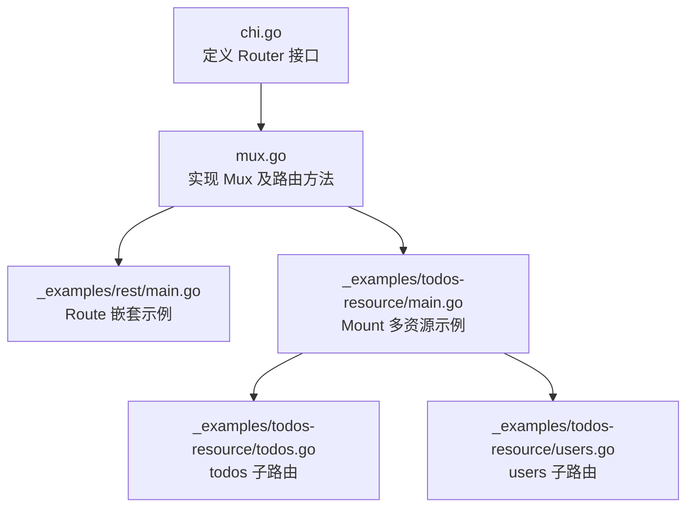
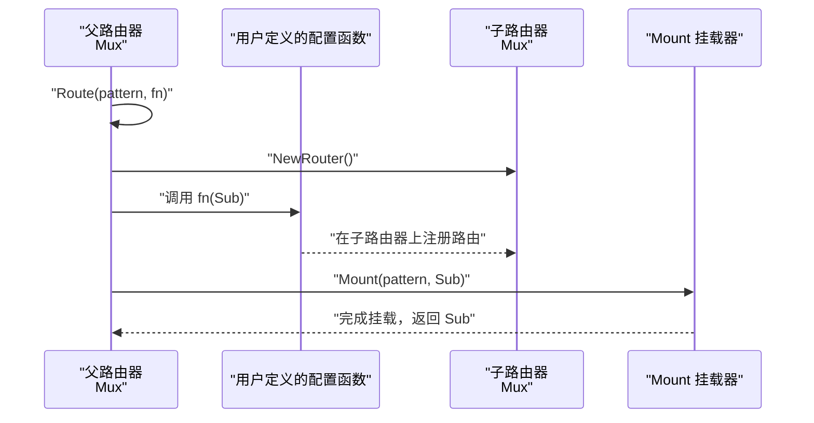
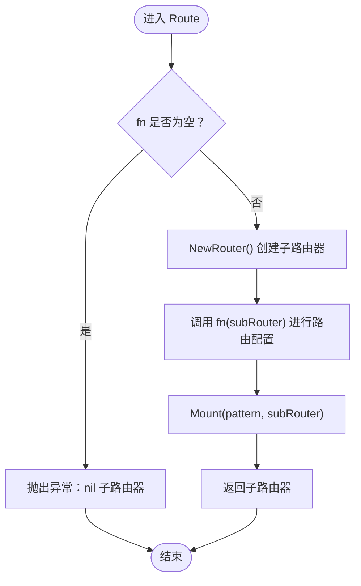
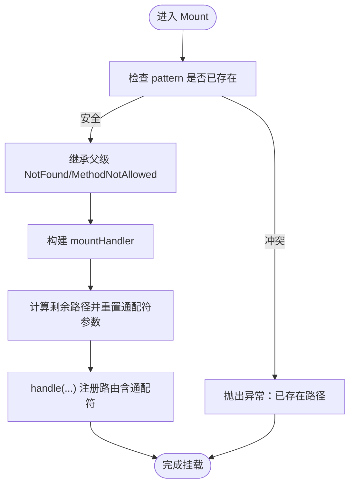
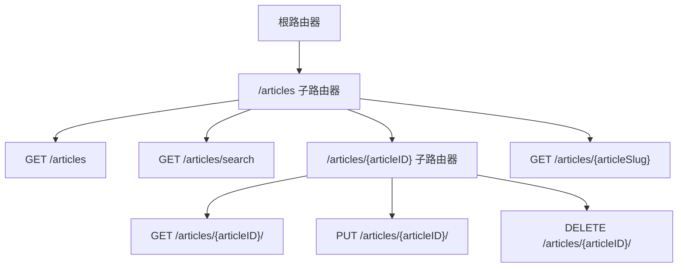
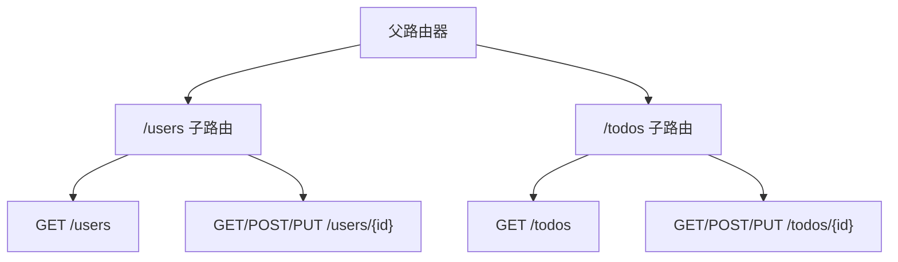
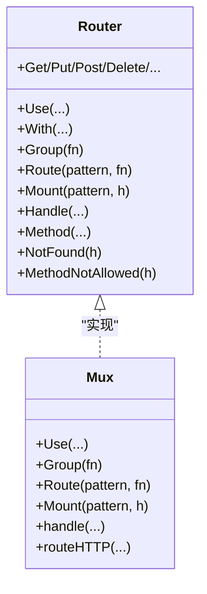

# Route方法

<cite>
**本文引用的文件**
- [mux.go](file://mux.go)
- [chi.go](file://chi.go)
- [_examples/rest/main.go](file://_examples/rest/main.go)
- [_examples/todos-resource/main.go](file://_examples/todos-resource/main.go)
- [_examples/todos-resource/todos.go](file://_examples/todos-resource/todos.go)
- [_examples/todos-resource/users.go](file://_examples/todos-resource/users.go)
</cite>

## 目录
1. [简介](#简介)
2. [项目结构](#项目结构)
3. [核心组件](#核心组件)
4. [架构总览](#架构总览)
5. [详细组件分析](#详细组件分析)
6. [依赖关系分析](#依赖关系分析)
7. [性能考量](#性能考量)
8. [故障排查指南](#故障排查指南)
9. [结论](#结论)
10. [附录](#附录)

## 简介
本篇文档围绕 chi 框架中的 Route 方法展开，系统性阐述其如何创建子路由器并将其挂载到指定路径，以及其内部如何委托 Mount 完成挂载过程。我们将结合 mux.go 中 Route 的实现、chi.go 中的接口定义，以及 _examples/rest/main.go 中 /articles 资源的嵌套路由示例，说明如何组织 RESTful API 的层次结构；并通过 _examples/todos-resource 示例展示在不同资源之间进行路由隔离与复用的实践方式，并总结其在大型 API 服务中的优势。

## 项目结构
- 核心实现位于 mux.go，其中包含 Mux 结构体及路由注册、中间件链、子路由器挂载等关键逻辑。
- 接口定义位于 chi.go，明确 Router 接口及其方法族，包括 Route、Mount、Group 等。
- 示例代码位于 _examples 目录：
  - _examples/rest/main.go：展示 RESTful API 的嵌套路由组织，重点体现 Route 的使用。
  - _examples/todos-resource：展示将多个资源以独立子路由器形式挂载到父路由器，体现资源隔离与复用。

图表来源
- [chi.go](file://chi.go#L64-L115)
- [mux.go](file://mux.go#L270-L340)
- [_examples/rest/main.go](file://_examples/rest/main.go#L78-L93)
- [_examples/todos-resource/main.go](file://_examples/todos-resource/main.go#L22-L30)
- [_examples/todos-resource/todos.go](file://_examples/todos-resource/todos.go#L11-L29)
- [_examples/todos-resource/users.go](file://_examples/todos-resource/users.go#L11-L28)

章节来源
- [chi.go](file://chi.go#L64-L115)
- [mux.go](file://mux.go#L270-L340)
- [_examples/rest/main.go](file://_examples/rest/main.go#L78-L93)
- [_examples/todos-resource/main.go](file://_examples/todos-resource/main.go#L22-L30)

## 核心组件
- Router 接口：定义了路由能力（含 Route、Mount、Group 等），是 chi 的核心抽象。
- Mux 实现：具体实现了 Router 接口，负责路由树构建、中间件链、子路由器挂载与请求分发。
- Route 方法：用于创建子路由器并挂载到指定路径，内部委托 Mount 完成挂载。
- Mount 方法：将另一个 http.Handler 或 chi.Router 作为子路由挂载到某路径下，支持通配符继续路由。

章节来源
- [chi.go](file://chi.go#L64-L115)
- [mux.go](file://mux.go#L270-L340)

## 架构总览
下图展示了 Route 方法从创建子路由器到挂载的关键流程，以及与 Mount 的协作关系。

图表来源
- [mux.go](file://mux.go#L270-L340)
- [chi.go](file://chi.go#L59-L62)

## 详细组件分析

### Route 方法的实现与行为
- 入口与参数校验：Route 接收 pattern 和一个配置函数 fn。若 fn 为 nil，会抛出异常，防止无效调用。
- 创建子路由器：通过 NewRouter() 创建一个新的 Mux 实例作为子路由器。
- 执行用户配置：调用 fn(subRouter)，允许在子路由器上注册路由、中间件等。
- 挂载子路由器：调用 Mount(pattern, subRouter) 将子路由器挂载到父路由器的指定路径下。
- 返回值：返回新创建的子路由器实例，便于后续链式操作或进一步配置。

图表来源
- [mux.go](file://mux.go#L270-L280)

章节来源
- [mux.go](file://mux.go#L270-L280)

### Mount 方法与子路由器挂载机制
- 安全检查：Mount 在挂载前会检测目标 pattern 是否已存在，避免重复挂载导致冲突。
- 继承父级错误处理：若子路由器未显式设置 NotFound/MethodNotAllowed，将继承父路由器的对应处理器。
- 路径切分与通配符：Mount 内部构造一个 mountHandler，在请求进入时将当前路径切分为“父路径”和“剩余路径”，并将通配符参数重置，确保子路由器能正确解析剩余路径。
- 注册路由：根据 pattern 注册路由规则，必要时添加通配符后缀，使子路由器得以继续匹配。

图表来源
- [mux.go](file://mux.go#L282-L340)

章节来源
- [mux.go](file://mux.go#L282-L340)

### RESTful API 层次化组织：/articles 资源嵌套路由
- 在 _examples/rest/main.go 中，通过 r.Route("/articles", ...) 创建 articles 子路由器，并在其中注册列表、搜索、按 ID 或按 slug 访问等路由。
- 在子路由器内部，再次使用 r.Route("/{articleID}", ...) 对单个文章资源进行嵌套，实现“资源 -> 子资源”的层次化结构。
- 该模式清晰地将不同层级的资源路由隔离，便于维护与扩展。

图表来源
- [_examples/rest/main.go](file://_examples/rest/main.go#L78-L93)

章节来源
- [_examples/rest/main.go](file://_examples/rest/main.go#L78-L93)

### 资源隔离与复用：todos 与 users 子路由
- 在 _examples/todos-resource/main.go 中，通过 r.Mount("/users", usersResource{}.Routes()) 与 r.Mount("/todos", todosResource{}.Routes()) 将两个资源的子路由器分别挂载到父路由器的不同路径下。
- 每个资源以独立的结构体实现 Routes() 方法，返回一个 chi.Router，从而实现资源级别的隔离与复用。
- 这种模式适合大型 API 服务，便于团队分工、模块化演进与统一中间件注入。

图表来源
- [_examples/todos-resource/main.go](file://_examples/todos-resource/main.go#L22-L30)
- [_examples/todos-resource/todos.go](file://_examples/todos-resource/todos.go#L11-L29)
- [_examples/todos-resource/users.go](file://_examples/todos-resource/users.go#L11-L28)

章节来源
- [_examples/todos-resource/main.go](file://_examples/todos-resource/main.go#L22-L30)
- [_examples/todos-resource/todos.go](file://_examples/todos-resource/todos.go#L11-L29)
- [_examples/todos-resource/users.go](file://_examples/todos-resource/users.go#L11-L28)

## 依赖关系分析
- Router 接口定义了 Route、Mount、Group 等方法，Mux 是其实现之一。
- Route 方法内部依赖 NewRouter() 创建子路由器，并调用 Mount 完成挂载。
- Mount 方法负责路径安全检查、错误处理继承、路径切分与通配符处理，最终将子路由器接入父路由器的路由树。

图表来源
- [chi.go](file://chi.go#L64-L115)
- [mux.go](file://mux.go#L100-L120)

章节来源
- [chi.go](file://chi.go#L64-L115)
- [mux.go](file://mux.go#L100-L120)

## 性能考量
- 路由树构建与查找：Mux 使用内部树结构存储路由，Route/Mount 会将子路由器注册到父树中，查询时按路径与方法匹配，整体具备良好的时间复杂度。
- 中间件链：Route/Mount 不直接参与中间件链构建，而是通过 Mux 的中间件栈与路由树协同工作，避免重复链式组合带来的额外开销。
- 路径切分与通配符：Mount 在进入子路由器前对路径进行切分与参数重置，减少子路由器内部的路径解析成本，提升整体吞吐。

[本节为通用性能讨论，不直接分析具体文件]

## 故障排查指南
- 调用 Route 传入 nil 配置函数：Route 会在开始阶段校验并抛出异常，提示无效的子路由器配置。请确保传入非空的配置函数。
- 重复挂载同一路径：Mount 在挂载前会检查目标 pattern 是否已存在，若重复挂载会抛出异常。请确保每个挂载路径唯一。
- 子路由器未设置错误处理：若子路由器未显式设置 NotFound/MethodNotAllowed，将继承父路由器的默认处理逻辑。如需自定义，请在子路由器上显式设置。

章节来源
- [mux.go](file://mux.go#L270-L280)
- [mux.go](file://mux.go#L294-L307)

## 结论
Route 方法通过“创建子路由器 + 执行用户配置 + 调用 Mount 挂载”的三步流程，简洁而强大地实现了子路由器的创建与挂载。结合 _examples/rest/main.go 的嵌套路由与 _examples/todos-resource 的资源复用实践，可以看出 Route 在组织 RESTful API 层次结构、实现资源隔离与复用方面具有显著优势。对于大型 API 服务而言，Route/Mount 的组合能够有效提升可维护性、可扩展性与团队协作效率。

## 附录
- 新建路由器：通过 NewRouter() 获取新的 Mux 实例，作为子路由器使用。
- 接口定义：Router 接口明确了 Route、Mount、Group 等方法签名，Mux 实现这些方法以提供具体功能。

章节来源
- [chi.go](file://chi.go#L59-L62)
- [chi.go](file://chi.go#L64-L115)