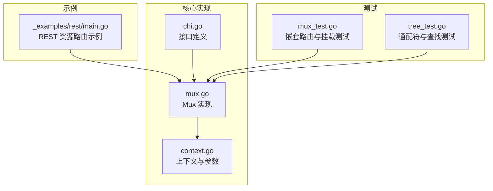
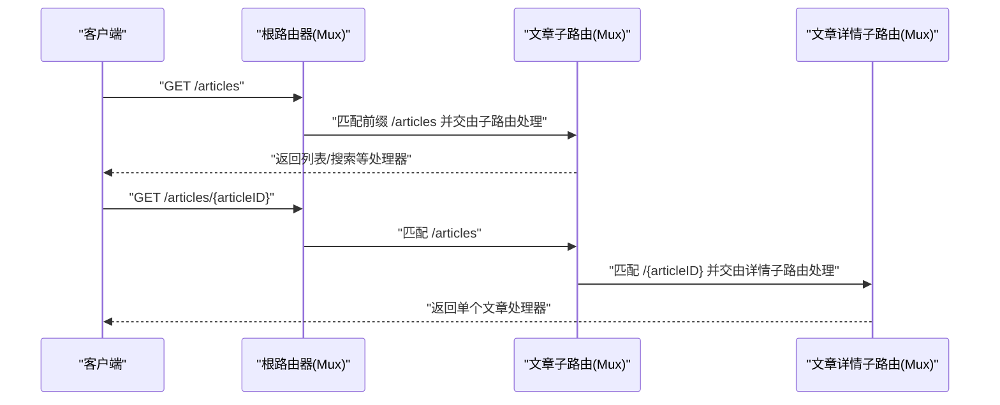
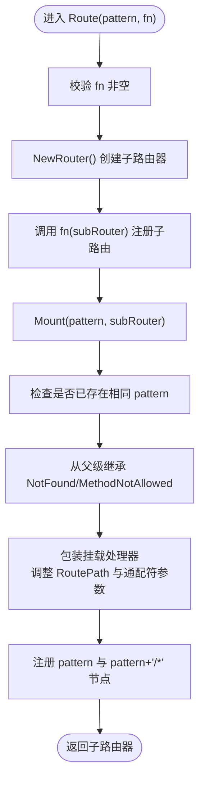
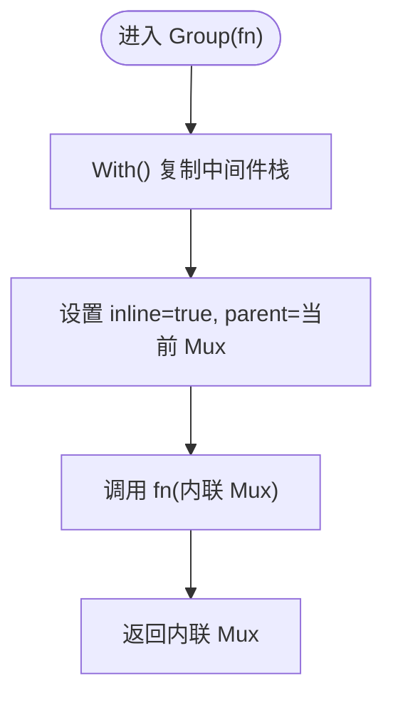
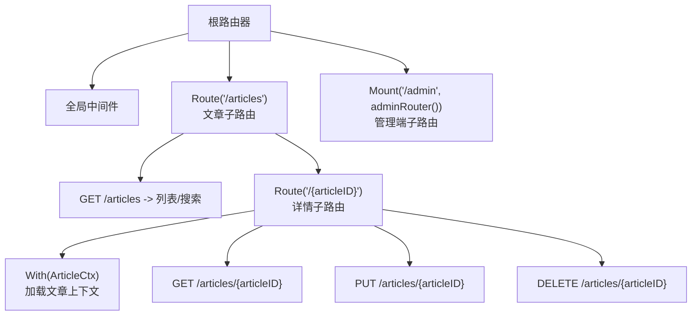
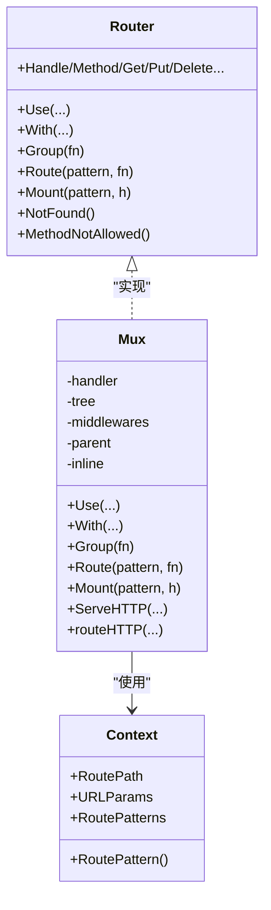

# 嵌套路由

<cite>
**本文引用的文件**
- [mux.go](file://mux.go)
- [chi.go](file://chi.go)
- [_examples/rest/main.go](file://_examples/rest/main.go)
- [context.go](file://context.go)
- [mux_test.go](file://mux_test.go)
- [tree_test.go](file://tree_test.go)
</cite>

## 目录
1. [简介](#简介)
2. [项目结构](#项目结构)
3. [核心组件](#核心组件)
4. [架构总览](#架构总览)
5. [详细组件分析](#详细组件分析)
6. [依赖关系分析](#依赖关系分析)
7. [性能考量](#性能考量)
8. [故障排查指南](#故障排查指南)
9. [结论](#结论)
10. [附录](#附录)

## 简介
本篇文档围绕 chi 框架的嵌套路由能力，系统阐述 Router 接口中的 Route 与 Group 方法在 RESTful API 路由组织中的差异与使用场景：
- Route：用于创建子路由器并挂载到指定路径，适合将资源域（如 /articles）拆分为独立的子路由树，便于模块化管理。
- Group：用于在同一路径下创建“内联 Mux”，组合额外中间件，适合为一组同路径下的处理器统一注入中间件栈。

结合 _examples/rest/main.go 中 /articles 资源的嵌套路由示例，我们将展示如何通过 Route/Group/Mount 构建层次化的 API 路由，并深入解析 mux.go 中 Route 方法如何创建新 Router 实例并通过 Mount 完成挂载，以及 Group 如何创建内联 Mux 来组合中间件。

## 项目结构
- 核心路由实现位于 mux.go，定义了 Mux 结构体及 Router 接口方法（含 Route、Group、Mount 等）。
- 接口定义位于 chi.go，明确 Router 的职责边界。
- 示例程序 _examples/rest/main.go 展示了 Route 在 REST 资源组织中的典型用法，包括嵌套子路由与 Mount 子路由器。
- 上下文与参数传递位于 context.go，支撑跨子路由的 URL 参数与模式记录。
- 测试文件 mux_test.go 与 tree_test.go 验证了嵌套路由行为、挂载安全与通配符匹配等细节。

图表来源
- [chi.go](file://chi.go#L64-L138)
- [mux.go](file://mux.go#L1-L120)
- [_examples/rest/main.go](file://_examples/rest/main.go#L56-L112)
- [context.go](file://context.go#L1-L80)
- [mux_test.go](file://mux_test.go#L1102-L1235)
- [tree_test.go](file://tree_test.go#L417-L445)

章节来源
- [chi.go](file://chi.go#L64-L138)
- [mux.go](file://mux.go#L1-L120)
- [_examples/rest/main.go](file://_examples/rest/main.go#L56-L112)
- [context.go](file://context.go#L1-L80)
- [mux_test.go](file://mux_test.go#L1102-L1235)
- [tree_test.go](file://tree_test.go#L417-L445)

## 核心组件
- Router 接口：定义 Use、With、Group、Route、Mount、各 HTTP 方法注册等能力，是嵌套路由的契约。
- Mux：Router 的默认实现，内部维护中间件栈、路由树、父 Mux 引用、上下文池等，负责路由查找、中间件链构建与挂载处理。
- Context：请求上下文中的路由状态容器，记录 RoutePath、URLParams、RoutePatterns 等，支持跨子路由参数透传与模式拼接。

章节来源
- [chi.go](file://chi.go#L64-L138)
- [mux.go](file://mux.go#L1-L120)
- [context.go](file://context.go#L1-L80)

## 架构总览
下面以 _examples/rest/main.go 中 /articles 资源为例，展示嵌套路由的组织方式与执行流程。

图表来源
- [_examples/rest/main.go](file://_examples/rest/main.go#L78-L93)
- [mux.go](file://mux.go#L270-L340)

章节来源
- [_examples/rest/main.go](file://_examples/rest/main.go#L78-L93)
- [mux.go](file://mux.go#L270-L340)

## 详细组件分析

### Route 与 Group 的区别与使用场景
- Route
  - 作用：创建一个新的子路由器（通过 NewRouter），并将该子路由挂载到指定路径 pattern 下，形成独立的子路由树。
  - 典型场景：按资源域划分路由，如 /articles、/admin 等，每个资源域可拥有自己的中间件与子路径。
  - 行为要点：Route 内部先创建子路由器，再调用 Mount 将其挂载到 pattern；若子路由实现了 Routes 接口，会设置 mSTUB 标志以便后续子路由查找。
- Group
  - 作用：在同一路径下创建一个“内联 Mux”，复制当前中间件栈并追加额外中间件，返回该内联 Mux 给回调函数配置处理器。
  - 典型场景：对同一路径下的多个处理器统一注入中间件（如鉴权、限流、日志等），不改变路径前缀。
  - 行为要点：Group 通过 With 创建内联 Mux，设置 inline=true、parent 指向当前 Mux，便于后续中间件链构建与 NotFound/MethodNotAllowed 的继承传播。

章节来源
- [mux.go](file://mux.go#L259-L280)
- [mux.go](file://mux.go#L235-L258)

### Route 方法的实现与挂载机制
- 关键步骤
  - 校验回调函数非空，避免无效挂载。
  - 使用 NewRouter 创建子路由器实例。
  - 回调函数接收子路由器，允许在其上注册处理器与中间件。
  - 调用 Mount 将子路由器挂载到 pattern 下，形成通配匹配。
- Mount 的关键点
  - 安全性检查：禁止在同一 pattern 上重复挂载，防止覆盖或冲突。
  - 继承父级错误处理器：若子路由器未显式设置 NotFound/MethodNotAllowed，则从父级继承。
  - 路径切分：在挂载时将父路由的匹配结果作为“连接参数”（通常是通配符 *），并在子路由中重置该参数，确保子路由从正确的相对路径开始匹配。
  - 通配符处理：pattern 后自动补全斜杠并注册 pattern+"/*"，使子路由能继续匹配剩余路径。

图表来源
- [mux.go](file://mux.go#L270-L340)

章节来源
- [mux.go](file://mux.go#L270-L340)

### Group 方法的实现与内联 Mux
- 关键步骤
  - 通过 With() 复制当前中间件栈（若当前 Mux 是内联则复制其父链中间件）。
  - 设置 inline=true、parent 指向当前 Mux，tree、middlewares、notFoundHandler、methodNotAllowedHandler 等字段从父级继承。
  - 调用 fn(im) 对内联 Mux 进行配置，返回该内联 Mux。
- 适用场景
  - 对同一路径下的多条路由统一注入中间件，例如鉴权、审计、限流等。
  - 与 Route 结合使用，先 Route 划分资源域，再在域内用 Group 统一中间件。

图表来源
- [mux.go](file://mux.go#L259-L268)

章节来源
- [mux.go](file://mux.go#L259-L268)

### RESTful API 的嵌套路由组织示例（_examples/rest/main.go）
- 根路由注册全局中间件（请求 ID、日志、恢复器、URL 格式化、响应内容类型）。
- 使用 Route("/articles", ...) 将文章资源域拆分为独立子路由树，子树内可进一步嵌套（如 /{articleID}）。
- 在子树中使用 With(...) 为特定处理器注入中间件（如分页中间件）。
- 使用 Mount("/admin", adminRouter()) 将另一个独立的子路由器挂载到 /admin，实现完全隔离的管理端路由。
- 文章上下文中间件 ArticleCtx 在详情子路由中加载文章对象并注入到请求上下文，供后续处理器使用。

图表来源
- [_examples/rest/main.go](file://_examples/rest/main.go#L56-L112)
- [_examples/rest/main.go](file://_examples/rest/main.go#L121-L145)
- [_examples/rest/main.go](file://_examples/rest/main.go#L218-L232)

章节来源
- [_examples/rest/main.go](file://_examples/rest/main.go#L56-L112)
- [_examples/rest/main.go](file://_examples/rest/main.go#L121-L145)
- [_examples/rest/main.go](file://_examples/rest/main.go#L218-L232)

### 路由上下文与参数透传（context.go）
- Context 记录每层子路由的 RoutePath、URLParams、RoutePatterns，并在 Find/Match 过程中更新。
- URLParam/URLParamFromCtx 提供从请求上下文中读取参数的能力，支持跨子路由参数访问。
- RoutePattern 可拼接当前请求在整棵路由树中的完整匹配模式，便于统计与可观测性。

章节来源
- [context.go](file://context.go#L1-L167)

### 测试验证与行为边界
- 嵌套组与中间件计数：验证 Group/With 在不同层级叠加中间件的效果，确保中间件数量与预期一致。
- 挂载现有路径：重复挂载同一 pattern 应触发 panic，保证路由安全。
- 类似 pattern 挂载：允许挂载不同前缀但不冲突的子路由，避免误判。
- 通配符与查找：树节点对通配符 /* 的查找与模式匹配行为得到验证。

章节来源
- [mux_test.go](file://mux_test.go#L1392-L1446)
- [mux_test.go](file://mux_test.go#L1470-L1511)
- [tree_test.go](file://tree_test.go#L417-L445)

## 依赖关系分析
- Router 接口与 Mux 实现
  - Router 定义了嵌套路由所需的核心方法集合，Mux 作为默认实现，承担中间件链构建、路由树插入、挂载处理与上下文管理。
- 上下文与路由树
  - Context 与 Mux 协作，通过 RoutePath、URLParams、RoutePatterns 支撑跨子路由的参数与模式传递。
- 示例与测试
  - _examples/rest/main.go 展示了 Route/Group/Mount 的实际组合方式；mux_test.go/tree_test.go 验证了行为边界与正确性。

图表来源
- [chi.go](file://chi.go#L64-L138)
- [mux.go](file://mux.go#L1-L120)
- [context.go](file://context.go#L1-L167)

章节来源
- [chi.go](file://chi.go#L64-L138)
- [mux.go](file://mux.go#L1-L120)
- [context.go](file://context.go#L1-L167)

## 性能考量
- 中间件链构建时机：Mux 在首次注册路由或使用 With/Group 时构建中间件链，之后不允许再注册新中间件，避免运行时开销。
- 上下文复用：通过 sync.Pool 复用 RouteContext，减少每次请求的分配成本。
- 路由树查找：基于前缀树的快速匹配，通配符与正则表达式在树中高效定位。
- 挂载安全性：Mount 在注册前检查是否存在相同 pattern，避免覆盖与冲突带来的运行时异常。

章节来源
- [mux.go](file://mux.go#L94-L120)
- [mux.go](file://mux.go#L235-L280)
- [mux.go](file://mux.go#L282-L340)

## 故障排查指南
- 重复挂载 panic
  - 现象：在同一 pattern 上多次调用 Mount 导致 panic。
  - 处理：确保每个 pattern 唯一，或合并子路由。
  - 参考：[mux_test.go](file://mux_test.go#L1470-L1511)
- 路由未找到/方法不允许
  - 现象：404 或 405。
  - 处理：检查父级是否设置了 NotFound/MethodNotAllowed，确认子路由是否继承；核对方法与路径大小写。
  - 参考：[mux.go](file://mux.go#L195-L233)
- 通配符位置错误
  - 现象：通配符不在末尾导致 panic。
  - 处理：将通配符置于路径末尾。
  - 参考：[tree_test.go](file://tree_test.go#L417-L445)
- 参数丢失或为空
  - 现象：URLParam 返回空值。
  - 处理：确认参数名与路由定义一致，检查中间件是否重写路径或上下文。
  - 参考：[context.go](file://context.go#L1-L80)

章节来源
- [mux_test.go](file://mux_test.go#L1470-L1511)
- [mux.go](file://mux.go#L195-L233)
- [tree_test.go](file://tree_test.go#L417-L445)
- [context.go](file://context.go#L1-L80)

## 结论
- Route 与 Group 分别服务于“资源域拆分”和“同域中间件组合”的两种嵌套需求，二者可配合使用：先 Route 划分资源域，再在域内用 Group 注入中间件。
- Mount 提供了安全可靠的子路由挂载机制，确保路径前缀与通配符的正确衔接，并支持错误处理器的继承。
- 通过 _examples/rest/main.go 的示例，可以清晰看到如何组织层次化 API 路由，既保持模块化又便于扩展与维护。

## 附录
- 实际代码示例路径（不直接展示代码内容）：
  - Route/Group/Mount 的组合使用：[_examples/rest/main.go](file://_examples/rest/main.go#L78-L93)，[_examples/rest/main.go](file://_examples/rest/main.go#L95-L98)
  - Group 嵌套与中间件叠加：[mux_test.go](file://mux_test.go#L1392-L1446)
  - Mount 安全性与路径处理：[mux.go](file://mux.go#L282-L340)
  - 上下文参数与模式拼接：[context.go](file://context.go#L1-L167)