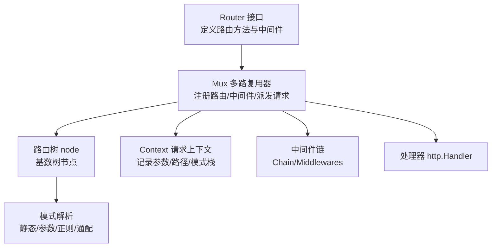
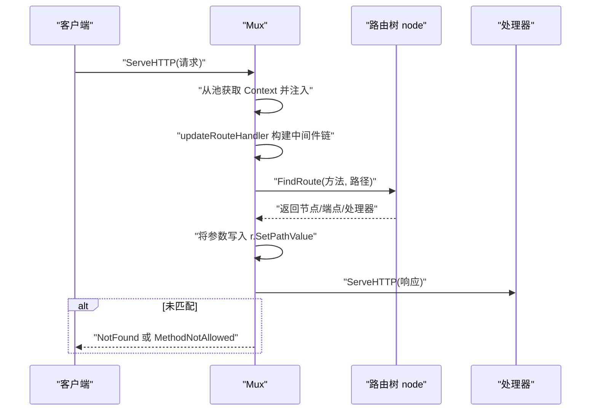
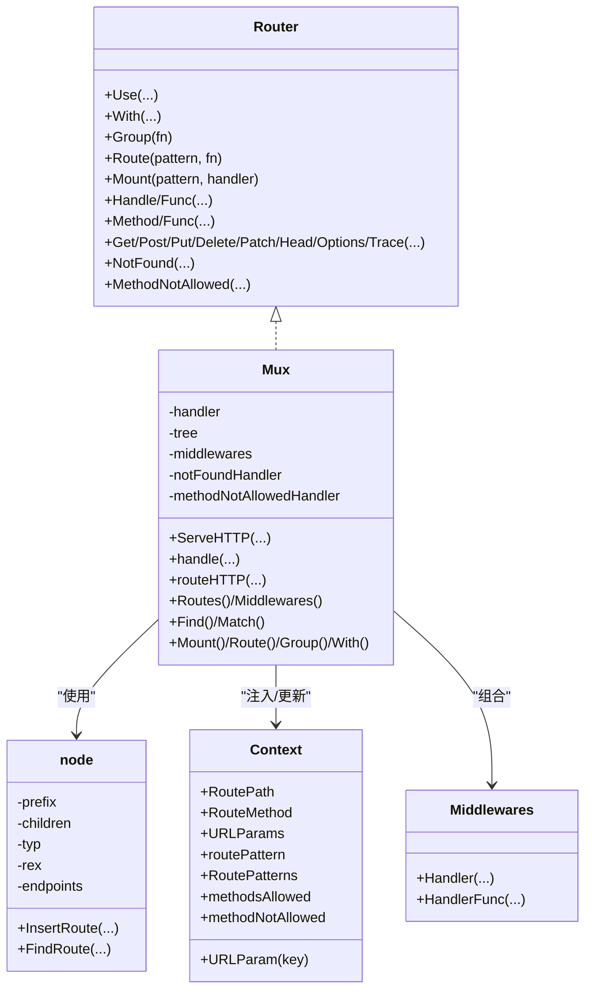

# 路由系统

<cite>
**本文引用的文件列表**
- [chi.go](file://chi.go)
- [mux.go](file://mux.go)
- [tree.go](file://tree.go)
- [pattern.go](file://pattern.go)
- [pattern_fallback.go](file://pattern_fallback.go)
- [context.go](file://context.go)
- [chain.go](file://chain.go)
- [_examples/rest/main.go](file://_examples/rest/main.go)
- [mux_test.go](file://mux_test.go)
- [tree_test.go](file://tree_test.go)
</cite>

## 目录
1. [简介](#简介)
2. [项目结构](#项目结构)
3. [核心组件](#核心组件)
4. [架构总览](#架构总览)
5. [详细组件分析](#详细组件分析)
6. [依赖关系分析](#依赖关系分析)
7. [性能考量](#性能考量)
8. [故障排查指南](#故障排查指南)
9. [结论](#结论)
10. [附录](#附录)

## 简介
本文件系统性阐述 chi 路由器的路由模式与实现机制，覆盖：
- 基本路由、路径参数、正则表达式参数、通配符
- 嵌套路由（Route 与 Group）与子路由器挂载（Mount）
- 路由树（tree.go）内部实现与模式匹配（pattern.go）
- 在请求处理器中通过 chi.URLParam() 提取参数
- 结合 _examples/rest/main.go 展示 RESTful API 的结构化路由组织

## 项目结构
chi 采用“接口 + 多路复用器 + 路由树”的分层设计：
- 接口层：定义 Router、Routes 等对外能力
- 多路复用器：Mux 实现路由注册、中间件链、请求派发
- 路由树：基于基数树（radix trie）的高效路由匹配
- 上下文与模式：Context 记录参数与匹配路径；pattern.go/pattern_fallback.go 支持 Go 1.23+ 的 Request.Pattern 字段

图表来源
- [chi.go](file://chi.go#L64-L138)
- [mux.go](file://mux.go#L21-L88)
- [tree.go](file://tree.go#L78-L128)
- [context.go](file://context.go#L43-L113)
- [chain.go](file://chain.go#L1-L50)

章节来源
- [chi.go](file://chi.go#L64-L138)
- [mux.go](file://mux.go#L21-L88)
- [tree.go](file://tree.go#L78-L128)
- [context.go](file://context.go#L43-L113)
- [chain.go](file://chain.go#L1-L50)

## 核心组件
- Router 接口：提供 Use、With、Group、Route、Mount、各 HTTP 方法注册等能力
- Mux：实现 Router，负责中间件链构建、路由注册、请求派发、NotFound/MethodNotAllowed
- node：路由树节点，支持静态、参数、正则、通配四种节点类型
- Context：请求生命周期内的路由上下文，记录匹配到的参数、路径与模式栈
- Middlewares/Chain：中间件组合工具，按顺序包裹最终处理器

章节来源
- [chi.go](file://chi.go#L64-L138)
- [mux.go](file://mux.go#L21-L88)
- [tree.go](file://tree.go#L78-L128)
- [context.go](file://context.go#L43-L113)
- [chain.go](file://chain.go#L1-L50)

## 架构总览
chi 的请求处理流程如下：
- 客户端请求到达 Mux.ServeHTTP
- 从 sync.Pool 获取 Context 并注入到请求上下文
- 调用 updateRouteHandler 构建中间件链 + 路由器
- 在 routeHTTP 中根据当前路由路径与方法查找匹配节点
- 将匹配到的参数写入 r.SetPathValue，并执行处理器
- 若未找到或方法不匹配，调用 NotFound 或 MethodNotAllowed

图表来源
- [mux.go](file://mux.go#L63-L92)
- [mux.go](file://mux.go#L439-L487)
- [tree.go](file://tree.go#L373-L396)

章节来源
- [mux.go](file://mux.go#L63-L92)
- [mux.go](file://mux.go#L439-L487)
- [tree.go](file://tree.go#L373-L396)

## 详细组件分析

### 路由模式与匹配
- 基本路由：以斜杠开头的静态路径
- 路径参数：形如 {name}，匹配到下一个分隔符前的任意字符序列
- 正则表达式参数：形如 {name:re}，使用 RE2 语法，自动添加 ^$ 包裹
- 通配符：形如 /*，匹配剩余路径，可跨分隔符

匹配逻辑要点：
- 静态节点：前缀完全匹配
- 参数/正则节点：按 tail 分隔符切分，避免跨段匹配；正则节点需满足 RE2 规则
- 通配符节点：将剩余路径整体作为参数

章节来源
- [chi.go](file://chi.go#L30-L55)
- [tree.go](file://tree.go#L230-L316)
- [tree.go](file://tree.go#L400-L543)
- [tree.go](file://tree.go#L684-L770)

### 嵌套路由与子路由器挂载
- Route(pattern, fn)：创建子路由器并在该模式下挂载
- Group(fn)：复制父路由器中间件栈，形成新的内联子路由器
- Mount(pattern, handler)：将另一个 http.Handler 或 Router 挂载到指定模式下，内部以通配符继续路由

挂载时的行为：
- 对于已存在的模式进行运行时安全检查
- 子路由器继承父路由器的 NotFound 与 MethodNotAllowed 处理器
- 在子路由器内部重置通配符参数，确保后续路由正确

章节来源
- [mux.go](file://mux.go#L259-L280)
- [mux.go](file://mux.go#L282-L340)
- [mux_test.go](file://mux_test.go#L494-L540)
- [mux_test.go](file://mux_test.go#L1180-L1235)

### 路由树（tree.go）内部实现
- node：包含子节点数组、前缀、类型（静态/参数/正则/通配）、正则表达式、端点映射等
- InsertRoute：将路由模式拆分为多个段，逐段插入树中，必要时分裂节点
- FindRoute：递归遍历多维节点组，按类型匹配并收集参数；若叶子节点存在子路由，则进入子路由继续匹配

复杂度与优化：
- 插入与查找基于基数树，通常为 O(L)，L 为路径长度
- 节点按 label 排序，参数节点尾部为 '/' 的优先级较低，保证更合理的匹配顺序

章节来源
- [tree.go](file://tree.go#L78-L128)
- [tree.go](file://tree.go#L138-L228)
- [tree.go](file://tree.go#L230-L316)
- [tree.go](file://tree.go#L373-L543)
- [tree_test.go](file://tree_test.go#L242-L340)

### 模式匹配（pattern.go）与 Go 1.23+ 兼容
- supportsPattern：Go 版本 ≥ 1.23 时启用 Request.Pattern 字段
- setPattern：在请求中设置匹配到的路由模式字符串
- pattern_fallback.go：低版本 Go 的空实现

章节来源
- [pattern.go](file://pattern.go#L1-L17)
- [pattern_fallback.go](file://pattern_fallback.go#L1-L18)
- [mux.go](file://mux.go#L469-L478)

### 请求上下文与参数提取
- Context：记录 RoutePath、RouteMethod、URLParams、routePattern、RoutePatterns、methodsAllowed、methodNotAllowed
- URLParam/URLParamFromCtx：从请求上下文中读取参数值
- mux.routeHTTP：在执行处理器前，将 Context 中的参数写入 r.SetPathValue，便于标准库或第三方库使用

章节来源
- [context.go](file://context.go#L9-L23)
- [context.go](file://context.go#L43-L113)
- [context.go](file://context.go#L114-L167)
- [mux.go](file://mux.go#L469-L478)

### RESTful API 示例（_examples/rest/main.go）
- 使用 Route 组织资源层级，如 /articles 与 /articles/{articleID}
- 使用正则表达式参数匹配文章别名：/{articleSlug:[a-z-]+}
- 使用 With 为特定资源加载上下文中间件（ArticleCtx），在处理器中通过 chi.URLParam() 提取参数
- 使用 Mount 挂载独立的 admin 子路由

章节来源
- [_examples/rest/main.go](file://_examples/rest/main.go#L78-L93)
- [_examples/rest/main.go](file://_examples/rest/main.go#L129-L145)
- [_examples/rest/main.go](file://_examples/rest/main.go#L219-L232)

## 依赖关系分析

图表来源
- [chi.go](file://chi.go#L64-L138)
- [mux.go](file://mux.go#L21-L88)
- [tree.go](file://tree.go#L78-L128)
- [context.go](file://context.go#L43-L113)
- [chain.go](file://chain.go#L1-L50)

章节来源
- [chi.go](file://chi.go#L64-L138)
- [mux.go](file://mux.go#L21-L88)
- [tree.go](file://tree.go#L78-L128)
- [context.go](file://context.go#L43-L113)
- [chain.go](file://chain.go#L1-L50)

## 性能考量
- 路由树为基数树，插入与查找近似 O(L)，适合大量路由与长路径
- 中间件链在首次注册路由后一次性构建，后续请求无需重复组装
- sync.Pool 复用 Context，减少 GC 压力
- 参数匹配时避免跨段匹配，减少回溯成本

[本节为通用性能讨论，不直接分析具体文件]

## 故障排查指南
- 路由未命中
  - 检查是否已注册处理器或是否被覆盖
  - 使用 Mux.Routes() 或 Walk 遍历路由树核对
- 方法不被允许
  - 查看 Context.methodsAllowed 是否填充
  - 确认是否在同一路由上注册了不同方法
- 参数为空
  - 确认请求路径与模式一致，且未跨段
  - 使用 chi.URLParam() 从 Context 读取
- 挂载冲突
  - Mount 会检测相同模式是否已存在，避免重复挂载
- 正则表达式错误
  - 模式非法会在插入时 panic，检查 RE2 语法

章节来源
- [mux.go](file://mux.go#L342-L351)
- [mux.go](file://mux.go#L489-L496)
- [tree.go](file://tree.go#L253-L261)
- [mux_test.go](file://mux_test.go#L1-L100)
- [mux_test.go](file://mux_test.go#L494-L540)

## 结论
chi 通过清晰的接口抽象、高效的基数树路由与灵活的中间件链，提供了简洁而强大的路由能力。开发者可以：
- 使用多种路由模式快速表达 RESTful 资源
- 通过 Route/Group/Mount 构建模块化、可维护的路由结构
- 在处理器中稳定地提取参数并通过 Context 追踪匹配路径与模式

[本节为总结，不直接分析具体文件]

## 附录

### 常见路由模式示例（路径片段）
- 基本路由：/users
- 路径参数：/users/{userID}
- 正则表达式参数：/articles/{slug:[a-z-]+}
- 通配符：/files/*

章节来源
- [chi.go](file://chi.go#L30-L55)
- [_examples/rest/main.go](file://_examples/rest/main.go#L91-L93)

### 参数提取与模式字段（代码片段路径）
- 在处理器中提取参数：参见 [URLParam 使用示例](file://_examples/rest/main.go#L129-L145)
- 设置 Request.Pattern（Go 1.23+）：参见 [pattern.go](file://pattern.go#L1-L17)
- 回退实现（低版本 Go）：参见 [pattern_fallback.go](file://pattern_fallback.go#L1-L18)

章节来源
- [_examples/rest/main.go](file://_examples/rest/main.go#L129-L145)
- [pattern.go](file://pattern.go#L1-L17)
- [pattern_fallback.go](file://pattern_fallback.go#L1-L18)