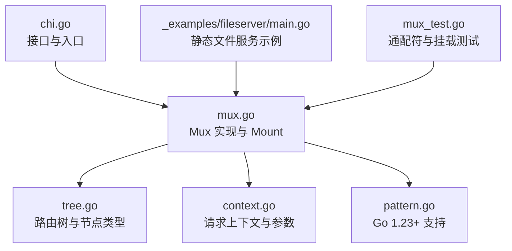
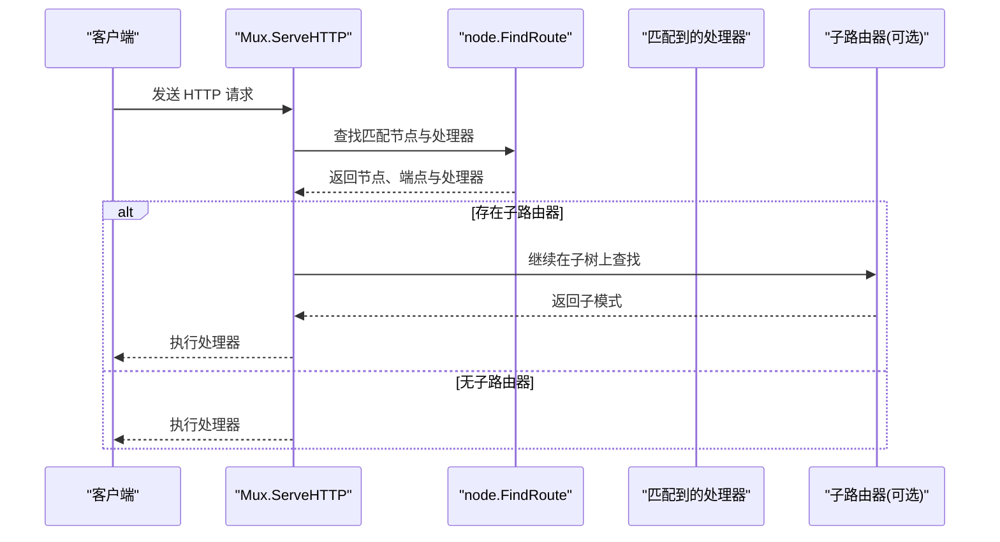
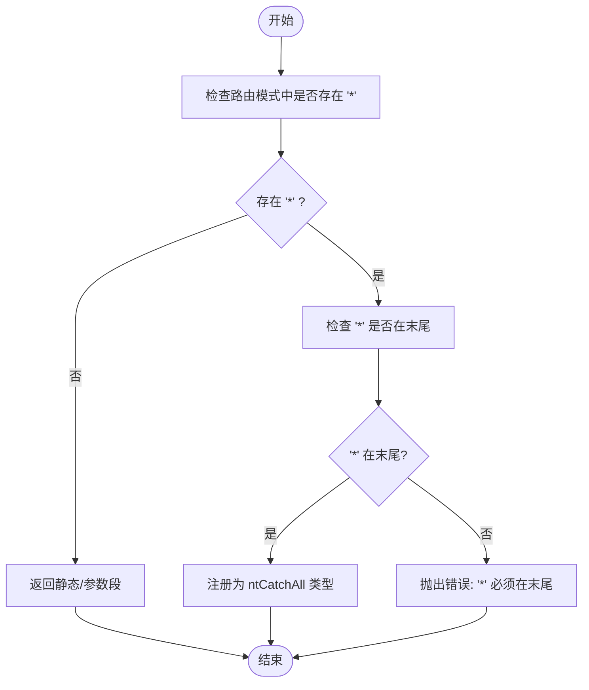
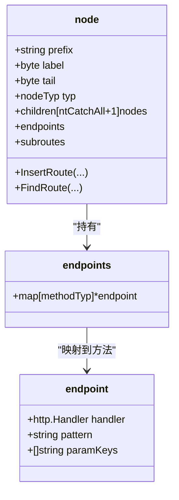
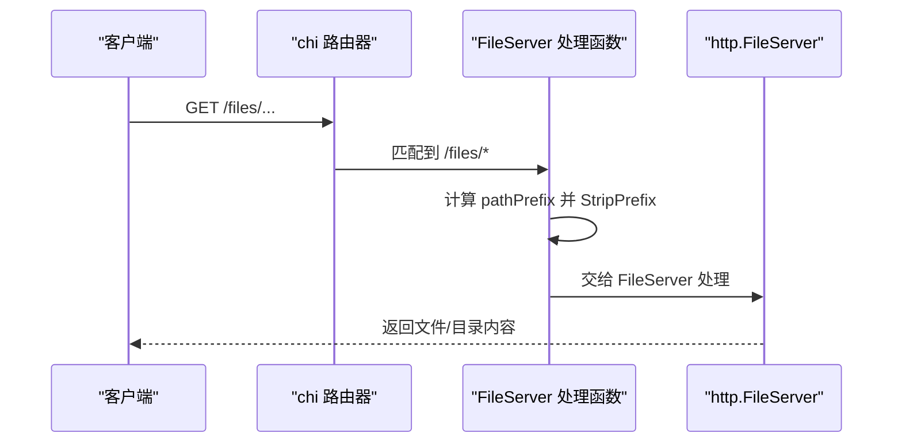
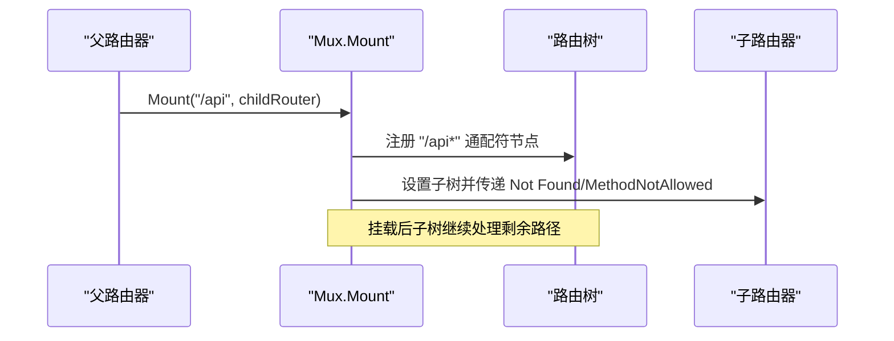
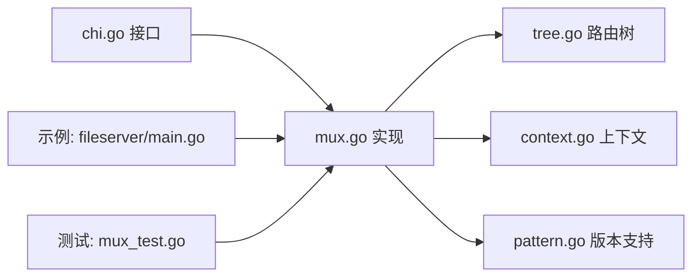

# 通配符路由

<cite>
**本文引用的文件列表**
- [chi.go](file://chi.go)
- [_examples/fileserver/main.go](file://_examples/fileserver/main.go)
- [mux.go](file://mux.go)
- [tree.go](file://tree.go)
- [context.go](file://context.go)
- [pattern.go](file://pattern.go)
- [mux_test.go](file://mux_test.go)
</cite>

## 目录
1. [简介](#简介)
2. [项目结构](#项目结构)
3. [核心组件](#核心组件)
4. [架构总览](#架构总览)
5. [详细组件分析](#详细组件分析)
6. [依赖关系分析](#依赖关系分析)
7. [性能考量](#性能考量)
8. [故障排查指南](#故障排查指南)
9. [结论](#结论)

## 简介
本篇文档围绕 chi 框架的“通配符路由”能力展开，系统性解释其语法规则、在路由树中的存储与匹配机制、典型使用场景（尤其是静态资源服务），并结合示例文件展示如何通过通配符实现目录浏览与文件服务。同时，重点说明通配符必须位于路由模式末尾的约束，并解析 Mount 方法如何利用通配符实现子路由器挂载。

## 项目结构
围绕通配符路由的相关代码主要分布在以下模块：
- 路由器接口与入口：chi.go
- 路由树与节点类型：tree.go
- 路由器实现与挂载逻辑：mux.go
- 请求上下文与参数提取：context.go
- Go 1.23+ 的请求 Pattern 字段支持：pattern.go
- 示例：_examples/fileserver/main.go
- 测试用例：mux_test.go

图表来源
- [chi.go](file://chi.go#L1-L138)
- [mux.go](file://mux.go#L1-L120)
- [tree.go](file://tree.go#L78-L120)
- [context.go](file://context.go#L1-L80)
- [pattern.go](file://pattern.go#L1-L17)
- [_examples/fileserver/main.go](file://_examples/fileserver/main.go#L1-L66)
- [mux_test.go](file://mux_test.go#L110-L206)

章节来源
- [chi.go](file://chi.go#L1-L138)
- [mux.go](file://mux.go#L1-L120)
- [tree.go](file://tree.go#L78-L120)
- [context.go](file://context.go#L1-L80)
- [pattern.go](file://pattern.go#L1-L17)
- [_examples/fileserver/main.go](file://_examples/fileserver/main.go#L1-L66)
- [mux_test.go](file://mux_test.go#L110-L206)

## 核心组件
- 通配符语法与规则
  - 通配符“*”仅能出现在路由模式末尾；若出现在中间或末尾后仍有文本，将触发错误。
  - 通配符可匹配路径中的任意剩余部分，包括斜杠字符。
- 路由树节点类型
  - ntCatchAll 表示通配符节点类型，对应“/*”。
  - 节点结构包含前缀、子节点数组、类型、标签等字段，用于构建多维字典树。
- 匹配流程
  - findRoute 在多组子节点中按顺序遍历，遇到 ntCatchAll 时会把剩余路径整体作为参数捕获。
- 文件服务器示例
  - 通过在路径后追加“*”，将所有子路径交由 http.FileServer 处理，实现静态资源服务与目录浏览。
- 子路由器挂载
  - Mount 将子路由器沿 pattern + “/*” 挂载，使子树继续处理剩余路径。

章节来源
- [tree.go](file://tree.go#L78-L120)
- [tree.go](file://tree.go#L684-L773)
- [tree.go](file://tree.go#L398-L543)
- [_examples/fileserver/main.go](file://_examples/fileserver/main.go#L46-L66)
- [mux.go](file://mux.go#L282-L340)

## 架构总览
下图展示了从请求进入，到路由树匹配、参数捕获、再到子路由器挂载的整体流程。

图表来源
- [mux.go](file://mux.go#L60-L120)
- [mux.go](file://mux.go#L440-L487)
- [tree.go](file://tree.go#L398-L543)

## 详细组件分析

### 通配符语法与约束
- 通配符“*”必须位于路由模式末尾，否则抛出异常。
- 若“*”后仍有文本，将提示应改用命名参数“{param}”。

图表来源
- [tree.go](file://tree.go#L684-L773)

章节来源
- [tree.go](file://tree.go#L684-L773)

### 路由树中的存储与匹配
- 节点类型
  - ntStatic、ntParam、ntRegexp、ntCatchAll 四类节点分别对应静态段、命名参数、正则参数、通配符。
- 插入过程
  - addChild 会根据下一个段的类型拆分静态段与参数段，必要时递归插入。
  - 对于 ntCatchAll，会在开头标记特殊起始索引，确保“*”位于末尾。
- 匹配过程
  - findRoute 遍历各组子节点，ntCatchAll 分支直接把剩余路径作为参数捕获，不进行分段校验。
  - 参数键名固定为“*”，值为完整剩余路径。

图表来源
- [tree.go](file://tree.go#L78-L120)
- [tree.go](file://tree.go#L114-L128)
- [tree.go](file://tree.go#L138-L228)
- [tree.go](file://tree.go#L398-L543)

章节来源
- [tree.go](file://tree.go#L78-L120)
- [tree.go](file://tree.go#L138-L228)
- [tree.go](file://tree.go#L398-L543)

### 文件服务器示例：静态资源与目录浏览
- 关键点
  - 在路径末尾追加“*”，形成“/files/*”。
  - 使用 http.StripPrefix 去除前缀，再交给 http.FileServer 处理。
  - 对路径进行规范化（末尾斜杠与重定向）以保证目录浏览与文件访问一致。
- 使用场景
  - 提供静态资源服务、目录浏览、文件下载等。

图表来源
- [_examples/fileserver/main.go](file://_examples/fileserver/main.go#L46-L66)

章节来源
- [_examples/fileserver/main.go](file://_examples/fileserver/main.go#L1-L66)

### 子路由器挂载：Mount 如何利用通配符
- Mount 的行为
  - 在 pattern 后自动追加“/*”，形成“/pattern/*”，将子路由器挂载到该通配符分支。
  - 若子路由器实现了 Routes 接口，则将其 subroutes 写入挂载节点，以便后续在子树上继续匹配。
  - 在挂载点处重置“*”参数，确保子树从剩余路径继续匹配。
- 安全性
  - 在挂载前检查是否已存在相同 pattern 的路由，避免重复挂载导致冲突。

图表来源
- [mux.go](file://mux.go#L282-L340)

章节来源
- [mux.go](file://mux.go#L282-L340)

### 请求上下文与参数提取
- 上下文
  - Context 中维护 routePattern、URLParams、RoutePatterns 等，贯穿请求生命周期。
  - 通配符参数键名为“*”，值为剩余路径。
- 参数读取
  - URLParam/URLParamFromCtx 可从请求上下文中读取参数。

章节来源
- [context.go](file://context.go#L1-L167)

### Go 1.23+ 的请求 Pattern 字段支持
- 当运行环境满足条件时，setPattern 会把匹配到的路由模式写入 http.Request.Pattern，便于可观测与调试。

章节来源
- [pattern.go](file://pattern.go#L1-L17)

## 依赖关系分析
- chi.go 定义了 Router 接口，其中包含 Mount 方法，为通配符挂载提供契约。
- mux.go 实现了 Mount 与 ServeHTTP，并在内部调用路由树进行匹配。
- tree.go 提供节点类型、插入与匹配逻辑，是通配符实现的核心。
- context.go 提供请求上下文与参数提取工具。
- pattern.go 在新版本 Go 中增强请求信息输出。

图表来源
- [chi.go](file://chi.go#L64-L115)
- [mux.go](file://mux.go#L1-L120)
- [tree.go](file://tree.go#L78-L120)
- [context.go](file://context.go#L1-L80)
- [pattern.go](file://pattern.go#L1-L17)
- [_examples/fileserver/main.go](file://_examples/fileserver/main.go#L1-L66)
- [mux_test.go](file://mux_test.go#L110-L206)

章节来源
- [chi.go](file://chi.go#L64-L115)
- [mux.go](file://mux.go#L1-L120)
- [tree.go](file://tree.go#L78-L120)
- [context.go](file://context.go#L1-L80)
- [pattern.go](file://pattern.go#L1-L17)
- [_examples/fileserver/main.go](file://_examples/fileserver/main.go#L1-L66)
- [mux_test.go](file://mux_test.go#L110-L206)

## 性能考量
- 路由树采用多维字典树结构，按节点类型分组存储，匹配时优先尝试静态段，再尝试参数段与通配符段，整体复杂度与路径长度线性相关。
- 通配符匹配无需分段校验，直接捕获剩余路径，减少回溯成本。
- 在高并发场景下，建议：
  - 合理组织路由层级，避免过多通配符分支。
  - 对静态资源使用合适的缓存策略与压缩中间件。
  - 使用 With/Group 为热点路径添加专用中间件栈，减少无关处理。

## 故障排查指南
- 通配符位置错误
  - 症状：注册路由时报错，提示“* 必须在末尾”或“请使用 {param} 替代”。
  - 排查：确认路由模式末尾是否为“*”，且“*”之后无其他文本。
  - 参考：[tree.go](file://tree.go#L684-L773)
- 重复挂载
  - 症状：Mount 报错，提示已在相同路径挂载。
  - 排查：检查是否在同一 pattern 下多次 Mount。
  - 参考：[mux.go](file://mux.go#L282-L340)
- 子路由器未处理路径
  - 症状：访问“/files/xxx”返回 404。
  - 排查：确认是否正确在路径末尾追加“*”，并使用 http.StripPrefix。
  - 参考：[_examples/fileserver/main.go](file://_examples/fileserver/main.go#L46-L66)
- 参数读取不到
  - 症状：URLParam 获取不到“*”参数。
  - 排查：确认请求确实命中了“/*”分支，且在处理器执行后读取上下文。
  - 参考：[context.go](file://context.go#L1-L167)

章节来源
- [tree.go](file://tree.go#L684-L773)
- [mux.go](file://mux.go#L282-L340)
- [_examples/fileserver/main.go](file://_examples/fileserver/main.go#L46-L66)
- [context.go](file://context.go#L1-L167)

## 结论
- 通配符“/*”是 chi 路由系统的重要能力，它允许将剩余路径整体作为参数捕获，非常适合静态资源服务与子路由器挂载。
- 其实现基于多维字典树，通过 ntCatchAll 节点类型与 findRoute 的特殊分支，高效完成匹配与参数收集。
- 在实际工程中，建议：
  - 严格遵守“* 必须位于末尾”的约束；
  - 使用示例中的方式为静态资源提供目录浏览与文件服务；
  - 利用 Mount 将大型服务拆分为多个子路由器，提升可维护性与可扩展性。