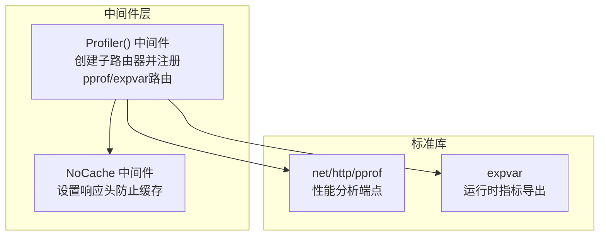
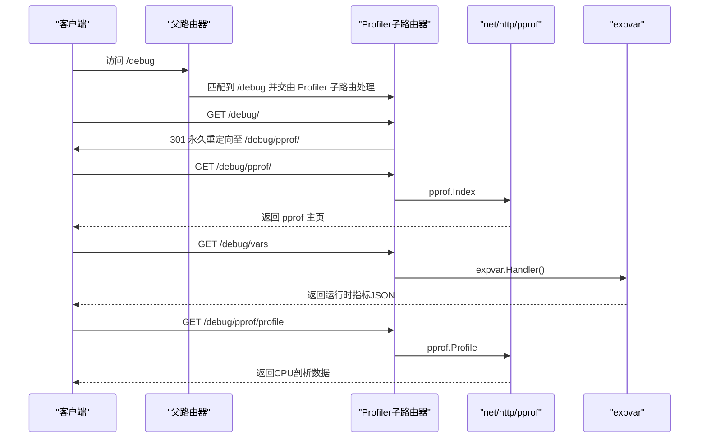
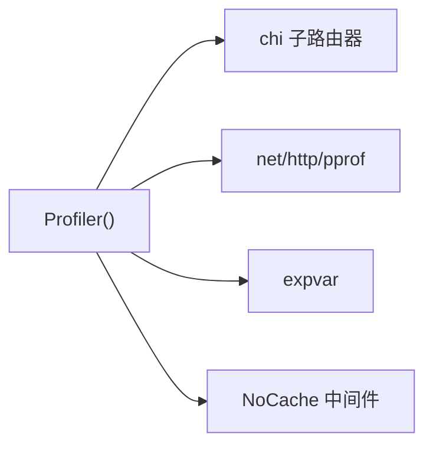

# 性能分析

<cite>
**本文引用的文件**
- [middleware/profiler.go](file://middleware/profiler.go)
- [middleware/nocache.go](file://middleware/nocache.go)
- [README.md](file://README.md)
- [_examples/hello-world/main.go](file://_examples/hello-world/main.go)
</cite>

## 目录
1. [简介](#简介)
2. [项目结构](#项目结构)
3. [核心组件](#核心组件)
4. [架构总览](#架构总览)
5. [详细组件分析](#详细组件分析)
6. [依赖关系分析](#依赖关系分析)
7. [性能考量](#性能考量)
8. [故障排查指南](#故障排查指南)
9. [结论](#结论)
10. [附录](#附录)

## 简介
本篇文档围绕 chi 框架的性能分析能力展开，重点解析 middleware/profiler.go 中的 Profiler() 中间件。该中间件通过子路由器挂载标准库 net/http/pprof 的调试端点，并结合 expvar 提供运行时指标导出，帮助开发者在开发与测试阶段快速定位性能瓶颈。文档将从架构设计、路由注册、重定向逻辑、端点作用与使用方法、安全与性能影响等方面进行系统化说明，并给出可操作的启用与访问示例。

## 项目结构
- Profiler() 中间件位于 middleware/profiler.go，负责创建一个子路由器并注册 pprof 与 expvar 相关路由。
- NoCache 中间件位于 middleware/nocache.go，作为 Profiler 子路由的中间件栈的一部分，确保调试页面不被缓存。
- README.md 在“Middlewares”章节明确列出 Profiler 中间件用于“轻松挂载 net/http/pprof 到路由器”。

图表来源
- [middleware/profiler.go](file://middleware/profiler.go#L23-L49)
- [middleware/nocache.go](file://middleware/nocache.go#L40-L60)

章节来源
- [README.md](file://README.md#L330-L365)
- [middleware/profiler.go](file://middleware/profiler.go#L23-L49)

## 核心组件
- Profiler() 中间件：创建 chi 子路由器，注入 NoCache 中间件，注册 /、/pprof、/pprof/*、/pprof/cmdline、/pprof/profile、/pprof/symbol、/pprof/trace、/vars 以及多类 pprof handler（goroutine、threadcreate、mutex、heap、block、allocs），并返回该子路由器以供父路由器挂载。
- NoCache 中间件：为调试路由设置一系列响应头，避免上游代理或客户端缓存调试页面，保证每次请求都能获取最新信息。
- expvar 路由：/vars 对外暴露运行时指标（如内存分配计数、Goroutine 数量等），便于结合浏览器或命令行工具查看。

章节来源
- [middleware/profiler.go](file://middleware/profiler.go#L23-L49)
- [middleware/nocache.go](file://middleware/nocache.go#L40-L60)

## 架构总览
Profiler() 中间件采用“子路由器 + 标准库 pprof”的组合模式：
- 子路由器负责隔离调试路由，避免污染主业务路由。
- 通过 Handle/HandleFunc 将 pprof 的 Index、Cmdline、Profile、Symbol、Trace 等处理函数映射到对应路径。
- 通过 Handle 将特定 pprof handler（按模式名）绑定到 /pprof/<mode> 路径。
- 通过 Handle 将 expvar.Handler 绑定到 /vars，统一对外暴露。

图表来源
- [middleware/profiler.go](file://middleware/profiler.go#L23-L49)

## 详细组件分析

### Profiler() 实现与路由注册
- 子路由器创建与中间件注入：使用 chi.NewRouter() 创建子路由器，并通过 r.Use(NoCache) 为调试路由设置防缓存策略。
- 重定向逻辑：
  - GET /debug/ 重定向到 /debug/pprof/（301 永久重定向）。
  - GET /debug/pprof 重定向到 /debug/（301 永久重定向），保持路径一致性。
- pprof 主页与子端点：
  - /debug/pprof/* 映射到 pprof.Index，提供交互式主页。
  - /debug/pprof/cmdline、/debug/pprof/profile、/debug/pprof/symbol、/debug/pprof/trace 分别映射到 pprof 对应处理函数。
- pprof 模式端点：
  - /debug/pprof/goroutine、/debug/pprof/threadcreate、/debug/pprof/mutex、/debug/pprof/heap、/debug/pprof/block、/debug/pprof/allocs 使用 pprof.Handler("mode") 绑定到对应模式。
- 运行时指标：
  - /debug/vars 使用 expvar.Handler() 对外输出运行时指标。

```mermaid
flowchart TD
Start(["进入 Profiler 子路由"]) --> RootGet["GET /debug/"]
RootGet --> RedirRoot["重定向到 /debug/pprof/"]
Start --> PProfGet["GET /debug/pprof"]
PProfGet --> RedirPProf["重定向到 /debug/"]
Start --> PProfStar["/debug/pprof/*"]
PProfStar --> PProfIndex["pprof.Index"]
Start --> Cmdline["/debug/pprof/cmdline"]
Cmdline --> PProfCmdline["pprof.Cmdline"]
Start --> Profile["/debug/pprof/profile"]
Profile --> PProfProfile["pprof.Profile"]
Start --> Symbol["/debug/pprof/symbol"]
Symbol --> PProfSymbol["pprof.Symbol"]
Start --> Trace["/debug/pprof/trace"]
Trace --> PProfTrace["pprof.Trace"]
Start --> Vars["/debug/vars"]
Vars --> ExpVar["expvar.Handler()"]
Start --> Goroutine["/debug/pprof/goroutine"]
Goroutine --> PProfGoroutine["pprof.Handler('goroutine')"]
Start --> Threadcreate["/debug/pprof/threadcreate"]
Threadcreate --> PProfThreadcreate["pprof.Handler('threadcreate')"]
Start --> Mutex["/debug/pprof/mutex"]
Mutex --> PProfMutex["pprof.Handler('mutex')"]
Start --> Heap["/debug/pprof/heap"]
Heap --> PProfHeap["pprof.Handler('heap')"]
Start --> Block["/debug/pprof/block"]
Block --> PProfBlock["pprof.Handler('block')"]
Start --> Allocs["/debug/pprof/allocs"]
Allocs --> PProfAllocs["pprof.Handler('allocs')"]
```

图表来源
- [middleware/profiler.go](file://middleware/profiler.go#L23-L49)

章节来源
- [middleware/profiler.go](file://middleware/profiler.go#L23-L49)

### NoCache 中间件的作用与影响
- NoCache 会删除可能存在的 ETag 相关请求头，并设置一系列响应头（如 Expires、Cache-Control、Pragma 等），确保调试页面不会被缓存。
- 在性能分析场景下，这能保证每次访问都能看到最新的分析结果，避免因缓存导致的误导。

章节来源
- [middleware/nocache.go](file://middleware/nocache.go#L40-L60)

### 各性能分析端点的作用与使用方法
- /debug/pprof/：pprof 主页，提供导航到各分析模式的入口。
- /debug/pprof/profile：生成 CPU 剖析数据，适合定位热点函数与调用链。
- /debug/pprof/trace：生成执行跟踪数据，适合分析调度与阻塞行为。
- /debug/pprof/symbol：解析符号地址，辅助将剖析数据与源码位置关联。
- /debug/pprof/cmdline：返回命令行参数，便于复现实验环境。
- /debug/pprof/goroutine：当前所有 Goroutine 的堆栈快照。
- /debug/pprof/threadcreate：线程创建事件的堆栈快照。
- /debug/pprof/mutex：互斥锁等待事件的堆栈快照。
- /debug/pprof/heap：堆内存分配统计，定位内存热点与泄漏。
- /debug/pprof/block：阻塞事件的堆栈快照。
- /debug/pprof/allocs：分配历史统计，与 heap 配合分析内存增长。
- /debug/vars：运行时指标 JSON，包含内存、Goroutine 数、GC 统计等。

使用建议
- 浏览器访问：直接在浏览器打开 /debug/pprof/ 查看主页；点击相应链接查看目标端点。
- 命令行访问：使用 curl 或 wget 获取 /debug/pprof/profile、/debug/pprof/trace 等二进制数据；使用 curl 获取 /debug/vars 输出的 JSON 指标。
- 结合工具：将 /debug/pprof/profile 的输出交给 go tool pprof 分析；将 /debug/pprof/trace 的输出交给 go tool trace 分析。

章节来源
- [middleware/profiler.go](file://middleware/profiler.go#L33-L47)
- [README.md](file://README.md#L330-L365)

### 如何在项目中启用性能分析中间件
- 在父路由器上挂载 Profiler 子路由，例如将 /debug 挂载为 Profiler() 的根路径。
- 示例参考：hello-world 示例展示了如何在服务启动前构建路由器并挂载中间件，可在此基础上添加 /debug 路由挂载。

章节来源
- [middleware/profiler.go](file://middleware/profiler.go#L14-L22)
- [_examples/hello-world/main.go](file://_examples/hello-world/main.go#L10-L21)

## 依赖关系分析
- Profiler() 依赖 chi 子路由器进行路由注册。
- 依赖 net/http/pprof 提供剖析端点。
- 依赖 expvar 提供运行时指标导出。
- 依赖 NoCache 中间件保证调试页面不被缓存。

图表来源
- [middleware/profiler.go](file://middleware/profiler.go#L23-L49)
- [middleware/nocache.go](file://middleware/nocache.go#L40-L60)

章节来源
- [middleware/profiler.go](file://middleware/profiler.go#L23-L49)

## 性能考量
- 开启剖析对系统有额外开销：profile 与 trace 会采集实时数据，可能增加 CPU 与内存占用；heap、block、allocs 等也会带来一定成本。
- 建议仅在开发与测试环境开启，或在生产环境限定时间段内临时启用。
- 使用 NoCache 可避免调试页面缓存带来的“旧数据”问题，但调试页面本身不会显著影响业务流量。
- expvar 输出的是只读指标，通常开销较小，但仍需关注高并发下的输出频率。

[本节为通用指导，无需代码来源]

## 故障排查指南
- 访问 /debug/ 返回 404：确认父路由器已正确挂载 Profiler 子路由到 /debug。
- 访问 /debug/pprof/ 返回空白或错误：检查是否正确导入 net/http/pprof；确认未被上游代理拦截。
- /debug/vars 无法访问：确认已注册 /debug/vars；检查网络与权限。
- 缓存导致页面不更新：确保 NoCache 中间件生效；必要时手动清除浏览器缓存。
- 生产环境泄露风险：仅在受控网络或内网开放 /debug；或通过反向代理限制来源 IP。

章节来源
- [middleware/profiler.go](file://middleware/profiler.go#L23-L49)
- [middleware/nocache.go](file://middleware/nocache.go#L40-L60)

## 结论
Profiler() 中间件通过子路由器与标准库 pprof/expvar 的组合，为 chi 应用提供了即插即用的性能分析能力。其简洁的路由注册与重定向逻辑，使得在开发与测试阶段能够快速获取 CPU、内存、Goroutine、互斥锁、阻塞等多维度的剖析数据，并结合运行时指标进行综合诊断。在生产环境中，应谨慎控制访问范围与启用时间，以平衡可观测性与系统开销。

[本节为总结性内容，无需代码来源]

## 附录
- 实际使用步骤（基于仓库示例）
  - 在父路由器上挂载 /debug 路由，指向 Profiler() 子路由。
  - 启动服务后，在浏览器访问 /debug/pprof/ 查看主页；根据需要访问 /debug/pprof/profile、/debug/pprof/trace、/debug/vars 等端点。
  - 通过命令行工具（curl/wget）抓取二进制或 JSON 数据，配合 go tool pprof/trace 进行离线分析。

章节来源
- [middleware/profiler.go](file://middleware/profiler.go#L14-L22)
- [_examples/hello-world/main.go](file://_examples/hello-world/main.go#L10-L21)