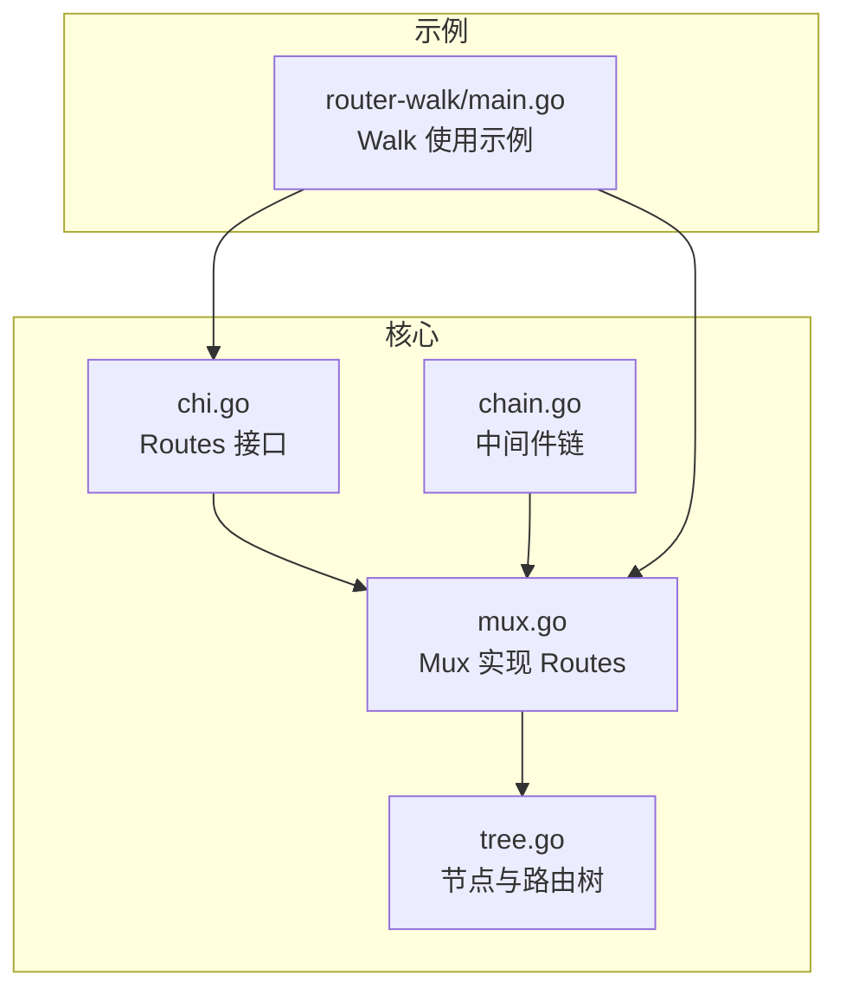
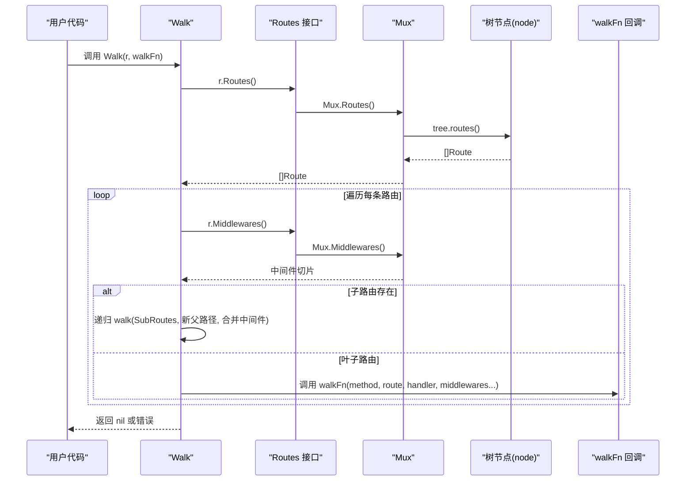
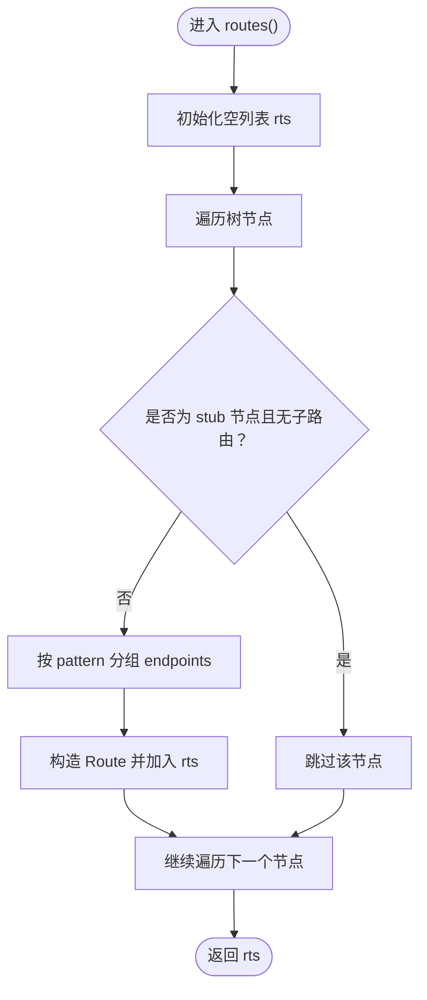
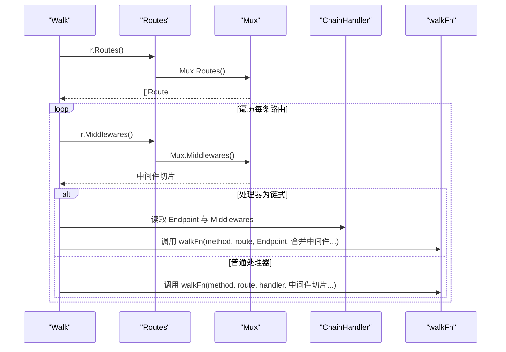
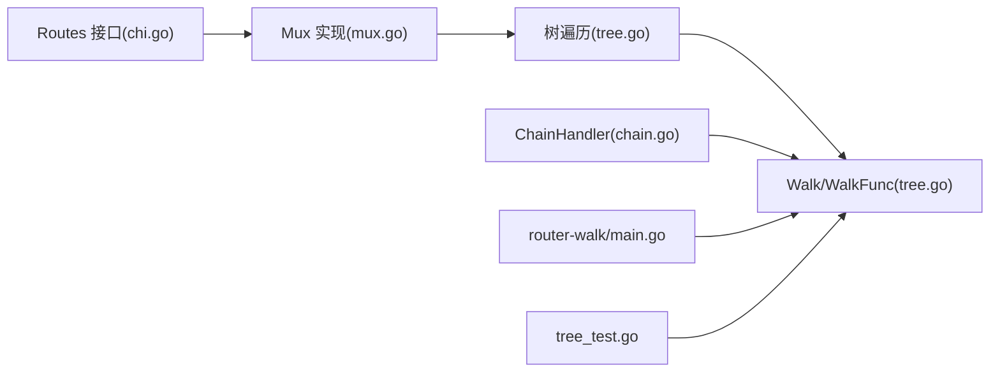

# 路由遍历

<cite>
**本文引用的文件**
- [tree.go](file://tree.go)
- [_examples/router-walk/main.go](file://_examples/router-walk/main.go)
- [chi.go](file://chi.go)
- [mux.go](file://mux.go)
- [chain.go](file://chain.go)
- [tree_test.go](file://tree_test.go)
</cite>

## 目录
1. [简介](#简介)
2. [项目结构](#项目结构)
3. [核心组件](#核心组件)
4. [架构总览](#架构总览)
5. [详细组件分析](#详细组件分析)
6. [依赖关系分析](#依赖关系分析)
7. [性能考量](#性能考量)
8. [故障排查指南](#故障排查指南)
9. [结论](#结论)
10. [附录](#附录)

## 简介
本篇文档围绕 chi 框架的“路由遍历”能力展开，重点解释 tree.go 中 routes() 与 walk() 方法的实现机制，说明如何通过 Routes() 接口获取完整的路由树结构；结合 _examples/router-walk/main.go 的示例，展示如何使用 chi.Walk() 函数遍历所有路由并输出 HTTP 方法与路径信息；进一步阐述路由遍历在生成 API 文档、调试路由冲突、监控路由状态等场景中的应用；最后给出自定义 walkFunc 收集路由元数据的方法、中间件处理方式、性能影响与最佳实践。

## 项目结构
- 核心路由树与遍历逻辑位于 tree.go：包含节点类型、端点映射、路由树构建与遍历（routes、walk）。
- 公共接口 Routes 定义于 chi.go：提供 Routes() 与 Middlewares() 等能力。
- Mux 实现 Routes 接口：在 mux.go 中将树的遍历结果暴露为 []Route，并提供 Mount/With 等挂载与中间件组合能力。
- 示例程序 _examples/router-walk/main.go 展示了如何调用 chi.Walk() 遍历路由并打印方法与路径。
- 中间件链路与链式处理器 chain.go：Walk 在遍历时会识别链式处理器，以便正确传递中间件序列。

图表来源
- [tree.go](file://tree.go#L619-L872)
- [chi.go](file://chi.go#L116-L138)
- [mux.go](file://mux.go#L342-L376)
- [chain.go](file://chain.go#L1-L49)
- [_examples/router-walk/main.go](file://_examples/router-walk/main.go#L1-L43)

章节来源
- [tree.go](file://tree.go#L619-L872)
- [chi.go](file://chi.go#L116-L138)
- [mux.go](file://mux.go#L342-L376)
- [_examples/router-walk/main.go](file://_examples/router-walk/main.go#L1-L43)

## 核心组件
- 路由树节点与端点
  - 节点类型：静态、参数、正则、通配。
  - 端点映射：按 HTTP 方法存储处理器与模式信息。
- 路由树遍历
  - routes()：从树中收集所有路由条目，按模式分组方法，生成 []Route。
  - walk()：深度优先遍历树，回调用户 walkFunc。
- Routes 接口与 Mux 实现
  - Routes() 返回 []Route，Middlewares() 返回当前栈的中间件。
  - Mux 在 Mount/With 等操作中维护子路由与中间件链。
- Walk 与 WalkFunc
  - Walk(r Routes, walkFn WalkFunc)：对外暴露的遍历入口。
  - WalkFunc：遍历每个具体方法与路径时的回调，可获取中间件序列。

章节来源
- [tree.go](file://tree.go#L82-L128)
- [tree.go](file://tree.go#L619-L682)
- [tree.go](file://tree.go#L820-L872)
- [chi.go](file://chi.go#L116-L138)
- [mux.go](file://mux.go#L342-L376)
- [chain.go](file://chain.go#L1-L49)

## 架构总览
下图展示了从 Mux 到树、再到 Walk 的完整调用链，以及中间件链在遍历中的传递。

图表来源
- [tree.go](file://tree.go#L619-L682)
- [tree.go](file://tree.go#L832-L872)
- [mux.go](file://mux.go#L342-L376)
- [chi.go](file://chi.go#L116-L138)

## 详细组件分析

### tree.go 中的 routes() 与 walk() 实现机制
- routes() 的职责
  - 遍历树节点，聚合每个节点上的端点映射 endpoints。
  - 将相同 pattern 的方法合并到一个 map 中，形成“按模式分组”的结构。
  - 对 mALL 的处理器进行特殊处理，将其转换为具体方法集合。
  - 生成 Route 结构体，包含 SubRoutes、Handlers、Pattern。
- walk() 的职责
  - 采用深度优先策略，先访问当前层的叶子节点或子路由，再递归访问子节点。
  - 通过回调函数对每个具体方法与路径执行 walkFn。
  - 忽略“通配方法”标记，仅向下传递具体方法。
- 复杂度与行为
  - 时间复杂度近似 O(N)，N 为树上节点数量。
  - 空间复杂度与节点数量成线性关系，递归深度取决于树高。

图表来源
- [tree.go](file://tree.go#L619-L682)

章节来源
- [tree.go](file://tree.go#L619-L682)

### 如何通过 Routes() 获取完整路由树结构
- Mux 实现 Routes 接口，其 Routes() 直接委托给树的 routes()。
- 返回值 []Route 提供：
  - Pattern：路由模式字符串。
  - Handlers：方法到处理器的映射。
  - SubRoutes：若为子路由挂载点，则指向子 Mux。
- 这些信息足以用于生成 API 文档、调试路由冲突、统计路由数量等。

章节来源
- [mux.go](file://mux.go#L342-L376)
- [tree.go](file://tree.go#L820-L827)

### _examples/router-walk/main.go 中的 Walk 使用
- 示例创建了一个简单路由器，注册了若干 GET/POST/PUT 路由，并通过 chi.Walk() 遍历。
- walkFunc 的作用：
  - 格式化输出 HTTP 方法与路径。
  - 可选地收集中间件信息（见下一节）。
- 示例还演示了子路由的挂载与遍历。

章节来源
- [_examples/router-walk/main.go](file://_examples/router-walk/main.go#L1-L43)

### 自定义 walkFunc 收集路由元数据
- walkFn 的签名允许获取：
  - method：HTTP 方法。
  - route：完整路径。
  - handler：具体处理器。
  - middlewares：中间件序列（含父级与当前级）。
- 常见用途：
  - 收集路由清单、方法集合、路径参数键名。
  - 统计中间件覆盖范围，辅助审计。
  - 生成 OpenAPI/Swagger 文档的路由段落。

章节来源
- [tree.go](file://tree.go#L829-L872)
- [chain.go](file://chain.go#L1-L49)

### 中间件在遍历过程中的处理方式
- Walk 会将父级中间件与当前级中间件合并传入 walkFn。
- 若处理器为链式处理器（ChainHandler），Walk 会识别其内部 Endpoint 与 Middlewares，并将其一并传递给 walkFn。
- 这保证了 walkFn 能够拿到“真实执行链”的完整中间件序列，便于审计与文档生成。

图表来源
- [tree.go](file://tree.go#L837-L872)
- [chain.go](file://chain.go#L1-L49)

章节来源
- [tree.go](file://tree.go#L837-L872)
- [chain.go](file://chain.go#L1-L49)

### 路由遍历在常见场景的应用
- 生成 API 文档
  - 遍历所有方法与路径，结合中间件信息生成文档片段。
- 调试路由冲突
  - 比较不同方法在同一路径下的处理器，定位覆盖关系。
- 监控路由状态
  - 统计活跃路由数、按中间件分组、导出路由白名单等。

章节来源
- [tree.go](file://tree.go#L829-L872)
- [mux.go](file://mux.go#L342-L376)

## 依赖关系分析
- 接口与实现
  - Routes 接口定义于 chi.go，Mux 在 mux.go 中实现 Routes() 与 Middlewares()。
- 树与遍历
  - tree.go 提供 node.routes() 与 node.walk()，Mux.Routes() 仅委托给树。
- Walk 与链式中间件
  - tree.go 的 Walk 与 walkFn 负责遍历与回调；chain.go 的 ChainHandler 为中间件链包装，Walk 会识别并透传链上中间件。
- 示例与测试
  - _examples/router-walk/main.go 展示 Walk 的基本用法。
  - tree_test.go 的 TestWalker 验证 Walk 的遍历行为。

图表来源
- [chi.go](file://chi.go#L116-L138)
- [mux.go](file://mux.go#L342-L376)
- [tree.go](file://tree.go#L619-L872)
- [chain.go](file://chain.go#L1-L49)
- [_examples/router-walk/main.go](file://_examples/router-walk/main.go#L1-L43)
- [tree_test.go](file://tree_test.go#L512-L523)

章节来源
- [chi.go](file://chi.go#L116-L138)
- [mux.go](file://mux.go#L342-L376)
- [tree.go](file://tree.go#L619-L872)
- [chain.go](file://chain.go#L1-L49)
- [_examples/router-walk/main.go](file://_examples/router-walk/main.go#L1-L43)
- [tree_test.go](file://tree_test.go#L512-L523)

## 性能考量
- 遍历复杂度
  - routes() 与 walk() 均为 O(N)，N 为树节点数；对大多数业务规模足够高效。
- 内存占用
  - 遍历过程中会复制中间件切片，注意避免在高频场景中重复触发遍历。
- 实践建议
  - 将遍历结果缓存至内存，定期刷新（如在路由变更后）。
  - 在生产环境避免在热路径上频繁调用 Walk。
  - 对大型路由树，可考虑分批遍历或按模块拆分遍历任务。

章节来源
- [tree.go](file://tree.go#L619-L682)
- [tree.go](file://tree.go#L837-L872)

## 故障排查指南
- 遍历未输出预期结果
  - 确认已调用 Mux.Use/With 注册中间件后再添加路由，否则中间件链可能为空。
  - 检查子路由挂载是否正确，确保 SubRoutes 字段非空。
- 中间件缺失
  - 若处理器为链式处理器，需确认 Walk 能识别 ChainHandler 类型。
- 路由冲突与覆盖
  - 使用 routes() 输出按模式分组的处理器，核对最新覆盖关系。
- 示例验证
  - 可参考 tree_test.go 的 TestWalker，验证 Walk 的行为是否符合预期。

章节来源
- [tree_test.go](file://tree_test.go#L512-L523)
- [tree.go](file://tree.go#L837-L872)
- [mux.go](file://mux.go#L342-L376)

## 结论
- routes() 与 walk() 提供了从树到高层结构的完整遍历能力，配合 Routes 接口与 Mux 实现，可稳定地获取路由树全貌。
- chi.Walk() 通过回调 walkFn，使路由元数据采集、文档生成、冲突排查与中间件审计成为可能。
- 在大规模路由场景中，应关注遍历频率与中间件链的传递，合理缓存与分批处理以平衡性能与可观测性。

## 附录
- 关键 API 路径
  - Walk 入口：[Walk](file://tree.go#L832-L835)
  - 遍历实现：[walk](file://tree.go#L837-L872)
  - 树遍历：[routes](file://tree.go#L619-L665)、[walk](file://tree.go#L667-L682)
  - 接口定义：[Routes](file://chi.go#L116-L133)
  - Mux 实现：[Mux.Routes](file://mux.go#L342-L346)
  - 链式处理器：[ChainHandler](file://chain.go#L22-L33)
  - 示例程序：[_examples/router-walk/main.go](file://_examples/router-walk/main.go#L1-L43)