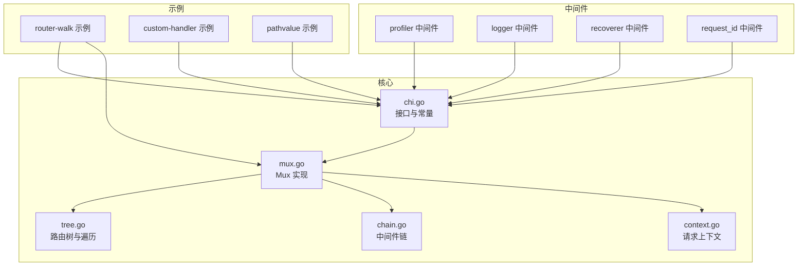
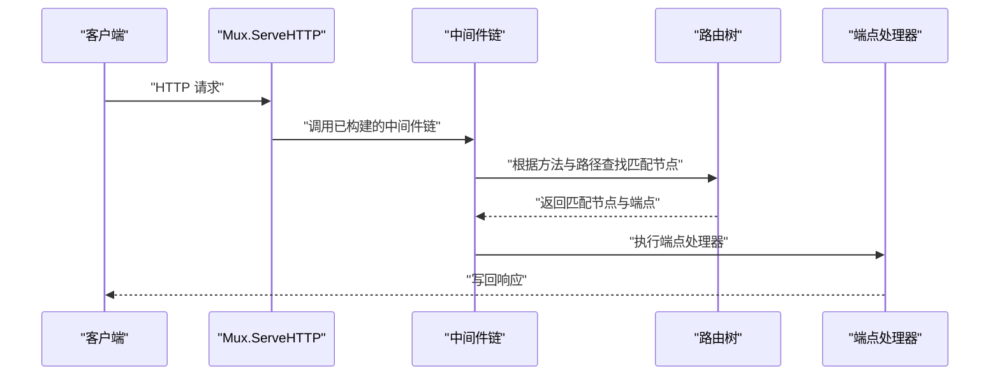
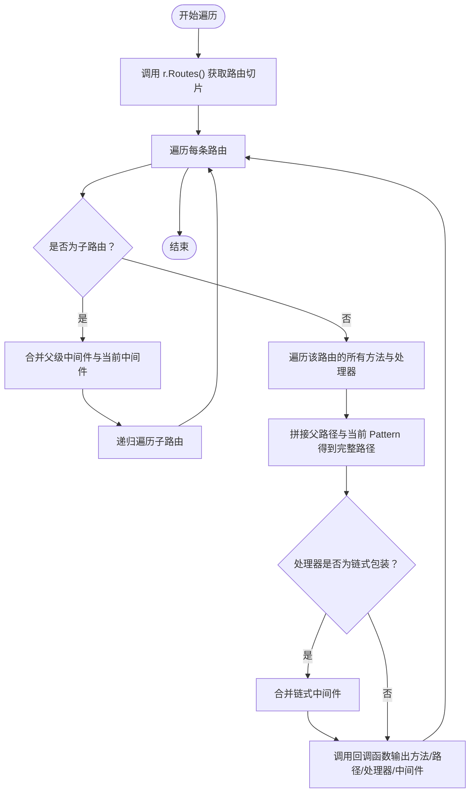
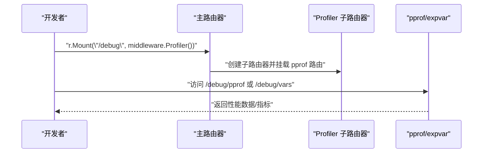
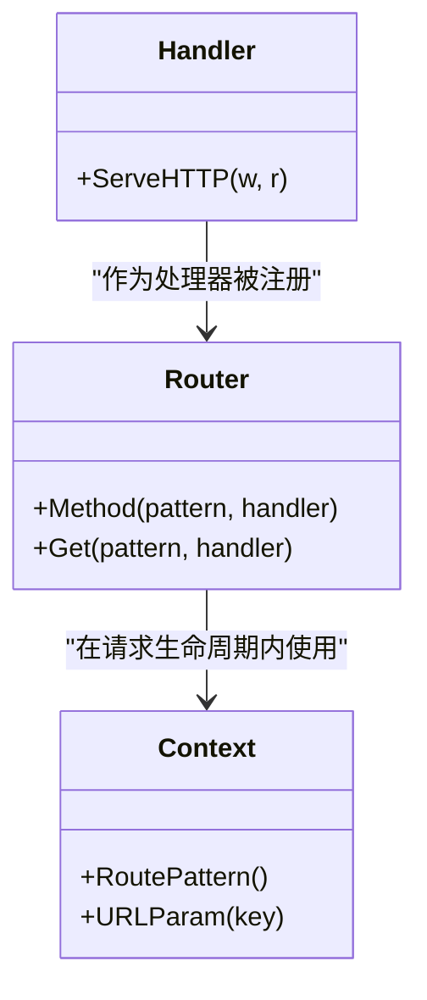
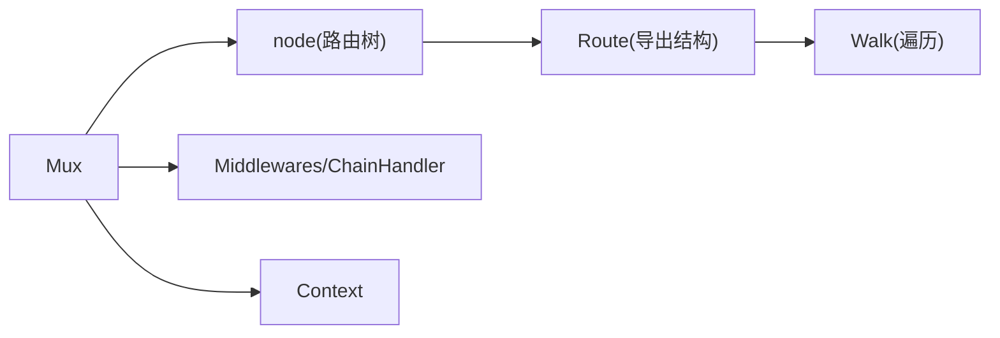

# 高级特性

<cite>
**本文引用的文件**
- [chi.go](file://chi.go)
- [mux.go](file://mux.go)
- [context.go](file://context.go)
- [tree.go](file://tree.go)
- [chain.go](file://chain.go)
- [_examples/router-walk/main.go](file://_examples/router-walk/main.go)
- [middleware/profiler.go](file://middleware/profiler.go)
- [_examples/custom-handler/main.go](file://_examples/custom-handler/main.go)
- [_examples/pathvalue/main.go](file://_examples/pathvalue/main.go)
- [middleware/logger.go](file://middleware/logger.go)
- [middleware/recoverer.go](file://middleware/recoverer.go)
- [middleware/request_id.go](file://middleware/request_id.go)
</cite>

## 目录
1. [简介](#简介)
2. [项目结构](#项目结构)
3. [核心组件](#核心组件)
4. [架构总览](#架构总览)
5. [详细组件分析](#详细组件分析)
6. [依赖关系分析](#依赖关系分析)
7. [性能考量](#性能考量)
8. [故障排查指南](#故障排查指南)
9. [结论](#结论)
10. [附录](#附录)

## 简介
本章节围绕 chi 框架的高级特性展开，重点包括：
- 路由遍历与“路由树”导出：通过 Routes 接口与 Walk 函数，将路由树结构化输出，用于生成文档、调试与可观测性。
- 性能分析工具：通过 middleware.Profiler 中间件集成 net/http/pprof 与 expvar，快速在开发环境启用性能分析。
- 自定义处理器与高级上下文操作：以自定义 Handler 类型与 PathValue 使用为例，展示如何扩展处理模型与高效读取路径参数。
- 大型项目最佳实践：从项目结构、中间件堆栈设计到错误恢复与日志记录，给出可落地的建议。

## 项目结构
chi 的核心由“路由器（Mux）+ 路由树（Radix Tree）+ 中间件链（Chain）+ 上下文（Context）”构成；示例与中间件位于独立目录，便于按需复用。

图表来源
- [chi.go](file://chi.go#L59-L138)
- [mux.go](file://mux.go#L1-L120)
- [context.go](file://context.go#L1-L80)
- [tree.go](file://tree.go#L1-L120)
- [chain.go](file://chain.go#L1-L50)
- [_examples/router-walk/main.go](file://_examples/router-walk/main.go#L1-L43)
- [_examples/custom-handler/main.go](file://_examples/custom-handler/main.go#L1-L36)
- [_examples/pathvalue/main.go](file://_examples/pathvalue/main.go#L1-L26)
- [middleware/profiler.go](file://middleware/profiler.go#L1-L50)
- [middleware/logger.go](file://middleware/logger.go#L1-L60)
- [middleware/recoverer.go](file://middleware/recoverer.go#L1-L60)
- [middleware/request_id.go](file://middleware/request_id.go#L1-L40)

章节来源
- [chi.go](file://chi.go#L59-L138)
- [mux.go](file://mux.go#L1-L120)
- [context.go](file://context.go#L1-L80)
- [tree.go](file://tree.go#L1-L120)

## 核心组件
- 路由器接口与实现
  - Router/Routes 接口定义了路由注册、中间件挂载、路由树导出等能力。
  - Mux 是具体实现，负责中间件链构建、路由树插入与匹配、子路由挂载等。
- 路由树与遍历
  - 基于 Radix Tree 的路由树，支持静态段、参数段、正则段与通配符段。
  - Routes.Routes() 将树转换为可遍历的结构；Walk 函数递归遍历并回调用户函数。
- 中间件链
  - Chain/Middlewares 提供中间件组合与执行顺序控制；ChainHandler 包装端点与中间件链。
- 请求上下文
  - Context 记录路由路径、参数、允许的方法集合等；提供 URLParam/RoutePattern 等辅助。

章节来源
- [chi.go](file://chi.go#L64-L138)
- [mux.go](file://mux.go#L1-L120)
- [tree.go](file://tree.go#L1-L120)
- [chain.go](file://chain.go#L1-L50)
- [context.go](file://context.go#L1-L80)

## 架构总览
下面的序列图展示了从请求进入、中间件链执行、路由树匹配到最终响应的完整流程。

图表来源
- [mux.go](file://mux.go#L60-L120)
- [tree.go](file://tree.go#L373-L420)
- [chain.go](file://chain.go#L34-L50)

## 详细组件分析

### 路由遍历与“路由树”导出（Routes() 与 Walk）
- Routes 接口
  - Routes() 返回路由树的结构化表示，包含 Pattern、Handlers、SubRoutes。
  - Middlewares() 返回当前路由器的中间件列表。
  - Match/Find 提供“只匹配不执行”的能力，便于诊断与文档生成。
- Walk 函数
  - 递归遍历 Routes 树，将每个路由的完整路径与处理器暴露给回调函数。
  - 支持合并父级中间件与链式中间件（ChainHandler），便于生成“真实执行顺序”的文档。
- 示例：router-walk
  - 示例中通过 Walk 输出所有方法与路径，展示如何在运行时收集路由信息，用于文档生成或调试。

图表来源
- [tree.go](file://tree.go#L829-L872)
- [tree.go](file://tree.go#L619-L665)
- [_examples/router-walk/main.go](file://_examples/router-walk/main.go#L1-L43)

章节来源
- [chi.go](file://chi.go#L116-L138)
- [tree.go](file://tree.go#L619-L665)
- [tree.go](file://tree.go#L829-L872)
- [_examples/router-walk/main.go](file://_examples/router-walk/main.go#L1-L43)

### 性能分析工具：middleware.Profiler
- 功能概述
  - 通过子路由器挂载 pprof 与 expvar，提供性能分析入口。
  - 自动重定向到 /pprof/ 子路径，覆盖 goroutine、heap、block、allocs、mutex 等分析点。
- 使用方式
  - 在路由根上挂载 /debug 子路由，即可启用 pprof/expvar。
- 注意事项
  - 仅在非 tinygo 构建目标下可用（通过构建标签限制）。

图表来源
- [middleware/profiler.go](file://middleware/profiler.go#L1-L50)
- [mux.go](file://mux.go#L282-L340)

章节来源
- [middleware/profiler.go](file://middleware/profiler.go#L1-L50)
- [mux.go](file://mux.go#L282-L340)

### 自定义处理器与高级上下文操作
- 自定义处理器
  - 示例通过定义一个返回 error 的 Handler 类型，并实现 http.Handler，将错误转换为状态码与响应体。
  - 展示了如何在处理器层面对错误进行统一处理，避免在业务层重复判断。
- 高级上下文操作
  - 使用 r.PathValue("key") 获取路径参数，避免额外解析。
  - 结合中间件（如 RequestID、Logger、Recoverer）在上下文中传递请求标识与日志上下文，提升可观测性。

图表来源
- [_examples/custom-handler/main.go](file://_examples/custom-handler/main.go#L1-L36)
- [_examples/pathvalue/main.go](file://_examples/pathvalue/main.go#L1-L26)
- [context.go](file://context.go#L98-L134)
- [chi.go](file://chi.go#L64-L115)

章节来源
- [_examples/custom-handler/main.go](file://_examples/custom-handler/main.go#L1-L36)
- [_examples/pathvalue/main.go](file://_examples/pathvalue/main.go#L1-L26)
- [context.go](file://context.go#L98-L134)

### 大型项目最佳实践
- 项目结构组织
  - 将路由定义拆分为多个子模块（如资源路由、版本路由），通过 Route()/Mount() 组合。
  - 将公共中间件集中管理，按功能分层（鉴权、限流、日志、追踪）。
- 中间件堆栈设计
  - 日志中间件应置于错误恢复之前，确保异常也能被记录。
  - 请求 ID 中间件贯穿全链路，便于跨服务追踪。
  - 错误恢复中间件放在靠近端点的位置，保证对下游影响最小。
- 错误处理与可观测性
  - 使用 Recoverer 捕获 panic 并输出可读堆栈。
  - 使用 Logger 记录请求耗时、状态码、字节数等关键指标。
  - 使用 RequestID 为每次请求分配唯一标识，便于日志聚合与问题定位。

章节来源
- [middleware/logger.go](file://middleware/logger.go#L23-L60)
- [middleware/recoverer.go](file://middleware/recoverer.go#L1-L60)
- [middleware/request_id.go](file://middleware/request_id.go#L1-L40)

## 依赖关系分析
- 路由器与路由树
  - Mux 通过 handle() 将路由注册到树中；ServeHTTP 通过中间件链与树完成匹配与执行。
- 中间件链
  - Chain/Middlewares 将中间件与端点组合为 ChainHandler；updateRouteHandler 在首次注册路由时构建链。
- 遍历与导出
  - tree.routes() 将树转换为 Route 切片；Walk 递归遍历并回调用户函数，合并中间件栈。

图表来源
- [mux.go](file://mux.go#L414-L487)
- [tree.go](file://tree.go#L619-L665)
- [chain.go](file://chain.go#L34-L50)
- [context.go](file://context.go#L1-L80)

章节来源
- [mux.go](file://mux.go#L414-L487)
- [tree.go](file://tree.go#L619-L665)
- [chain.go](file://chain.go#L34-L50)
- [context.go](file://context.go#L1-L80)

## 性能考量
- 路由匹配复杂度
  - 路由树采用 Radix Tree，查找近似 O(L)，其中 L 为路径长度；参数/正则段会增加分支搜索成本。
- 中间件链开销
  - 中间件数量与嵌套深度直接影响链式组合与执行时间；建议将高频中间件置于链首，减少无效分支。
- 内存与池化
  - Mux 使用 sync.Pool 复用 Context，降低 GC 压力；注意避免在中间件中频繁分配大对象。
- pprof/expvar
  - 通过 Profiler 快速启用 CPU/内存/阻塞/互斥等分析；生产环境建议限制访问范围与缓存策略。

章节来源
- [tree.go](file://tree.go#L373-L420)
- [mux.go](file://mux.go#L60-L120)
- [middleware/profiler.go](file://middleware/profiler.go#L1-L50)

## 故障排查指南
- 路由未命中或方法不允许
  - 使用 Mux.Match/Find 进行诊断；检查方法映射与路径是否正确。
  - 若出现 405，确认 Allowed 方法头是否正确设置。
- 中间件顺序问题
  - 日志应在错误恢复之前；否则异常可能无法记录。
  - 请求 ID 应尽早注入，以便后续中间件与日志使用。
- panic 与堆栈
  - 使用 Recoverer 输出可读堆栈；必要时结合 PrettyStack 定位问题。
- 路由遍历结果异常
  - 确认 Walk 回调中是否正确合并父级中间件与链式中间件；注意通配符路径的替换逻辑。

章节来源
- [mux.go](file://mux.go#L353-L413)
- [middleware/logger.go](file://middleware/logger.go#L23-L60)
- [middleware/recoverer.go](file://middleware/recoverer.go#L1-L60)
- [tree.go](file://tree.go#L829-L872)

## 结论
- chi 提供了强大的路由树与中间件链机制，配合 Routes/Walk 可轻松生成文档与调试信息。
- middleware.Profiler 为性能分析提供了即插即用的能力，适合在开发与预生产阶段启用。
- 自定义处理器与高级上下文操作提升了扩展性与可观测性，结合标准中间件可构建健壮的大型项目。

## 附录
- 关键 API 路径参考
  - 路由接口与方法：[chi.go](file://chi.go#L64-L115)
  - 路由树与遍历：[tree.go](file://tree.go#L619-L665), [tree.go](file://tree.go#L829-L872)
  - 中间件链：[chain.go](file://chain.go#L1-L50)
  - 请求上下文：[context.go](file://context.go#L1-L80)
  - 路由器实现与匹配：[mux.go](file://mux.go#L414-L487)
  - 性能分析中间件：[middleware/profiler.go](file://middleware/profiler.go#L1-L50)
  - 自定义处理器示例：[_examples/custom-handler/main.go](file://_examples/custom-handler/main.go#L1-L36)
  - 路径参数示例：[_examples/pathvalue/main.go](file://_examples/pathvalue/main.go#L1-L26)
  - 日志中间件：[middleware/logger.go](file://middleware/logger.go#L23-L60)
  - 错误恢复中间件：[middleware/recoverer.go](file://middleware/recoverer.go#L1-L60)
  - 请求 ID 中间件：[middleware/request_id.go](file://middleware/request_id.go#L1-L40)